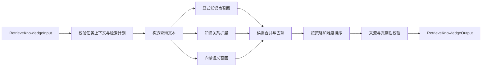

# V2 RAG 知识检索智能体内部实现方案

> 文档状态：阶段三算法已实现；全量调参与冻结验收待阶段四
> 更新日期：2026-07-20  
> 适用领域：`ai_app_dev`（人工智能应用开发实训）  
> 当前阶段：V2 Agent 算法独立开发，不切换生产运行链

## 1. 文档目的

本文档用于指导 Knowledge Retrieval Agent 的 V2 内部算法实现与独立验证。

本阶段交付的是一个能够独立接收 `RetrieveKnowledgeInput`、完成真实知识检索并返回
`RetrieveKnowledgeOutput` 的检索智能体。它不是完整多智能体系统的交付，也不包含 V2
LangGraph、worker、持久化和 SSE 集成。

本阶段完成后，应形成以下可验证链路：

```text
RetrieveKnowledgeInput
    -> 查询构造
    -> 显式知识召回
    -> 知识关系扩展
    -> 向量语义召回
    -> 合并、去重与排序
    -> 来源校验
    -> RetrieveKnowledgeOutput
```

## 2. 与项目目标的关系

检索智能体位于项目核心闭环中的 `retrieval` 环节：

```text
learner profile -> diagnosis -> retrieval -> generation -> review -> decision -> feedback -> update
```

本方案主要支撑以下项目目标：

- 根据学习者画像、薄弱知识和学习目标执行个性化检索。
- 为生成智能体提供受控的来源白名单，降低无来源生成和事实幻觉。
- 使用 prerequisite、dependent、related 关系补充学习顺序所需知识。
- 输出可追溯的知识片段和来源，为双模型审核提供事实证据。
- 通过检索专项评测量化重点知识命中率、知识覆盖率和来源完整率。

检索智能体本身不负责生成教学内容，也不能单独完成幻觉率、难度匹配准确率和完整闭环的
最终验收。上述指标仍需要 Content Generation Agent、Review and Validation Agent 以及统一
评测脚本共同完成。

## 3. 当前实现基线

仓库已经具备以下基础能力：

- ChromaDB HTTP VectorStore 和领域 collection。
- 知识点全量、增量索引构建脚本。
- 知识新增或修改后的 `needs_reembedding` 标记。
- V1 Knowledge Retrieval Agent 和 LangGraph 检索节点。
- 50 条知识点、60 道诊断题和知识关系数据。
- 冻结的 V2 `RetrieveKnowledgeInput`、`RetrievedChunk`、`SourceRef` 和
  `RetrieveKnowledgeOutput` 契约。

当前实现仍有以下限制：

- `backend/app/rag/embeddings.py` 使用 384 维确定性哈希向量，不是真实 embedding。
- 切片仅按空行合并至约 800 字，没有标题继承和重叠上下文。
- 检索主要是单路 Chroma Top-K，priority 和 prerequisite 只在召回后标记，没有保证召回。
- 难度、画像策略和知识关系尚未真正参与候选选择与排序。
- 50 条知识已补强为可独立理解的通用领域知识，全部具备可追溯的外部 `source_url`；其中
  3 条正文超过 800 字，可用于后续多切片验证。
- 现有 `p0_cases.json` 使用 `AIAPP-Kxxx`，与种子库真实知识 ID 不一致，不能直接作为
  RAG 召回评测集；该文件继续作为端到端 MVP 评测基线保留。

## 4. 当前阶段边界

### 4.1 本阶段完成

- 真实 OpenAI-compatible embedding 调用。
- 独立候选向量索引和索引一致性校验。
- V2 检索智能体及其内部 RAG service。
- 三种生成策略和来源复核用途下的多路检索。
- 知识关系扩展、去重、难度适配和稳定排序。
- 完整的 V2 来源对象、覆盖情况和警告输出。
- RAG 单元测试、集成测试和独立离线评测。

### 4.2 本阶段不完成

- 不修改 `build_learning_graph()`、`nodes.py` 和 `generation_worker.py`。
- 不切换当前 V1 生产运行链。
- 不写入 `agent_runs`、`agent_messages`，不发送 SSE 事件。
- 不修改冻结的 V2 contract、State、Schema、示例和合同测试。
- 不实现 PDF/Word 批量入库、临时材料隔离或通用文档问答。
- 不引入 BM25、Cross-Encoder、LLM reranker、Redis 或 Neo4j。
- 不修改前端页面和 `/api/v1` 公共接口。

这些能力将在所有 V2 Agent 算法完成后的统一集成阶段处理。

## 5. 总体检索流程



### 5.1 输入校验

检索智能体只接收冻结的 `RetrieveKnowledgeInput`，主要使用：

- `context.domain_code`：限定知识领域。
- `context.learning_goal`：当前学习目标。
- `profile`：画像类型、能力得分和薄弱知识。
- `retrieval_plan`：策略、目标难度、资源类型、重点知识、前置知识、查询词和返回数量。
- `revision_plan`：审核要求修订时的补充查询词和问题信息。
- `purpose`：补救解释、巩固练习、挑战任务或来源复核。

`task_id` 必须与 `context.task_id` 一致，输出继续使用同一个 `task_id` 和
`contract_version`。

### 5.2 查询构造

查询文本按以下顺序组合并去重：

```text
context.learning_goal
+ retrieval_plan.query_terms
+ profile.weak_knowledge 的名称和分类
+ revision_plan.query_terms
```

空字符串和重复词必须删除。审核修订场景必须保留 revision query，不能仅复用第一次查询。

查询示例：

```text
掌握 RAG 文档切片 补救讲解 RAG 文档切片策略 Embedding 基础 来源追溯
```

### 5.3 多路候选召回

检索同时使用三类候选来源。

显式知识点召回：

- 直接检索 `priority_knowledge_ids`。
- 直接检索 `prerequisite_knowledge_ids`。
- 显式知识不能因为语义相似度不足而从候选池中被静默遗漏。
- 按输入顺序分别去重，priority 先于 prerequisite；不存在、跨领域、缺索引或缺来源的 ID
  进入 `missing_knowledge_ids` 并生成非敏感 warning。
- 每个显式知识点在进入最终选择前最多保留 3 个候选 chunk，避免长知识点耗尽候选预算。

知识关系扩展：

- prerequisite：`relation.target` 为目标知识时读取 `relation.source`。
- dependent：沿 prerequisite 关系反向查找后续知识。
- related：双向查找相关知识。
- 仅从 priority 和 prerequisite 显式知识集合执行一跳扩展，不递归扩展关系候选。
- 关系查询限定同一 `domain_code`，忽略自环和无效 ID，并按关系类型、知识 ID 稳定排序。
- 每个种子知识的每种关系最多保留 2 个知识点，关系候选全局最多 24 个；超出预算时记录
  `relation_candidates_truncated` warning。
- 不增加新的关系表或契约字段。

向量语义召回：

- 使用真实 embedding 将最终查询文本向量化。
- 仅检索 `context.domain_code` 对应的候选 collection。
- 初始候选数为 `min(collection_count, max(24, n_results * 3))`。
- Chroma collection 使用 cosine 距离。

候选池预算：

- 显式候选不得因内部候选池预算被删除，但最终输出仍受 V2 契约最多 12 条限制。
- 关系候选最多 24 个，语义候选按上述 Top-K 规则获取。
- 合并后的候选只保存在单次执行内，不写入 State、日志或数据库完整载荷。

### 5.4 合并与去重

- 按 `chunk_id` 去重。
- 同一知识点首先保留最相关的一个 chunk，避免单个知识点占满上下文。
- 同一 chunk 通过多条路径命中时，记录最强 `matched_by`。
- 命中优先级为 priority、prerequisite、related/dependent、semantic。
- 主知识点覆盖完成后，如仍有名额，再补充同一知识点的其他高相关 chunk。

所有候选必须使用同一套真实相似度：

- 查询向量和候选 chunk 向量都来自候选 collection 声明的同一 embedding 模型。
- 语义召回使用 Chroma cosine distance，`similarity = clamp(1 - distance, 0, 1)`。
- 显式和关系候选从候选 collection 读取 chunk embedding，在 Agent 内计算 cosine similarity，
  再限制到 `[0, 1]`；不得为显式命中填充固定 1.0。
- 缺少 embedding、模型不一致或向量维度不一致的候选不得返回，必须生成 warning。

### 5.5 策略排序

`remedial` 用于补救解释：

```text
priority -> prerequisite -> related -> semantic -> dependent
```

优先选择目标难度及以下、距离目标难度最近的内容。

`consolidation` 用于巩固练习：

```text
priority -> related -> prerequisite -> semantic -> dependent
```

优先选择与目标难度最接近的内容。

`challenge` 用于挑战任务：

```text
dependent -> related -> priority -> semantic -> prerequisite
```

优先选择目标难度及以上、距离目标难度最近的内容。

`source_verification` 用于审核来源复核：

- 优先使用 `revision_plan.query_terms`。
- 优先返回 `priority_knowledge_ids`、`prerequisite_knowledge_ids` 和 revision query 能定位到的
  争议知识片段。
- 路径顺序为 priority、prerequisite、semantic、related、dependent。
- 不因旧查询结果存在而跳过重新检索。
- 冻结的 `RevisionPlan` 不包含旧 `source_ref_id`，因此本阶段不能保证按原来源 ID 精确复查；
  调用方应通过 priority ID 和 revision query 表达复核范围，并在无法定位时输出 warning。

最终选择分为两个阶段：

1. 覆盖保留：为显式知识预留最多 `n_results` 个位置，每个知识点选择综合得分最高的一个
   chunk，按 priority 输入顺序、prerequisite 输入顺序选择。
2. 策略补位：使用剩余位置从关系和语义候选中按综合得分选择；主知识点覆盖后仍有位置时，
   才允许同一知识点进入第二个 chunk。

当去重后的显式知识数量超过 `n_results` 时，按上述稳定顺序截断；未进入最终输出的显式 ID
必须进入 `missing_knowledge_ids`，并记录 `explicit_plan_exceeds_output_budget` warning。这里的
`missing` 表示“计划要求但最终没有合格返回片段”，不等同于知识库中不存在。

策略补位使用确定性综合得分，避免召回路径完全压制语义相关性：

```text
total_score = 0.50 * route_score
            + 0.35 * similarity
            + 0.15 * difficulty_score
```

- `route_score` 按各策略上文给出的路径顺序依次取 `1.00 / 0.85 / 0.70 / 0.55 / 0.40`。
- `difficulty_score` 范围为 `[0, 1]`。先计算
  `base = max(0, 1 - 0.20 * abs(chunk_difficulty - target_difficulty))`；consolidation 直接使用
  base，remedial 在 chunk 难度高于目标时使用 `base * 0.5`，challenge 在 chunk 难度低于
  目标时使用 `base * 0.5`。
- 相同 `total_score` 时，依次按 similarity 降序、difficulty 差值升序、`chunk_id` 升序稳定
  排序。
- 单元测试必须固定上述权重。权重调整只能基于开发评测集，并记录算法版本，不能针对冻结
  验收集逐例调参。

### 5.6 来源与完整性校验

每个 `RetrievedChunk` 必须包含：

- `chunk_id`
- `knowledge_id`
- `name`
- `category`
- `difficulty`
- `content`
- `similarity`
- `matched_by`
- `used_for`
- `source`

其中 `SourceRef` 必须包含：

- `source_ref_id`，与 `chunk_id` 相同。
- `knowledge_id`。
- `source_title`。
- 可选的 `source_url`。
- 非空 `license_note`。

缺少必须来源字段的候选不得作为正常证据返回，应记录到 `warnings`。

### 5.7 输出规则

最终输出严格使用 `RetrieveKnowledgeOutput`：

```text
RetrieveKnowledgeOutput
├── query_text
├── chunks                  最多 12 条
├── covered_knowledge_ids   实际返回片段覆盖的知识 ID
├── missing_knowledge_ids   计划要求但没有合格片段的知识 ID
└── warnings                缺索引、缺来源、数量不足等非敏感警告
```

`covered_knowledge_ids` 与 `missing_knowledge_ids` 不得重叠。智能体不得伪造缺失知识、来源或
相似度。

覆盖集合按最终输出计算：

- `covered_knowledge_ids` 是最终 `chunks` 实际覆盖的去重知识 ID。
- `missing_knowledge_ids` 只检查计划中的 priority 和 prerequisite ID，不把所有语义相关金
  标知识自动写入运行时输出。
- ID 在知识库存在但因输出预算、来源不合格或索引缺失未返回时，仍属于 missing，并由 warning
  区分具体原因。

## 6. Embedding 与候选索引设计

### 6.1 为什么使用独立候选索引

独立索引不是 V2 契约要求，而是开发阶段的迁移保护措施。

当前 V1 collection 保存 384 维 mock 向量；真实 embedding 的维度和分布通常不同。如果直接
覆盖当前 collection：

- Chroma 可能因维度不一致拒绝写入或查询。
- 当前 V1 仍会使用 mock 查询向量检索真实向量，结果失真。
- 全量重建会影响已有演示链的稳定性。

因此开发阶段使用：

```text
knowledge_ai_app_dev             当前 V1/mock 索引
knowledge_ai_app_dev_candidate   真实 embedding 候选索引的逻辑名称
```

manifest 可将逻辑名称解析到带构建版本的物理 collection，供失败重建时保留上一版本。候选索引
验证通过并完成 V2 运行链切换后，正式检索再指向候选索引，旧 mock 索引随后下线。逻辑索引
名称不使用 `v2`，避免把 Agent 契约版本耦合到知识基础设施。

### 6.2 Embedding Provider

新增内部 `EmbeddingProvider` 接口：

```text
embed_texts(texts: list[str]) -> list[list[float]]
model_name -> str
```

OpenAI-compatible 实现使用现有配置：

- `OPENAI_API_BASE`
- `OPENAI_API_KEY`
- `EMBEDDING_MODEL`

调用规则：

- 使用 `/embeddings`。
- 每批最多 32 条文本。
- 失败等待 1s、3s、5s，最多重试 3 次。
- 普通日志只记录模型名、批次数、耗时、尝试次数和错误类型。
- 不记录完整查询、知识正文或 embedding 向量。
- live 模式缺少配置或调用失败时明确失败，不静默退回 mock。

现有确定性哈希 embedding 继续用于 V1 和隔离单元测试。

### 6.3 索引一致性

候选 collection 的 metadata 保存：

- `domain_code`
- `embedding_model`
- `embedding_dimensions`
- `distance_metric=cosine`
- `index_version`

模型名、维度或距离度量变化时，增量构建必须失败并提示执行全量 `--reset`，不得在同一个
collection 中混合不同向量。

候选索引使用独立 manifest 管理同步状态，避免与 V1 共用一个 `needs_reembedding` 状态：

```text
candidate_index_manifest
├── active_collection
├── domain_code
├── embedding_model
├── embedding_dimensions
├── distance_metric
├── index_version
├── source_data_version
├── last_successful_sync_at
└── indexed_item_count
```

- manifest 保存于 Docker 持久化数据目录，使用临时文件加原子替换写入，不进入 Agent State。
- candidate 增量构建同时使用 `KnowledgeItem.updated_at > last_successful_sync_at` 和
  `needs_reembedding=true` 查找变化项，不能只依赖可能被 V1 构建流程清除的共享布尔字段。
- 每次增量构建比较数据库知识 ID 和 candidate collection 已索引 ID，删除数据库中已不存在的
  孤儿 chunk。
- candidate 构建流程不得清除共享的 `needs_reembedding`；在 V2 正式切换前，该字段仍由 V1
  索引流程负责。切换时再统一索引状态所有权。
- 全量构建先写临时 collection，完成条数、维度、来源字段和 smoke query 校验后，才原子更新
  manifest 的 `active_collection`；失败时保留上一个可用 candidate collection。
- Agent 每次执行只读取 manifest 指向的 active collection，不根据名称猜测当前索引。

### 6.4 切片与元数据

切片采用 Markdown 标题和段落感知策略：

- 单个 chunk 目标上限 800 字。
- 相邻 chunk 保留约 100 字重叠上下文。
- 短段落不拆分，超长段落按句子边界拆分。
- 子标题正文继承最近的标题上下文。
- chunk ID 使用 `{knowledge_id}::chunk::{index}`。

每个 chunk 的 metadata 保存领域、知识 ID、名称、分类、难度、标签、来源、许可、切片位置和
embedding 模型。

切片质量测试至少使用补强后确实会产生多个 chunk 的知识项。短知识项只验证字段完整性，不用
于证明标题继承和重叠上下文有效。

## 7. V2 Agent 内部接口

新增独立的 V2 retrieval agent 模块，当前 legacy `retrieval_agent.py` 保持不变。

对外唯一执行边界：

```text
execute(RetrieveKnowledgeInput) -> RetrieveKnowledgeOutput
```

实现要求：

- 新 Agent 只使用 `app.agents.contracts` 中的 V2 输入输出模型。
- 不导入 `legacy_contracts` 和 `legacy_state`。
- 数据库会话、Chroma client 和 embedding client 只存在于 Agent 边界内部，不进入 State。
- 使用独立检索 Prompt，明确职责、来源限制和禁止生成教学内容。
- 检索失败返回受控异常，不生成形式正确但内容虚假的输出。

本阶段的查询构造、关系解析、候选选择和排序均为确定性算法，不调用 LLM。独立 Prompt 作为
Agent 职责和未来统一编排时的系统约束保留，但不得将“存在 Prompt”表述为当前执行链已经发生
模型推理。真实模型调用只发生在 Embedding Provider。

建议内部职责划分：

```text
V2KnowledgeRetrievalAgent
    -> QueryBuilder
    -> KnowledgeRelationResolver
    -> CandidateRetriever
    -> CandidateSelector
    -> RetrievalOutputAssembler
```

上述组件只在确实降低测试和算法复杂度时拆分，不为每个步骤建立独立框架。

## 8. 知识数据补强

现有 50 条知识点已完成正文和来源补强，并固定为 RAG 算法开发的数据基线：

- 保留现有真实 `knowledge_id`，不改为 `AIAPP-Kxxx`。
- 每条知识至少包含可独立理解和核验的事实、适用条件或操作说明。
- 外部技术事实优先引用 FastAPI、OpenAI、Chroma、LangGraph、Vue 等官方文档。
- 项目内部规则不作为通用领域知识进入 RAG 语料，需求、设计和 Agent 契约只约束项目实现。
- 所有知识具有非空 `source_title` 和 `license_note`。
- 所有知识均具有外部 `source_url`。
- 校验 67 条 prerequisite 和 14 条 related 关系，删除无效 ID 和自环。

复杂切片优化应在知识内容补强后进行，否则当前短文本大多只会产生单个 chunk，无法验证切片
质量。

## 9. 实施顺序

### 阶段一：检索金标准与数据

1. 先补强知识正文、来源和关系质量，完成无效 ID、自环和来源字段校验，并记录
   `source_data_version`。
2. 在知识数据版本固定后新建 RAG 专项评测集，使用种子库真实知识 ID。
3. 准备 50 个查询案例并标记期望重点、前置、关系和语义相关知识；输入计划 ID 与金标准相关
   ID 分开保存，不能把全部期望答案都放入 priority 或 prerequisite 输入。
4. 将案例固定拆分为 30 个开发案例和 20 个冻结验收案例，保存验收集内容哈希；算法权重和规则
   只允许根据开发集调整。
5. 保存当前 mock 检索指标作为对照基线。

阶段一产物保存在独立的 `data/rag_evaluation/`，包含 30 条开发案例、20 条冻结验收案例和
验收集内容哈希。现有 `data/evaluation_cases/p0_cases.json` 不参与 RAG 指标计算。

### 阶段二：真实向量索引

1. 实现 OpenAI-compatible Embedding Provider。
2. 实现标题感知切片和候选 collection。
3. 实现 candidate manifest、全量原子重建、增量同步、孤儿清理、模型一致性校验和 smoke
   query。
4. 使用真实 embedding 完成首次候选索引重建。

### 阶段三：V2 检索算法

1. 实现查询构造和显式知识召回。
2. 实现 prerequisite、dependent、related 扩展。
3. 实现统一 cosine 相似度、语义召回、候选合并、去重、覆盖保留和策略综合排序。
4. 实现来源校验、覆盖集合和 warnings。
5. 封装 V2 `execute()` 边界并通过契约校验。

### 阶段四：评测与收敛

1. 使用 30 个开发案例建立基线、调试和调整确定性权重。
2. 冻结算法版本后只运行一次 20 个验收案例；未达标时先记录版本和失败归因，再开启下一轮
   明确版本的开发，禁止在同一版本上逐例修补验收集。
3. 对失败案例按查询、索引、关系、排序、来源和输出预算六类归因。
4. 运行 semantic-only、explicit-only、semantic+relation 和 full 四组消融实验，区分真实语义
   能力、数据可用性和显式 ID 直取能力。
5. 优先调整数据、查询构造和确定性排序，不立即引入额外 reranker。
6. 达到验收指标后冻结算法行为和 candidate manifest，进入 V2 集成准入检查。

### 阶段五：V2 集成准入检查

本阶段仍不修改运行链，但在交付前必须产出后续接线清单：

1. 明确 V1 State 到 `RetrieveKnowledgeInput`、`RetrieveKnowledgeOutput` 到后续生成输入的适配
   责任，不修改冻结契约。
2. 明确 candidate active collection、Embedding Provider 配置和失败处理的运行时依赖。
3. 明确接线后 `agent_runs`、`agent_messages` 和 SSE 只记录摘要、ID、指标和 warning，不记录
   完整查询、正文或向量。
4. 只有冻结验收集达标、candidate 索引完整、V1 回归通过且适配清单评审通过，才允许提交
   统一 V2 运行链切换。

## 10. 测试与验收

### 10.1 单元测试

- Embedding 批处理、重试、缺少配置、响应维度不一致和测试替身。
- 标题继承、段落切片、超长文本、空文本和稳定 chunk ID。
- 三种策略的路径顺序和难度偏好。
- priority、prerequisite、related、dependent、semantic 命中。
- 重复 chunk、同知识多 chunk、缺失知识和缺失来源。
- 输出最多 12 条、covered/missing 不重叠、所有枚举合法。
- revision query 和 `source_verification` 确实触发重新检索。
- 显式 ID 数量超过 `n_results` 时稳定截断，并正确输出 missing 和 warning。
- 显式、关系、语义三类候选使用同一 cosine 计算规则，不使用固定伪相似度。
- 一跳关系边界、关系候选上限、环和无效 ID 不会造成递归扩展或非确定性结果。
- 综合评分、相同分数 tie-break 和算法版本保持稳定。

### 10.2 集成测试

- 使用测试 Embedding Provider 和本地 ChromaDB 完成默认、无网络的确定性建库与查询。
- 使用显式 `live` 标记的测试验证真实 OpenAI-compatible embedding 和 ChromaDB；缺少 live
  配置时跳过，不得静默使用 mock 后报告为真实验收结果。
- 全量重建后 collection metadata 和实际维度一致。
- 相同模型允许增量更新，不同模型拒绝增量更新。
- V1 清除 `needs_reembedding` 后，candidate 仍能依据更新时间水位发现变化；candidate 构建
  不清除 V1 的共享标记。
- 全量 candidate 构建失败时 manifest 仍指向上一个有效 collection。
- 领域过滤有效，不返回其他 domain 的知识。
- 所有输出均可通过冻结的 V2 Pydantic model 校验。
- 现有 V1 测试保持通过。

### 10.3 RAG 评测指标

50 个检索案例拆分为 30 个开发案例和 20 个冻结验收案例。以下门槛以冻结验收集为准，同时
报告开发集和完整 50 例结果：

- Recall@12 `>= 90%`。
- priority 知识命中率 `>= 95%`。
- prerequisite 覆盖率 `>= 90%`。
- 来源字段完整率 `= 100%`。
- 跨领域错误结果 `= 0`。
- 检索 P95 `<= 3s`。
- V2 契约非法输出 `= 0`。

指标解释：

- priority 命中率同时报告“知识项存在时的直取成功率”和“最终 Top-12 覆盖率”，避免把数据库
  可用性误报为语义检索质量。
- prerequisite 覆盖率区分输入已明确给出的 prerequisite 和通过关系扩展发现的 prerequisite。
- Recall@12 的金标准包含未出现在输入 priority/prerequisite 中的相关知识，用于检验真实语义
  和关系召回能力。
- 四组消融实验使用同一案例和索引版本；正式报告至少列出 full 相对 semantic-only 的提升。

评测报告必须包含模型名、索引版本、案例数、分子、分母、比率、失败 case ID、P50/P95 和
评测时间。

建议检查命令：

```powershell
cd backend
python -m compileall app tests
pytest tests/contracts tests/unit
pytest tests/integration -m "not live"
python -m app.scripts.build_chroma_candidate_index --domain-code ai_app_dev --reset --live --json
pytest tests/integration -m live
python -m app.scripts.evaluate_rag --split development --json
python -m app.scripts.evaluate_rag --split acceptance --json
```

命令名称可在实现时按仓库脚本命名规范落地，但功能和参数保持一致。

## 11. 完成定义

满足以下条件时，可认为 Knowledge Retrieval Agent 的 V2 内部算法完成：

1. Agent 能独立接收合法 `RetrieveKnowledgeInput` 并返回合法 `RetrieveKnowledgeOutput`。
2. 真实 embedding 和候选索引可通过一条命令重复构建。
3. 三种策略和来源复核均有可复现测试。
4. priority、前置和关系知识实际参与召回与排序，而不是仅在召回后打标签。
5. 所有返回 chunk 均具备可追溯 `SourceRef`。
6. 50 个 RAG 案例达到本文件的检索指标。
7. 当前 V1 演示链和既有测试无回归。
8. 冻结 V2 contract、State、Schema 和顶层图没有被修改。
9. candidate manifest 能证明索引模型、维度、数据版本和同步水位一致，失败重建不会破坏上一
   个有效索引。
10. 已提交 V2 集成准入清单，明确适配、运行记录、SSE 摘要和切换回退责任。

以下事项不属于本阶段完成条件：

- V2 LangGraph 接线。
- `agent_runs`、`agent_messages` 持久化。
- SSE 与前端展示。
- Generation、Review、Orchestrator 的 V2 端到端消费。

这些内容统一进入后续 V2 集成切换阶段。

## 12. 阶段三实现记录

- V2 独立执行入口为 `app.agents.v2_retrieval_agent.V2KnowledgeRetrievalAgent`，公共边界固定为
  `execute(RetrieveKnowledgeInput) -> RetrieveKnowledgeOutput`；它不继承带有 legacy contract 依赖的
  `BaseAgent`，也不接入当前 LangGraph。
- `app.rag.v2_retrieval.V2CandidateRetriever` 读取 manifest active collection，校验 collection metadata，
  执行显式召回、单跳关系扩展、真实 embedding 语义召回、统一 cosine、覆盖保留和确定性排序。
- `python -m app.scripts.evaluate_rag --engine v2-candidate --mode full --split development --live --json`
  执行真实 V2 评测；`--live` 是付费边界，缺失时命令会失败而不是回退 mock。可用 mode：`full`、
  `semantic-only`、`explicit-only`、`semantic+relation`。
- 阶段三只交付算法、测试和评测报告结构。全量 development 调参、四组消融、冻结 acceptance 评测及
  V1→V2 运行链切换均属于后续阶段；V1 collection 与 V1 retrieval agent 保持不变。
