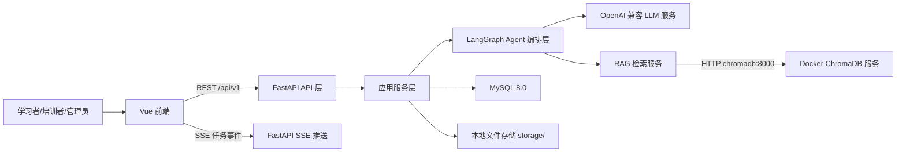
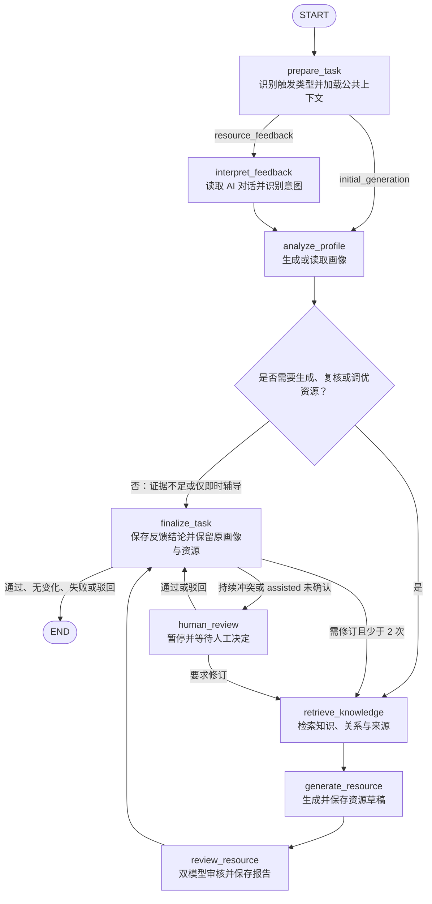

# 人工智能应用开发实训多智能体个性化知识生成系统设计文档

> 文档版本：v1.1
> 编制日期：2026 年 7 月 14 日
> 关联赛题：XH-202630 领域知识个性化生成与多智能体协同决策系统研究
> 主验证领域：人工智能应用开发实训
> 作品定位：以人工智能应用开发为验证样例，构建可迁移的多智能体个性化技能培训系统。
> 需求基线：需求规格说明书 v1.2（2026 年 7 月 14 日）

---

## 1. 技术栈总览

### 1.1 技术选型

| 层级 | 技术 | 固定版本 | 用途 |
|------|------|----------|------|
| 前端框架 | Vue | 3.5.12 | 构建 Web 单页应用 |
| 前端语言 | TypeScript | 5.5.4 | 类型约束与可维护开发 |
| 构建工具 | Vite | 5.4.11 | 前端构建与本地开发 |
| UI 组件库 | Element Plus | 2.8.4 | 表单、表格、弹窗、布局、统计卡片 |
| 图表库 | ECharts | 5.5.1 | 雷达图、热力图、折线图、柱状图 |
| 流程图组件 | Vue Flow | 1.41.5 | Agent 协同流程可视化 |
| 状态管理 | Pinia | 2.2.4 | 前端会话状态、任务状态、页面缓存 |
| HTTP 客户端 | Axios | 1.7.7 | REST API 调用 |
| Markdown 渲染 | marked + highlight.js + marked-katex-extension | marked 15.0.8 + highlight.js 11.11.1 + marked-katex-extension 5.1.4 | 讲义、实操指南、测试题渲染，支持代码高亮和公式 |
| 文件导入导出 | xlsx + file-saver | xlsx 0.18.5 + file-saver 2.0.5 | 知识库批量导入、评测数据导出 |
| 后端框架 | FastAPI | 0.115.6 | REST API、SSE 推送、OpenAPI 文档 |
| 后端语言 | Python | 3.12.4 | Agent 编排、RAG、业务逻辑 |
| Agent 编排 | LangGraph | 0.2.56 | 多智能体状态图、条件分支、重试、检查点 |
| ORM | SQLAlchemy | 2.0.35 | MySQL 数据访问 |
| 数据库迁移 | Alembic | 1.13.3 | 数据库版本迁移 |
| 关系数据库 | MySQL | 8.0.39 | 用户、画像、题目、资源、日志、评测数据 |
| 向量数据库 | ChromaDB | 1.5.8 | 知识库 Embedding 存储与语义检索 |
| LLM 统一调用 | OpenAI Python SDK | 1.51.2 | 兼容 OpenAI 格式模型服务 |
| 文档解析 | pypdf + markdown | pypdf 4.3.1 | 知识库文档导入 |
| 后端测试 | pytest | 8.3.3 | 单元测试与接口测试 |
| 前端测试 | Vitest + Vue Test Utils | Vitest 2.1.1 + Vue Test Utils 2.4.6 | 组件与工具函数测试 |
| 代码规范 | Ruff + ESLint + Prettier | Ruff 0.6.9 + ESLint 9.11.1 + Prettier 3.3.3 | 代码质量和格式化 |
| 容器化 | Docker Compose | 2.29.7 | 本地一键启动前后端与数据库 |

### 1.2 固定实现边界

1. 系统第一版只实现一个主验证领域：`ai_app_dev`，中文名为“人工智能应用开发实训”。
2. 第一版知识关系使用 MySQL 表建模，不引入 Neo4j。
3. 第一版 Agent 状态使用 MySQL 持久化，不引入 Redis。
4. 第一版实时过程展示使用 SSE，不使用 WebSocket。
5. 第一版向量检索使用 Docker Compose 中独立部署的 ChromaDB 服务。后端容器通过 `CHROMA_HOST=chromadb`、`CHROMA_PORT=8000` 访问，宿主机调试端口为 `8001`；数据由 Docker 命名卷 `chroma_data` 持久化，不在应用进程内使用本地嵌入式 Chroma 或 `data/chroma` 目录。
6. 第一版 Agent 编排使用 LangGraph `StateGraph` 实现，不手写临时流程控制器。
7. 所有外部模型通过 OpenAI 兼容接口调用，模型供应商由环境变量配置，但业务代码不直接依赖具体供应商。
8. 第一版用户体系采用演示账号和角色字段，不建设完整注册、找回密码、复杂权限审批流程。
9. 第一版以可演示闭环和可复现评测为优先，企业级兼容、长期版本治理和细粒度审计放入后续扩展。

### 1.3 第一版 MVP 范围

第一版必须优先完成能够支撑比赛评分的最小闭环，避免将开发资源消耗在低收益的企业后台能力上。

| 类别 | 第一版交付范围 |
|------|----------------|
| 领域数据 | 1 个 `ai_app_dev` 领域包，至少 50 条真实知识点、60 道诊断题 |
| 学习者样例 | 至少 3 组差异化学习者画像，覆盖初学者、进阶者和实操型学习者 |
| Agent 闭环 | 协调编排、学情分析、知识检索、内容生成、审核校验 5 个主流程 Agent；交互导学 Agent 由反馈触发 |
| 资源输出 | 每个画像生成定制化讲义、实操指南、分阶测试题 3 类资源 |
| 审核纠错 | 审核报告必须包含事实准确性、来源追溯、难度匹配和核心覆盖评分 |
| 可视化 | 完成学情画像页、Agent 协同页、学习资源页、学习报告页 4 个核心页面 |
| 评测 | 提供 50 组评测样例和 `test_script`，可复现幻觉率、难度匹配准确率、知识覆盖率 |

### 1.4 简化与扩展原则

1. REST API 固定前缀为 `/api/v1`，第一版不建设 `/api/v2`。
2. 所有 API 响应包含 `schema_version` 字段，便于演示和测试脚本稳定解析。
3. 数据库结构通过 Alembic 迁移管理，禁止直接手工改生产库结构。
4. 领域配置包含 `domain_schema_version` 字段，第一版固定为 `"1.0"`。
5. Agent 输入输出 JSON 必须包含 `contract_version` 字段。正式开发契约已冻结为 `"agent-contract-v2"`，以 `docs/agent-contract-v2.md`、Pydantic 模型和生成的 JSON Schema 为唯一事实来源；当前可运行图在整体切换前临时使用 `legacy_*` 中的 `"agent-contract-v1"`。
6. 已生成学习资源不可直接覆盖；第一版在 `learning_resources` 中保留 `version` 字段，不单独建设完整资源版本表。
7. 知识条目修改后记录 `updated_at` 和变更摘要；完整历史版本表作为后续增强项。

---

## 2. 系统架构

### 2.1 总体架构



### 2.2 分层职责

| 层级 | 目录 | 职责 |
|------|------|------|
| 前端表现层 | `frontend/src/pages` | 页面渲染、表单交互、图表展示、流程状态展示 |
| 前端数据层 | `frontend/src/api` | 封装 `/api/v1` 请求和 SSE 订阅 |
| API 层 | `backend/app/api/v1` | 参数校验、权限校验、响应格式封装 |
| 应用服务层 | `backend/app/services` | 学情画像、诊断测试、资源生成、反馈、报告等业务流程 |
| Agent 编排层 | `backend/app/agents` | 使用 LangGraph `StateGraph` 定义多 Agent 节点、状态、条件边、重试、审核闭环 |
| RAG 层 | `backend/app/rag` | 文档切片、Embedding、向量检索、引用片段返回 |
| 数据访问层 | `backend/app/repositories` | 数据库读写封装 |
| 数据模型层 | `backend/app/models` | SQLAlchemy 表模型 |
| 配置层 | `backend/app/core` | 环境变量、日志、异常、鉴权、兼容性策略 |

### 2.3 核心业务闭环



系统只维护一个学习闭环和一个 LangGraph `StateGraph`。首次资源生成与资源反馈通过 `trigger_type` 进入同一张图，并复用 `analyze_profile`、`retrieve_knowledge`、`generate_resource`、`review_resource` 和 `finalize_task`。资源反馈的主要入口是学习者与交互导学 Agent 的连续 AI 对话；快捷标签、评分或文本标记只能作为辅助证据。

顶层节点只保留 Agent 调用、条件路由和人工中断等需要独立追踪的业务检查点。加载上下文、保存草稿、保存审核报告、更新画像、计算影响范围、发布资源和刷新路径等确定性操作由对应节点内部的应用服务完成，不再拆成独立顶层节点。证据不足时 `finalize_task` 保留原画像、路径和资源并保存追问、提示或即时解释；画像发生有效变化时，`analyze_profile` 在同一次运行中创建画像新版本并计算影响范围，再触发受影响资源的局部重生成。
### 2.4 Agent 状态机

Agent 编排由 LangGraph `StateGraph` 执行。系统将一个生成任务映射为一个图运行实例，`generation_tasks.public_id` 作为 `thread_id`，用于串联 MySQL 中的任务状态、Agent 运行日志和 SSE 前端事件。

下列扁平 `AgentGraphState` 仅表示当前 legacy V1 运行时，不得作为新 Agent 实现依据。正式 V2 使用节点专属输出组成的 `AgentGraphState`，字段以 `docs/agent-contract-v2.md` 和 `backend/app/agents/state.py` 为准。legacy V1 状态如下：

```python
class AgentGraphState(TypedDict):
    contract_version: str
    task_id: str
    trigger_type: Literal["initial_generation", "resource_feedback"]
    execution_mode: Literal["auto", "assisted"]
    learner_id: str
    profile_id: str | None
    domain_code: str
    resource_types: list[str]
    learning_goal: str
    temporary_material_ids: list[str]
    resource_id: str | None
    feedback_id: str | None
    tutoring_session_id: str | None
    tutoring_message_id: str | None
    feedback_intent: str | None
    recommended_action: str | None
    profile_update_required: bool
    profile_change_evidence: list[dict]
    affected_knowledge_ids: list[str]
    affected_path_node_ids: list[str]
    affected_resource_ids: list[str]
    profile: dict
    retrieved_chunks: list[dict]
    draft_resources: list[dict]
    review_reports: list[dict]
    revision_count: int
    decision: str
    manual_review_required: bool
    manual_review_task_id: str | None
    human_review_decision: Literal["approve", "request_revision", "reject"] | None
    agent_contexts: dict[str, dict]
    error_message: str | None
```

`initial_generation` 分支不使用的资源和反馈字段允许为 `None` 或空列表；`resource_feedback` 分支必须提供 `resource_id` 和 `feedback_id`。`temporary_material_ids` 只允许引用状态为 `ready`、作用域为当前学习者和当前任务的临时材料。`agent_contexts` 按 Agent 名称分区保存裁剪后的工作上下文，节点只能读取公共字段和自己的命名空间，避免多个 Agent 共用一份无边界对话历史。

LangGraph 顶层节点固定为 8 个：

| 节点 | 对应 Agent | 职责 | 内部复用的确定性服务 |
|------|------------|------|----------------------|
| `prepare_task` | 协调编排 Agent | 识别 `trigger_type`、加载公共任务上下文并选择入口 | 任务读取、资源与会话关联校验 |
| `interpret_feedback` | 交互导学 Agent | 读取连续 AI 对话、识别反馈意图并生成即时追问或建议 | 反馈上下文加载、消息保存、意图结构化 |
| `analyze_profile` | 学情分析 Agent | 首次任务生成或读取画像；反馈任务判断证据、更新画像并计算影响范围 | 诊断聚合、画像版本保存、影响集合计算 |
| `retrieve_knowledge` | 知识检索 Agent | 检索知识点、引用片段、前置关系和允许使用的临时材料 | Chroma 检索、关系查询、来源整理 |
| `generate_resource` | 内容生成 Agent | 生成三类核心资源或辅导型衍生内容 | 模板渲染、引用预检、草稿持久化 |
| `review_resource` | 审核校验 Agent | 审核事实、来源、难度和覆盖率，执行双模型交叉检查 | 审核报告保存、分歧计算 |
| `human_review` | 协调编排 Agent | 在持续分歧或辅助模式下暂停任务并恢复人工决定 | 人工复核任务、检查点和 `interrupt()` |
| `finalize_task` | 协调编排 Agent | 根据画像、审核或人工决定完成发布、修订路由、失败收尾或无变化收尾 | 反馈决策保存、资源发布、局部路径刷新、终态更新 |

`analyze_profile` 通过 `trigger_type` 复用同一节点：首次生成时负责建立或读取画像；反馈任务时负责读取反馈证据、决定是否创建新版本，并在画像变化时计算 `affected_knowledge_ids`、`affected_path_node_ids` 和 `affected_resource_ids`。`finalize_task` 通过当前 `decision` 复用同一节点：既处理无需生成的即时辅导结果，也处理资源发布、修订回路、人工复核路由和失败终态。
LangGraph 条件边固定为：

```text
START -> prepare_task
prepare_task -> analyze_profile       when trigger_type = initial_generation
prepare_task -> interpret_feedback    when trigger_type = resource_feedback
interpret_feedback -> analyze_profile

analyze_profile -> finalize_task      when no generation, review or regeneration is required
analyze_profile -> retrieve_knowledge when generation, review or regeneration is required

retrieve_knowledge -> generate_resource -> review_resource -> finalize_task

finalize_task -> END                  when decision in [completed, no_change, failed, rejected]
finalize_task -> retrieve_knowledge   when decision = revision_required and revision_count < 2
finalize_task -> human_review         when decision = manual_review_required or (execution_mode = assisted and human_review_decision is None)

human_review -> interrupt
Command(resume=human_review_decision) -> human_review
human_review -> retrieve_knowledge    when human_review_decision = request_revision and revision_count < 2
human_review -> finalize_task         when human_review_decision in [approve, reject]
```

`finalize_task` 不调用教学内容生成模型，只读取结构化画像结果、审核结果、人工决定和修订次数，执行确定性路由与持久化。`generate_resource` 在节点内部保存待审核草稿，`review_resource` 在节点内部保存两路审核报告，`finalize_task` 在通过时发布资源并局部刷新受影响路径。
人工干预规则固定为：

1. `auto` 模式仅在双模型持续冲突时进入人工复核；`assisted` 模式在发布前必须经过管理员确认。
2. `human_review` 不是终态。任务保持 `waiting_human`，前端显示待处理原因和审核证据，但学习者不可见资源正文。
3. 管理员可选择 `approve`、`request_revision` 或 `reject`，必须填写复核意见；决定、操作者、时间和证据写入 `manual_review_tasks`。
4. 恢复运行必须复用原 `thread_id` 和检查点，不得新建一条无法追踪的旁路任务。
5. `request_revision` 仍受最多 2 次自动修订约束；超出后只能驳回或由管理员明确批准。

Agent 任务状态枚举固定为：

| 状态 | 含义 | 是否终态 |
|------|------|----------|
| `pending` | 已创建，等待执行 | 否 |
| `running` | 正在执行 | 否 |
| `waiting_review` | 等待审核 Agent 校验 | 否 |
| `revision_required` | 审核未通过，等待修订 | 否 |
| `waiting_human` | 双模型持续冲突，等待管理员人工复核 | 否 |
| `completed` | 全部资源生成并审核通过 | 是 |
| `failed` | 重试后仍失败 | 是 |
| `cancelled` | 用户或管理员取消 | 是 |

失败重试规则固定为：

1. LLM 调用失败最多重试 3 次。
2. 重试等待时间为 1 秒、3 秒、5 秒。
3. 三次失败后任务状态置为 `failed`。
4. 失败原因写入 `agent_runs.error_message`。

---

## 3. 目录结构

```text
ai-training-agent-system/
├── README.md
├── docker-compose.yml
├── .env.example
├── docs/
│   ├── requirements.md
│   ├── design.md
│   ├── api-v1.md
│   ├── deployment.md
│   ├── ENV_SETUP.md
│   └── demo_accounts.md
├── backend/
│   ├── pyproject.toml
│   ├── alembic.ini
│   ├── alembic/
│   │   ├── env.py
│   │   └── versions/
│   ├── app/
│   │   ├── main.py
│   │   ├── api/
│   │   │   └── v1/
│   │   │       ├── auth.py
│   │   │       ├── learners.py
│   │   │       ├── diagnostics.py
│   │   │       ├── knowledge.py
│   │   │       ├── generation_tasks.py
│   │   │       ├── resources.py
│   │   │       ├── reports.py
│   │   │       ├── materials.py
│   │   │       ├── tutoring.py
│   │   │       ├── reviews.py
│   │   │       ├── domains.py
│   │   │       └── evaluations.py
│   │   ├── agents/
│   │   │   ├── base.py
│   │   │   ├── orchestrator.py
│   │   │   ├── graphs.py
│   │   │   ├── state.py
│   │   │   ├── nodes.py
│   │   │   ├── checkpointer.py
│   │   │   ├── profile_agent.py
│   │   │   ├── retrieval_agent.py
│   │   │   ├── generation_agent.py
│   │   │   ├── review_agent.py
│   │   │   ├── tutoring_agent.py
│   │   │   ├── contracts.py
│   │   │   ├── tools.py
│   │   │   ├── context.py
│   │   │   └── prompts/
│   │   │       ├── orchestrator_agent.md
│   │   │       ├── profile_agent.md
│   │   │       ├── retrieval_agent.md
│   │   │       ├── generation_agent.md
│   │   │       ├── review_agent.md
│   │   │       └── tutoring_agent.md
│   │   ├── core/
│   │   │   ├── config.py
│   │   │   ├── security.py
│   │   │   ├── logging.py
│   │   │   ├── errors.py
│   │   │   └── compatibility.py
│   │   ├── models/
│   │   │   ├── user.py
│   │   │   ├── learner.py
│   │   │   ├── domain.py
│   │   │   ├── knowledge.py
│   │   │   ├── diagnostic.py
│   │   │   ├── agent.py
│   │   │   ├── resource.py
│   │   │   ├── feedback.py
│   │   │   ├── learning_path.py
│   │   │   ├── material.py
│   │   │   ├── tutoring.py
│   │   │   ├── review.py
│   │   │   └── evaluation.py
│   │   ├── schemas/
│   │   │   ├── common.py
│   │   │   ├── learner.py
│   │   │   ├── diagnostic.py
│   │   │   ├── generation.py
│   │   │   ├── resource.py
│   │   │   ├── report.py
│   │   │   ├── material.py
│   │   │   ├── tutoring.py
│   │   │   ├── review.py
│   │   │   └── domain.py
│   │   ├── services/
│   │   │   ├── learner_service.py
│   │   │   ├── diagnostic_service.py
│   │   │   ├── profile_service.py
│   │   │   ├── generation_service.py
│   │   │   ├── feedback_service.py
│   │   │   ├── tutoring_service.py
│   │   │   ├── material_service.py
│   │   │   ├── review_service.py
│   │   │   ├── export_service.py
│   │   │   ├── report_service.py
│   │   │   ├── domain_service.py
│   │   │   └── evaluation_service.py
│   │   ├── rag/
│   │   │   ├── chunker.py
│   │   │   ├── embeddings.py
│   │   │   ├── vector_store.py
│   │   │   └── retriever.py
│   │   ├── repositories/
│   │   │   ├── base.py
│   │   │   ├── learner_repo.py
│   │   │   ├── knowledge_repo.py
│   │   │   ├── agent_repo.py
│   │   │   └── resource_repo.py
│   │   └── workers/
│   │       └── generation_worker.py
│   └── tests/
│       ├── unit/
│       └── api/
├── frontend/
│   ├── package.json
│   ├── vite.config.ts
│   ├── index.html
│   └── src/
│       ├── main.ts
│       ├── App.vue
│       ├── api/
│       │   ├── client.ts
│       │   ├── learners.ts
│       │   ├── diagnostics.ts
│       │   ├── generation.ts
│       │   ├── resources.ts
│       │   ├── reports.ts
│       │   ├── materials.ts
│       │   ├── tutoring.ts
│       │   ├── reviews.ts
│       │   └── domains.ts
│       ├── components/
│       │   ├── AgentFlow/
│       │   ├── Charts/
│       │   ├── ResourceViewer/
│       │   ├── ResourceMarkdownViewer/
│       │   ├── TutoringPanel/
│       │   ├── TemporaryMaterialUpload/
│       │   ├── ReviewArbitration/
│       │   └── Layout/
│       ├── pages/
│       │   ├── DashboardPage.vue
│       │   ├── LearnerProfilePage.vue
│       │   ├── DiagnosticPage.vue
│       │   ├── AgentWorkspacePage.vue
│       │   ├── ResourcePage.vue
│       │   ├── ReportPage.vue
│       │   ├── KnowledgeAdminPage.vue
│       │   ├── DomainConfigPage.vue
│       │   └── ManualReviewPage.vue
│       ├── stores/
│       │   ├── authStore.ts
│       │   ├── taskStore.ts
│       │   └── domainStore.ts
│       ├── types/
│       │   └── api.ts
│       └── styles/
│           └── theme.css
├── data/
│   ├── seed/
│   │   ├── ai_app_dev_domain.json
│   │   ├── knowledge_items.json
│   │   ├── diagnostic_questions.json
│   │   └── sample_learners.json
│   └── evaluation_cases/
│       ├── EC-001.json
│       ├── ...
│       └── EC-050.json
├── test_script/
│   ├── requirements.txt
│   ├── src/
│   │   ├── main.py
│   │   ├── evaluator.py
│   │   ├── matcher.py
│   │   └── extract.py
│   └── README.md
└── storage/
    ├── exports/
    ├── uploads/
    └── generated/
```

---

## 4. 数据库设计

### 4.1 通用字段约定

1. 主键统一使用 `BIGINT UNSIGNED AUTO_INCREMENT`。
2. 对外暴露统一使用 `public_id`，类型为 `VARCHAR(36)`，存储 UUID。
3. 所有业务表包含 `created_at`、`updated_at`。
4. 需要软删除的表包含 `deleted_at`。
5. JSON 字段使用 MySQL `JSON` 类型。
6. 字符集使用 `utf8mb4`，排序规则使用 `utf8mb4_0900_ai_ci`。

### 4.2 表清单

第一版数据库只保留支撑闭环演示和指标复现的核心表。历史版本、长期审计和复杂兼容表作为后续扩展，不作为 MVP 必建范围。

| 表名 | 用途 | 第一版优先级 |
|------|------|--------------|
| `users` | 演示账号与角色，包含学习者、培训者、管理员 | 必建 |
| `learners` | 学习者扩展信息 | 必建 |
| `domains` | 领域配置，第一版只维护当前有效配置 | 必建 |
| `knowledge_items` | 当前有效知识条目，记录来源和更新时间 | 必建 |
| `knowledge_relations` | 知识点前置、依赖、关联关系 | 必建 |
| `knowledge_chunks` | RAG 文本切片元数据 | 必建 |
| `diagnostic_questions` | 诊断题库 | 必建 |
| `diagnostic_sessions` | 诊断测试会话 | 必建 |
| `answer_records` | 答题记录 | 必建 |
| `learner_profiles` | 学情画像 | 必建 |
| `generation_tasks` | 资源生成任务 | 必建 |
| `agent_runs` | 单个 Agent 执行记录 | 必建 |
| `agent_messages` | Agent 间标准消息 | 必建 |
| `learning_resources` | 生成的学习资源，包含 `version` 字段 | 必建 |
| `review_reports` | 审核报告，记录双模型审核结果和仲裁结论 | 必建 |
| `resource_feedback` | 学习者反馈与画像更新决策 | 必建 |
| `learning_paths` | 学习路径，支持 `needs_refresh` 标记 | 必建 |
| `temporary_learning_materials` | 当前任务的隔离临时材料及解析状态 | P1，紧随核心 P0 |
| `tutoring_sessions` | 交互导学多轮会话 | 必建 |
| `tutoring_messages` | 学习者与导学 Agent 的会话消息 | 必建 |
| `manual_review_tasks` | 人工复核队列、决定与恢复信息 | 必建 |
| `evaluation_cases` | 评测样例元数据，可由脚本文件导入 | 建议 |
| `evaluation_results` | 评测结果汇总；第一版也可由 `test_script` 输出文件替代 | 可选 |

后续扩展可新增 `domain_versions`、`knowledge_item_versions`、`resource_versions` 等历史版本表，不影响第一版闭环交付。

### 4.3 核心表结构

#### 4.3.1 `users`

| 字段 | 类型 | 约束 | 说明 |
|------|------|------|------|
| `id` | BIGINT UNSIGNED | PK | 内部主键 |
| `public_id` | VARCHAR(36) | UNIQUE NOT NULL | 对外 ID |
| `username` | VARCHAR(64) | UNIQUE NOT NULL | 登录名 |
| `password_hash` | VARCHAR(255) | NOT NULL | 密码哈希 |
| `display_name` | VARCHAR(64) | NOT NULL | 展示名 |
| `role` | ENUM('learner','instructor','admin') | NOT NULL | 用户角色 |
| `status` | ENUM('active','disabled') | NOT NULL DEFAULT 'active' | 账号状态 |
| `created_at` | DATETIME | NOT NULL | 创建时间 |
| `updated_at` | DATETIME | NOT NULL | 更新时间 |

索引：`idx_users_role(role)`。

#### 4.3.2 `learners`

| 字段 | 类型 | 约束 | 说明 |
|------|------|------|------|
| `id` | BIGINT UNSIGNED | PK | 内部主键 |
| `public_id` | VARCHAR(36) | UNIQUE NOT NULL | 对外 ID |
| `user_id` | BIGINT UNSIGNED | FK users.id | 对应用户 |
| `education_level` | ENUM('college','bachelor','master','doctor','vocational','other') | NOT NULL | 学历 |
| `major` | VARCHAR(128) | NOT NULL | 专业 |
| `experience_years` | DECIMAL(3,1) | NOT NULL DEFAULT 0 | 相关经验年限 |
| `learning_style` | ENUM('theory','practice','mixed') | NOT NULL DEFAULT 'mixed' | 学习风格 |
| `target_domain_code` | VARCHAR(64) | NOT NULL | 目标领域 |
| `tags` | JSON | NOT NULL | 学习方向标签 |
| `created_at` | DATETIME | NOT NULL | 创建时间 |
| `updated_at` | DATETIME | NOT NULL | 更新时间 |

索引：`idx_learners_user(user_id)`、`idx_learners_domain(target_domain_code)`。

#### 4.3.3 `domains`

| 字段 | 类型 | 约束 | 说明 |
|------|------|------|------|
| `id` | BIGINT UNSIGNED | PK | 内部主键 |
| `code` | VARCHAR(64) | UNIQUE NOT NULL | 领域编码，主领域固定为 `ai_app_dev` |
| `name` | VARCHAR(128) | NOT NULL | 领域名称 |
| `description` | TEXT | NOT NULL | 领域描述 |
| `domain_schema_version` | VARCHAR(16) | NOT NULL DEFAULT '1.0' | 配置协议版本 |
| `ability_model` | JSON | NOT NULL | 能力模型 |
| `difficulty_rubric` | JSON | NOT NULL | 难度标准 |
| `review_rules` | JSON | NOT NULL | 审核规则 |
| `resource_templates` | JSON | NOT NULL | 资源模板 |
| `status` | ENUM('active','archived') | NOT NULL DEFAULT 'active' | 状态 |
| `created_at` | DATETIME | NOT NULL | 创建时间 |
| `updated_at` | DATETIME | NOT NULL | 更新时间 |

#### 4.3.4 `knowledge_items`

| 字段 | 类型 | 约束 | 说明 |
|------|------|------|------|
| `id` | BIGINT UNSIGNED | PK | 内部主键 |
| `public_id` | VARCHAR(36) | UNIQUE NOT NULL | 对外 ID |
| `domain_code` | VARCHAR(64) | NOT NULL | 所属领域 |
| `title` | VARCHAR(255) | NOT NULL | 知识点名称 |
| `category` | ENUM('theory','practice','case','tooling') | NOT NULL | 分类 |
| `difficulty` | TINYINT UNSIGNED | NOT NULL | 难度 1-5 |
| `summary` | VARCHAR(512) | NOT NULL | 摘要 |
| `content_md` | MEDIUMTEXT | NOT NULL | Markdown 正文 |
| `source_title` | VARCHAR(255) | NOT NULL | 来源名称 |
| `source_url` | VARCHAR(1024) | NULL | 来源链接 |
| `source_license` | VARCHAR(128) | NOT NULL | 授权说明 |
| `tags` | JSON | NOT NULL | 标签 |
| `version` | INT UNSIGNED | NOT NULL DEFAULT 1 | 当前版本 |
| `status` | ENUM('draft','active','archived') | NOT NULL DEFAULT 'active' | 状态 |
| `needs_reembedding` | BOOLEAN | NOT NULL DEFAULT TRUE | 是否需要重建向量 |
| `embedding_status` | ENUM('pending','processing','ready','failed') | NOT NULL DEFAULT 'pending' | 向量更新状态 |
| `change_summary` | VARCHAR(512) | NULL | 最近变更摘要 |
| `created_at` | DATETIME | NOT NULL | 创建时间 |
| `updated_at` | DATETIME | NOT NULL | 更新时间 |

索引：`idx_knowledge_domain(domain_code)`、`idx_knowledge_difficulty(difficulty)`、`idx_knowledge_category(category)`。

#### 4.3.5 `knowledge_relations`

| 字段 | 类型 | 约束 | 说明 |
|------|------|------|------|
| `id` | BIGINT UNSIGNED | PK | 内部主键 |
| `source_item_id` | BIGINT UNSIGNED | FK knowledge_items.id | 起点知识 |
| `target_item_id` | BIGINT UNSIGNED | FK knowledge_items.id | 终点知识 |
| `relation_type` | ENUM('prerequisite','depends_on','related_to','next_step') | NOT NULL | 关系类型 |
| `weight` | DECIMAL(4,3) | NOT NULL DEFAULT 1.000 | 关系权重 |
| `created_at` | DATETIME | NOT NULL | 创建时间 |

唯一约束：`uk_knowledge_relation(source_item_id,target_item_id,relation_type)`。

#### 4.3.6 `knowledge_chunks`

| 字段 | 类型 | 约束 | 说明 |
|------|------|------|------|
| `id` | BIGINT UNSIGNED | PK | 内部主键 |
| `public_id` | VARCHAR(36) | UNIQUE NOT NULL | 对外 ID |
| `knowledge_item_id` | BIGINT UNSIGNED | FK knowledge_items.id | 所属知识条目 |
| `chunk_index` | INT UNSIGNED | NOT NULL | 切片序号 |
| `content` | TEXT | NOT NULL | 切片文本 |
| `token_count` | INT UNSIGNED | NOT NULL | Token 数 |
| `embedding_id` | VARCHAR(128) | UNIQUE NOT NULL | ChromaDB 中的向量 ID |
| `created_at` | DATETIME | NOT NULL | 创建时间 |

唯一约束：`uk_chunk_item_index(knowledge_item_id,chunk_index)`。

#### 4.3.7 `diagnostic_questions`

| 字段 | 类型 | 约束 | 说明 |
|------|------|------|------|
| `id` | BIGINT UNSIGNED | PK | 内部主键 |
| `public_id` | VARCHAR(36) | UNIQUE NOT NULL | 对外 ID |
| `domain_code` | VARCHAR(64) | NOT NULL | 所属领域 |
| `knowledge_item_id` | BIGINT UNSIGNED | FK knowledge_items.id | 关联知识点 |
| `question_type` | ENUM('single_choice','multiple_choice','short_answer') | NOT NULL | 题型 |
| `difficulty` | TINYINT UNSIGNED | NOT NULL | 难度 1-5 |
| `stem` | TEXT | NOT NULL | 题干 |
| `options` | JSON | NULL | 选择题选项 |
| `answer_key` | JSON | NOT NULL | 标准答案 |
| `rubric` | JSON | NOT NULL | 评分规则 |
| `created_at` | DATETIME | NOT NULL | 创建时间 |
| `updated_at` | DATETIME | NOT NULL | 更新时间 |

#### 4.3.8 `diagnostic_sessions`

| 字段 | 类型 | 约束 | 说明 |
|------|------|------|------|
| `id` | BIGINT UNSIGNED | PK | 内部主键 |
| `public_id` | VARCHAR(36) | UNIQUE NOT NULL | 对外 ID |
| `learner_id` | BIGINT UNSIGNED | FK learners.id | 学习者 |
| `domain_code` | VARCHAR(64) | NOT NULL | 领域 |
| `status` | ENUM('created','submitted','scored','profiled') | NOT NULL | 状态 |
| `question_ids` | JSON | NOT NULL | 本次题目 ID 列表 |
| `total_score` | DECIMAL(5,2) | NULL | 总分 |
| `started_at` | DATETIME | NOT NULL | 开始时间 |
| `submitted_at` | DATETIME | NULL | 提交时间 |
| `created_at` | DATETIME | NOT NULL | 创建时间 |
| `updated_at` | DATETIME | NOT NULL | 更新时间 |

#### 4.3.9 `answer_records`

| 字段 | 类型 | 约束 | 说明 |
|------|------|------|------|
| `id` | BIGINT UNSIGNED | PK | 内部主键 |
| `session_id` | BIGINT UNSIGNED | FK diagnostic_sessions.id | 测试会话 |
| `question_id` | BIGINT UNSIGNED | FK diagnostic_questions.id | 题目 |
| `knowledge_item_id` | BIGINT UNSIGNED | FK knowledge_items.id | 知识点 |
| `learner_answer` | JSON | NOT NULL | 学习者答案 |
| `is_correct` | BOOLEAN | NOT NULL | 是否正确 |
| `score` | DECIMAL(5,2) | NOT NULL | 得分 |
| `time_spent_seconds` | INT UNSIGNED | NOT NULL | 作答耗时 |
| `attempt_count` | INT UNSIGNED | NOT NULL DEFAULT 1 | 修改次数 |
| `is_skipped` | BOOLEAN | NOT NULL DEFAULT FALSE | 是否跳过该题 |
| `ai_comment` | VARCHAR(1024) | NULL | AI 评语 |
| `created_at` | DATETIME | NOT NULL | 创建时间 |

#### 4.3.10 `learner_profiles`

| 字段 | 类型 | 约束 | 说明 |
|------|------|------|------|
| `id` | BIGINT UNSIGNED | PK | 内部主键 |
| `public_id` | VARCHAR(36) | UNIQUE NOT NULL | 对外 ID |
| `learner_id` | BIGINT UNSIGNED | FK learners.id | 学习者 |
| `diagnostic_session_id` | BIGINT UNSIGNED | FK diagnostic_sessions.id | 来源测试 |
| `domain_code` | VARCHAR(64) | NOT NULL | 领域 |
| `ability_scores` | JSON | NOT NULL | 五维能力分数 |
| `known_knowledge` | JSON | NOT NULL | 已掌握知识点 |
| `weak_knowledge` | JSON | NOT NULL | 薄弱知识点 |
| `blind_spots` | JSON | NOT NULL | 未接触知识点 |
| `profile_summary` | TEXT | NOT NULL | 画像摘要 |
| `profile_version` | INT UNSIGNED | NOT NULL DEFAULT 1 | 画像版本 |
| `previous_profile_id` | BIGINT UNSIGNED | FK learner_profiles.id NULL | 上一画像版本 |
| `changed_dimensions` | JSON | NOT NULL | 本次变化维度 |
| `evidence_refs` | JSON | NOT NULL | 支撑画像判断的答题、反馈或行为证据 |
| `confidence` | DECIMAL(4,3) | NOT NULL DEFAULT 0 | 画像变更置信度 |
| `trigger_feedback_id` | BIGINT UNSIGNED | NULL | 触发本次判断的反馈 |
| `decision_reason` | TEXT | NOT NULL | 更新或保持画像的理由 |
| `profile_changed_at` | DATETIME | NULL | 最近一次有效变更时间 |
| `created_at` | DATETIME | NOT NULL | 创建时间 |

索引：`idx_profiles_learner_domain(learner_id,domain_code)`。

#### 4.3.11 `generation_tasks`

| 字段 | 类型 | 约束 | 说明 |
|------|------|------|------|
| `id` | BIGINT UNSIGNED | PK | 内部主键 |
| `public_id` | VARCHAR(36) | UNIQUE NOT NULL | 对外 ID |
| `learner_id` | BIGINT UNSIGNED | FK learners.id | 学习者 |
| `profile_id` | BIGINT UNSIGNED | FK learner_profiles.id | 使用画像 |
| `domain_code` | VARCHAR(64) | NOT NULL | 领域 |
| `trigger_type` | ENUM('initial_generation','resource_feedback') | NOT NULL DEFAULT 'initial_generation' | 统一图触发类型 |
| `execution_mode` | ENUM('auto','assisted') | NOT NULL DEFAULT 'auto' | 自动或人工干预模式 |
| `temporary_material_ids` | JSON | NOT NULL | 当前任务允许使用的临时材料 ID |
| `source_resource_id` | BIGINT UNSIGNED | FK learning_resources.id NULL | 反馈触发时的来源资源 |
| `source_feedback_id` | BIGINT UNSIGNED | FK resource_feedback.id NULL | 反馈触发时的来源反馈 |
| `requested_resource_types` | JSON | NOT NULL | 请求资源类型 |
| `status` | ENUM('pending','running','waiting_review','revision_required','waiting_human','completed','failed','cancelled') | NOT NULL | 状态 |
| `progress` | TINYINT UNSIGNED | NOT NULL DEFAULT 0 | 进度 0-100 |
| `error_message` | TEXT | NULL | 失败原因 |
| `created_by` | BIGINT UNSIGNED | FK users.id | 创建人 |
| `created_at` | DATETIME | NOT NULL | 创建时间 |
| `updated_at` | DATETIME | NOT NULL | 更新时间 |

#### 4.3.12 `agent_runs`

| 字段 | 类型 | 约束 | 说明 |
|------|------|------|------|
| `id` | BIGINT UNSIGNED | PK | 内部主键 |
| `public_id` | VARCHAR(36) | UNIQUE NOT NULL | 对外 ID |
| `task_id` | BIGINT UNSIGNED | FK generation_tasks.id | 所属任务 |
| `agent_name` | ENUM('profile','retrieval','generation','review','orchestrator','tutoring') | NOT NULL | Agent 名称 |
| `status` | ENUM('pending','running','completed','failed') | NOT NULL | 状态 |
| `input_json` | JSON | NOT NULL | 输入 |
| `output_json` | JSON | NULL | 输出 |
| `model_name` | VARCHAR(128) | NULL | 使用模型 |
| `prompt_version` | VARCHAR(32) | NOT NULL | Prompt 版本 |
| `tokens_input` | INT UNSIGNED | NOT NULL DEFAULT 0 | 输入 Token |
| `tokens_output` | INT UNSIGNED | NOT NULL DEFAULT 0 | 输出 Token |
| `duration_ms` | INT UNSIGNED | NOT NULL DEFAULT 0 | 耗时 |
| `error_message` | TEXT | NULL | 错误 |
| `started_at` | DATETIME | NULL | 开始时间 |
| `finished_at` | DATETIME | NULL | 结束时间 |
| `created_at` | DATETIME | NOT NULL | 创建时间 |

#### 4.3.13 `agent_messages`

| 字段 | 类型 | 约束 | 说明 |
|------|------|------|------|
| `id` | BIGINT UNSIGNED | PK | 内部主键 |
| `task_id` | BIGINT UNSIGNED | FK generation_tasks.id | 所属任务 |
| `sender_agent` | VARCHAR(64) | NOT NULL | 发送方 |
| `receiver_agent` | VARCHAR(64) | NOT NULL | 接收方 |
| `message_type` | ENUM('request','response','review','revision','decision','event') | NOT NULL | 消息类型 |
| `payload` | JSON | NOT NULL | 消息内容 |
| `contract_version` | VARCHAR(32) | NOT NULL DEFAULT 'agent-contract-v1' | 契约版本 |
| `created_at` | DATETIME | NOT NULL | 创建时间 |

#### 4.3.14 `learning_resources`

| 字段 | 类型 | 约束 | 说明 |
|------|------|------|------|
| `id` | BIGINT UNSIGNED | PK | 内部主键 |
| `public_id` | VARCHAR(36) | UNIQUE NOT NULL | 对外 ID |
| `task_id` | BIGINT UNSIGNED | FK generation_tasks.id | 生成任务 |
| `learner_id` | BIGINT UNSIGNED | FK learners.id | 学习者 |
| `domain_code` | VARCHAR(64) | NOT NULL | 领域 |
| `resource_type` | ENUM('lecture','practice_guide','graded_quiz','remedial_explanation','challenge_task') | NOT NULL | 资源类型；前三项为核心学习资源，后两项为 AI 对话反馈产生的辅导型衍生内容 |
| `title` | VARCHAR(255) | NOT NULL | 标题 |
| `content_md` | MEDIUMTEXT | NOT NULL | Markdown 内容 |
| `difficulty` | TINYINT UNSIGNED | NOT NULL | 难度 1-5 |
| `adapted_profile_type` | VARCHAR(64) | NOT NULL | 适配画像类型 |
| `adaptation_reason` | TEXT | NOT NULL | 个性化适配原因 |
| `source_refs` | JSON | NOT NULL | 知识来源引用 |
| `review_status` | ENUM('pending','passed','revision_required','manual_review_required','review_stale','rejected') | NOT NULL | 审核状态 |
| `series_id` | VARCHAR(64) | NOT NULL INDEX | 同一资源历次修订的稳定系列 ID |
| `previous_resource_id` | BIGINT UNSIGNED | FK learning_resources.id NULL | 上一版本资源 |
| `version` | INT UNSIGNED | NOT NULL DEFAULT 1 | 系列内版本号 |
| `is_current` | BOOLEAN | NOT NULL DEFAULT TRUE | 是否为当前可用版本 |
| `created_at` | DATETIME | NOT NULL | 创建时间 |
| `updated_at` | DATETIME | NOT NULL | 更新时间 |

资源类型需要区分“核心学习资源”和“反馈衍生内容”：`lecture`、`practice_guide`、`graded_quiz` 是系统面向学习路径生成的三类核心资源；`remedial_explanation` 和 `challenge_task` 是 AI 对话后按需产生的即时辅导内容，不作为第四、第五类核心资源。分阶测试题仍可作为诊断或画像更新的证据，但完成测试不等同于提交反馈，反馈必须通过 AI 对话会话进入交互导学流程。

资源修订时不得覆盖原行的 `content_md`。新版本沿用 `series_id`，设置
`previous_resource_id` 和递增的 `version`，审核通过并发布时在同一事务中将上一版本
`is_current=false`、新版本 `is_current=true`。`GET /resources/{resource_id}/versions`
按 `series_id` 返回完整版本链，因此 MVP 不需要额外的 `resource_versions` 表。

#### 4.3.15 `review_reports`

| 字段 | 类型 | 约束 | 说明 |
|------|------|------|------|
| `id` | BIGINT UNSIGNED | PK | 内部主键 |
| `resource_id` | BIGINT UNSIGNED | FK learning_resources.id | 资源 |
| `task_id` | BIGINT UNSIGNED | FK generation_tasks.id | 任务 |
| `factual_score` | DECIMAL(5,2) | NOT NULL | 事实准确分 |
| `source_trace_score` | DECIMAL(5,2) | NOT NULL | 溯源分 |
| `difficulty_match_score` | DECIMAL(5,2) | NOT NULL | 难度匹配分 |
| `coverage_score` | DECIMAL(5,2) | NOT NULL | 知识覆盖分 |
| `decision` | ENUM('passed','revision_required','manual_review_required','rejected') | NOT NULL | 审核结论 |
| `primary_review` | JSON | NOT NULL | 主审核模型的独立评分、问题和证据 |
| `secondary_review` | JSON | NOT NULL | 次审核模型的独立评分、问题和证据 |
| `evidence_refs` | JSON | NOT NULL | 审核使用的来源证据 |
| `disagreement_summary` | JSON | NULL | 两路审核分歧摘要 |
| `arbitration` | JSON | NULL | 重新检索、复审和人工复核过程 |
| `review_rule_version` | VARCHAR(32) | NOT NULL | 审核规则版本 |
| `issues` | JSON | NOT NULL | 问题列表 |
| `suggestions` | JSON | NOT NULL | 修改建议 |
| `created_at` | DATETIME | NOT NULL | 创建时间 |

#### 4.3.16 `resource_feedback`

| 字段 | 类型 | 约束 | 说明 |
|------|------|------|------|
| `id` | BIGINT UNSIGNED | PK | 内部主键 |
| `resource_id` | BIGINT UNSIGNED | FK learning_resources.id | 资源 |
| `learner_id` | BIGINT UNSIGNED | FK learners.id | 学习者 |
| `rating` | TINYINT UNSIGNED | NULL | 可选的 1-5 星辅助评价；AI 对话反馈不要求填写 |
| `difficulty_feedback` | ENUM('too_easy','matched','too_hard') | NULL | 可选的快捷难度标签；主要反馈入口为 AI 对话 |
| `usefulness_feedback` | ENUM('helpful','neutral','not_helpful') | NULL | 可选的快捷有用性标签 |
| `error_mark_text` | TEXT | NULL | 标记错误文本 |
| `comment` | TEXT | NULL | 文字反馈 |
| `trigger_action` | ENUM('none','review_again','remedial_explanation','challenge_task') | NOT NULL | 触发动作 |
| `feedback_type` | ENUM('quick_tag','rating','text_selection','tutoring_message') | NOT NULL | 反馈来源类型；自然语言正文只保存在导学消息中 |
| `feedback_summary` | VARCHAR(512) | NOT NULL | 脱敏后的反馈摘要 |
| `tutoring_session_id` | BIGINT UNSIGNED | FK tutoring_sessions.id NULL | 关联导学会话 |
| `tutoring_message_id` | BIGINT UNSIGNED | FK tutoring_messages.id NULL | 触发本次结构化反馈的对话消息；快捷标签反馈可为空 |
| `feedback_intent` | ENUM('too_hard','too_easy','confusing','incorrect','helpful','other') | NULL | Agent 识别的反馈意图 |
| `recommended_action` | ENUM('explain','challenge','review','regenerate','update_profile','update_path','no_change') | NULL | 推荐动作 |
| `profile_update_required` | BOOLEAN | NOT NULL DEFAULT FALSE | 是否需要创建画像新版本 |
| `profile_change_evidence` | JSON | NOT NULL | 画像判断证据 |
| `decision_confidence` | DECIMAL(4,3) | NOT NULL DEFAULT 0 | 更新决策置信度 |
| `affected_knowledge_ids` | JSON | NOT NULL | 受影响知识点 |
| `affected_path_node_ids` | JSON | NOT NULL | 受影响路径节点 |
| `affected_resource_ids` | JSON | NOT NULL | 受影响资源 |
| `decision_reason` | TEXT | NULL | 更新或不更新理由 |
| `created_at` | DATETIME | NOT NULL | 创建时间 |

#### 4.3.17 `learning_paths`

| 字段 | 类型 | 约束 | 说明 |
|------|------|------|------|
| `id` | BIGINT UNSIGNED | PK | 内部主键 |
| `public_id` | VARCHAR(36) | UNIQUE NOT NULL | 对外 ID |
| `learner_id` | BIGINT UNSIGNED | FK learners.id | 学习者 |
| `profile_id` | BIGINT UNSIGNED | FK learner_profiles.id | 生成路径时使用的画像 |
| `domain_code` | VARCHAR(64) | NOT NULL | 领域 |
| `learning_goal` | VARCHAR(512) | NOT NULL | 学习目标 |
| `path_nodes` | JSON | NOT NULL | 节点、资源、依据、完成条件和下一步决策 |
| `needs_refresh` | BOOLEAN | NOT NULL DEFAULT FALSE | 是否需要局部刷新 |
| `refresh_reason` | VARCHAR(512) | NULL | 刷新原因 |
| `version` | INT UNSIGNED | NOT NULL DEFAULT 1 | 路径版本 |
| `generated_at` | DATETIME | NOT NULL | 最近生成时间 |
| `created_at` | DATETIME | NOT NULL | 创建时间 |
| `updated_at` | DATETIME | NOT NULL | 更新时间 |

索引：`idx_paths_learner_refresh(learner_id,needs_refresh)`。

#### 4.3.18 `temporary_learning_materials`

| 字段 | 类型 | 约束 | 说明 |
|------|------|------|------|
| `id` | BIGINT UNSIGNED | PK | 内部主键 |
| `public_id` | VARCHAR(36) | UNIQUE NOT NULL | 对外 ID |
| `learner_id` | BIGINT UNSIGNED | FK learners.id | 所属学习者 |
| `generation_task_id` | BIGINT UNSIGNED | FK generation_tasks.id NULL | 绑定的当前任务 |
| `tutoring_session_id` | BIGINT UNSIGNED | NULL | 绑定的导学会话 |
| `file_name_masked` | VARCHAR(255) | NOT NULL | 脱敏文件名 |
| `file_hash` | CHAR(64) | NOT NULL | SHA-256 |
| `mime_type` | VARCHAR(128) | NOT NULL | PDF、Markdown、TXT 或允许的代码类型 |
| `source_note` | VARCHAR(512) | NOT NULL | 学习者填写的来源说明 |
| `storage_ref` | VARCHAR(512) | NOT NULL | 受控存储引用 |
| `processing_status` | ENUM('pending','parsing','ready','failed','expired') | NOT NULL | 解析状态 |
| `use_scope` | ENUM('task_context') | NOT NULL DEFAULT 'task_context' | 仅当前任务上下文 |
| `parse_summary` | JSON | NULL | 页数、片段数和解析摘要 |
| `error_message` | VARCHAR(1024) | NULL | 解析失败原因 |
| `expires_at` | DATETIME | NOT NULL | 过期时间 |
| `created_at` | DATETIME | NOT NULL | 创建时间 |
| `updated_at` | DATETIME | NOT NULL | 更新时间 |

#### 4.3.19 `tutoring_sessions`

| 字段 | 类型 | 约束 | 说明 |
|------|------|------|------|
| `id` | BIGINT UNSIGNED | PK | 内部主键 |
| `public_id` | VARCHAR(36) | UNIQUE NOT NULL | 对外 ID |
| `learner_id` | BIGINT UNSIGNED | FK learners.id | 学习者 |
| `resource_id` | BIGINT UNSIGNED | FK learning_resources.id NULL | 关联资源 |
| `status` | ENUM('active','closed','expired') | NOT NULL | 会话状态 |
| `turn_count` | INT UNSIGNED | NOT NULL DEFAULT 0 | 已完成轮次 |
| `created_at` | DATETIME | NOT NULL | 创建时间 |
| `updated_at` | DATETIME | NOT NULL | 更新时间 |

#### 4.3.20 `tutoring_messages`

| 字段 | 类型 | 约束 | 说明 |
|------|------|------|------|
| `id` | BIGINT UNSIGNED | PK | 内部主键 |
| `public_id` | VARCHAR(36) | UNIQUE NOT NULL | 对外 ID |
| `session_id` | BIGINT UNSIGNED | FK tutoring_sessions.id | 导学会话 |
| `sender` | ENUM('learner','tutoring_agent','system') | NOT NULL | 发送方 |
| `message_type` | ENUM('question','answer','hint','explanation','decision') | NOT NULL | 消息类型 |
| `content` | TEXT | NOT NULL | 会话正文，仅受控业务存储保存 |
| `feedback_id` | BIGINT UNSIGNED | FK resource_feedback.id NULL | 关联反馈 |
| `created_at` | DATETIME | NOT NULL | 创建时间 |

#### 4.3.21 `manual_review_tasks`

| 字段 | 类型 | 约束 | 说明 |
|------|------|------|------|
| `id` | BIGINT UNSIGNED | PK | 内部主键 |
| `public_id` | VARCHAR(36) | UNIQUE NOT NULL | 对外 ID |
| `task_id` | BIGINT UNSIGNED | FK generation_tasks.id | 原生成任务 |
| `resource_id` | BIGINT UNSIGNED | FK learning_resources.id | 待复核资源 |
| `review_report_id` | BIGINT UNSIGNED | FK review_reports.id | 双模型审核报告 |
| `trigger_reason` | ENUM('model_disagreement','assisted_mode','revision_limit') | NOT NULL | 触发原因 |
| `status` | ENUM('pending','resolved','cancelled') | NOT NULL | 处理状态 |
| `decision` | ENUM('approve','request_revision','reject') | NULL | 管理员决定 |
| `review_comment` | TEXT | NULL | 必填复核意见 |
| `reviewed_by` | BIGINT UNSIGNED | FK users.id NULL | 复核管理员 |
| `resolved_at` | DATETIME | NULL | 完成时间 |
| `created_at` | DATETIME | NOT NULL | 创建时间 |

#### 4.3.22 `evaluation_cases`

| 字段 | 类型 | 约束 | 说明 |
|------|------|------|------|
| `id` | BIGINT UNSIGNED | PK | 内部主键 |
| `public_id` | VARCHAR(36) | UNIQUE NOT NULL | 对外 ID |
| `domain_code` | VARCHAR(64) | NOT NULL | 领域 |
| `case_name` | VARCHAR(128) | NOT NULL | 样例名称 |
| `learner_profile_snapshot` | JSON | NOT NULL | 学习者画像快照 |
| `expected_knowledge_ids` | JSON | NOT NULL | 期望覆盖知识点 |
| `expected_difficulty` | TINYINT UNSIGNED | NOT NULL | 期望难度 |
| `resource_type` | ENUM('lecture','practice_guide','graded_quiz') | NOT NULL | 资源类型 |
| `judgment_rules` | JSON | NOT NULL | 人工金标准和判定规则 |
| `knowledge_base_version` | VARCHAR(64) | NOT NULL | 固定知识库版本 |
| `created_at` | DATETIME | NOT NULL | 创建时间 |

#### 4.3.23 `evaluation_results`

| 字段 | 类型 | 约束 | 说明 |
|------|------|------|------|
| `id` | BIGINT UNSIGNED | PK | 内部主键 |
| `case_id` | BIGINT UNSIGNED | FK evaluation_cases.id | 评测样例 |
| `resource_id` | BIGINT UNSIGNED | FK learning_resources.id | 被评测资源 |
| `verifiable_claim_count` | INT UNSIGNED | NOT NULL | 可核验事实声明总数 |
| `unsupported_or_incorrect_count` | INT UNSIGNED | NOT NULL | 错误或来源无法支持的声明数 |
| `difficulty_matched` | BOOLEAN | NOT NULL | 难度是否匹配 |
| `expected_knowledge_ids` | JSON | NOT NULL | 当前任务目标核心知识点 |
| `correctly_covered_knowledge_ids` | JSON | NOT NULL | 被资源正确覆盖的目标知识点 |
| `undetermined_claims` | JSON | NOT NULL | 无法判定且未计为正确的声明 |
| `metric_details` | JSON | NOT NULL | 分子、分母、比率和失败原因 |
| `knowledge_base_version` | VARCHAR(64) | NOT NULL | 评测知识库版本 |
| `reviewer` | VARCHAR(64) | NOT NULL | 评测人或脚本版本 |
| `comment` | TEXT | NULL | 备注 |
| `evaluated_at` | DATETIME | NOT NULL | 评测时间 |
| `created_at` | DATETIME | NOT NULL | 创建时间 |

### 4.4 初始种子数据

系统必须内置以下数据：

1. 领域 `ai_app_dev`。
2. 至少 50 条人工智能应用开发知识点。
3. 至少 60 道诊断题，其中选择题不少于 40 道，简答题不少于 20 道。
4. 至少 3 个学习者画像：
   - `L-AI-001`：零基础本科生，理论弱，实操弱。
   - `L-AI-002`：有 Python 基础的高职学生，理论中等，实操强。
   - `L-AI-003`：有后端开发经验的研究生，理论强，RAG 和 Agent 编排弱。
5. 至少 50 组评测样例，覆盖 3 类资源、5 个难度等级和 3 种画像。

---

## 5. API 接口设计

### 5.1 通用规范

基础路径：`/api/v1`

第一版认证方式采用演示令牌或演示用户头，满足角色区分和演示隔离即可：

```text
Authorization: Bearer demo-token
X-Demo-User: learner_001
X-Demo-Role: learner | instructor | admin
```

正式 JWT、注册、找回密码和账号生命周期管理作为后续扩展，不进入 MVP 必做范围。

通用成功响应：

```json
{
  "schema_version": "1.0",
  "request_id": "req_20260704120000001",
  "data": {}
}
```

通用错误响应：

```json
{
  "schema_version": "1.0",
  "request_id": "req_20260704120000001",
  "error": {
    "code": "VALIDATION_ERROR",
    "message": "参数校验失败",
    "details": {
      "field": "domain_code"
    }
  }
}
```

错误码固定为：

| 错误码 | HTTP 状态 | 含义 |
|--------|-----------|------|
| `UNAUTHORIZED` | 401 | 未登录或 Token 无效 |
| `FORBIDDEN` | 403 | 无权限 |
| `NOT_FOUND` | 404 | 资源不存在 |
| `VALIDATION_ERROR` | 422 | 参数校验失败 |
| `CONFLICT` | 409 | 状态冲突或重复提交 |
| `TASK_FAILED` | 500 | 任务执行失败 |
| `LLM_PROVIDER_ERROR` | 502 | 模型服务调用失败 |

### 5.2 演示账号接口

第一版只提供演示账号能力，目标是让评委和团队成员快速切换学习者、培训者和管理员视角，不建设完整账号系统。

| 方法 | 路径 | 说明 | 权限 |
|------|------|------|------|
| GET | `/auth/demo-users` | 获取内置演示账号列表 | 公开 |
| POST | `/auth/demo-login` | 选择演示账号并返回演示令牌 | 公开 |
| GET | `/auth/me` | 获取当前演示用户 | 登录用户 |

`POST /auth/demo-login` 请求：

```json
{
  "demo_user": "admin"
}
```

响应：

```json
{
  "schema_version": "1.0",
  "request_id": "req_001",
  "data": {
    "access_token": "demo-token-admin",
    "token_type": "bearer",
    "user": {
      "public_id": "uuid",
      "username": "admin",
      "display_name": "管理员",
      "role": "admin"
    }
  }
}
```

### 5.3 学习者接口

| 方法 | 路径 | 说明 | 权限 |
|------|------|------|------|
| POST | `/learners` | 创建学习者 | instructor/admin |
| GET | `/learners` | 学习者列表 | instructor/admin |
| GET | `/learners/{learner_id}` | 学习者详情 | learner本人/instructor/admin |
| PATCH | `/learners/{learner_id}` | 更新学习者基础信息 | learner本人/instructor/admin |
| POST | `/learners/import` | 批量导入 Excel/CSV 学习者信息并返回逐行校验结果 | instructor/admin |
| GET | `/learners/{learner_id}/profiles/latest` | 获取最新画像 | learner本人/instructor/admin |

`POST /learners` 请求：

```json
{
  "display_name": "学习者A",
  "education_level": "bachelor",
  "major": "计算机科学与技术",
  "experience_years": 0.5,
  "learning_style": "practice",
  "target_domain_code": "ai_app_dev",
  "tags": ["Python", "RAG", "大模型应用开发"]
}
```

### 5.4 诊断测试接口

| 方法 | 路径 | 说明 | 权限 |
|------|------|------|------|
| POST | `/diagnostics/sessions` | 创建诊断测试 | learner本人/instructor/admin |
| GET | `/diagnostics/sessions/{session_id}` | 获取测试题目 | learner本人/instructor/admin |
| POST | `/diagnostics/sessions/{session_id}/submit` | 提交答案并评分 | learner本人 |
| GET | `/diagnostics/sessions/{session_id}/result` | 获取诊断结果 | learner本人/instructor/admin |

`POST /diagnostics/sessions` 请求：

```json
{
  "learner_id": "learner-public-id",
  "domain_code": "ai_app_dev",
  "question_count": 10
}
```

诊断题抽取规则：

1. 按学习者方向标签和 `domain_code` 过滤候选题，单次默认抽取 10 题且不得少于 10 题。
2. 选择题与简答题都必须出现，并同时覆盖理论和实操知识分类。
3. 在满足题型与分类约束后按难度分层随机抽取，记录随机种子和题目 ID，保证测试可复现。
4. 题库不足以满足约束时返回 `DIAGNOSTIC_POOL_INSUFFICIENT`，不得静默退化为单一题型。

`POST /diagnostics/sessions/{session_id}/submit` 请求：

```json
{
  "answers": [
    {
      "question_id": "question-public-id",
      "answer": ["A"],
      "time_spent_seconds": 45,
      "attempt_count": 1,
      "is_skipped": false
    }
  ]
}
```

### 5.5 知识库接口

| 方法 | 路径 | 说明 | 权限 |
|------|------|------|------|
| GET | `/knowledge/items` | 查询知识点 | 登录用户 |
| POST | `/knowledge/items` | 创建知识点 | admin |
| GET | `/knowledge/items/{item_id}` | 获取知识点详情 | 登录用户 |
| PATCH | `/knowledge/items/{item_id}` | 更新知识点、标记重嵌入并计算影响范围 | admin |
| DELETE | `/knowledge/items/{item_id}` | 软删除知识点并标记关系、路径和资源影响 | admin |
| POST | `/knowledge/items/import` | 批量导入 Excel/JSON 知识点并返回逐行校验结果 | admin |
| POST | `/knowledge/reindex` | 重建所有或指定知识点的向量索引 | admin |
| GET | `/knowledge/reindex/status` | 查询待处理数量、进度和失败项 | admin |
| GET | `/knowledge/relations` | 获取知识关系 | 登录用户 |

`GET /knowledge/items` 参数：

| 参数 | 类型 | 必填 | 说明 |
|------|------|------|------|
| `domain_code` | string | 是 | 固定为 `ai_app_dev` |
| `category` | string | 否 | `theory/practice/case/tooling` |
| `difficulty` | integer | 否 | 1-5 |
| `keyword` | string | 否 | 标题关键词 |
| `page` | integer | 否 | 默认 1 |
| `page_size` | integer | 否 | 默认 20，最大 100 |

知识变更事务规则：

1. 新增、修改、删除或导入成功后，在同一数据库事务中设置 `needs_reembedding=true`、`embedding_status=pending`。
2. 使用 `knowledge_relations` 计算前置、后继和相关知识影响集合，并将对应学习路径设为 `needs_refresh=true`。
3. 后台任务只重建受影响 Chroma 向量；成功后设置 `needs_reembedding=false` 和 `embedding_status=ready`，失败时保留待处理标记。
4. 图关系按稳定知识点 ID 自动同步：PATCH/导入携带的关系执行校验后 upsert，删除知识点时自动停用关联边，普通内容修改保留原边并执行完整性检查。
5. 模型建议但无法由导入数据或管理员配置确认的新关系进入待确认列表，不得无证据写入正式图谱。
6. 来源或审核规则变化时，将受影响资源设为 `review_stale`。
7. API 响应返回 `affected_knowledge_ids`、`affected_relation_ids`、`affected_path_count`、`reindex_status` 和 `review_stale_count`。

### 5.6 生成任务接口

| 方法 | 路径 | 说明 | 权限 |
|------|------|------|------|
| POST | `/generation-tasks` | 创建首次资源生成任务，可选择自动或人工干预模式 | learner本人/instructor/admin |
| GET | `/generation-tasks/{task_id}` | 查询统一任务详情 | learner本人/instructor/admin |
| GET | `/generation-tasks/{task_id}/events` | 订阅统一任务 SSE 事件 | learner本人/instructor/admin |
| POST | `/generation-tasks/{task_id}/cancel` | 取消任务 | learner本人/instructor/admin |
| GET | `/generation-tasks/{task_id}/agent-runs` | 查看 Agent 执行记录和结构化输入输出摘要 | learner本人/instructor/admin |

`POST /resources/{resource_id}/feedback` 保存反馈后，由后端自动创建 `trigger_type=resource_feedback` 的统一任务，并通过同一个 `task_id` 串联反馈识别、画像判断、资源处理、Agent 运行记录和 SSE 事件。

`POST /generation-tasks` 请求：

```json
{
  "learner_id": "learner-public-id",
  "profile_id": "profile-public-id",
  "domain_code": "ai_app_dev",
  "resource_types": ["lecture", "practice_guide", "graded_quiz"],
  "learning_goal": "掌握基于本地知识库的 RAG 应用开发",
  "trigger_type": "initial_generation",
  "execution_mode": "auto",
  "temporary_material_ids": ["material-public-id"]
}
```

响应：

```json
{
  "schema_version": "1.0",
  "request_id": "req_002",
  "data": {
    "task_id": "task-public-id",
    "status": "pending",
    "trigger_type": "initial_generation",
    "event_stream_url": "/api/v1/generation-tasks/task-public-id/events"
  }
}
```

SSE 事件格式：

```text
event: trigger_routed
data: {"task_id":"task-public-id","trigger_type":"resource_feedback","status":"running"}

event: agent_status
data: {"task_id":"task-public-id","agent_name":"retrieval","status":"running","progress":30}

event: feedback_classified
data: {"task_id":"task-public-id","feedback_id":"feedback-public-id","feedback_intent":"too_hard","recommended_action":"explain"}

event: profile_update_decided
data: {"task_id":"task-public-id","profile_update_required":false,"decision_reason":"单次主观反馈不足以修改能力画像"}

event: profile_updated
data: {"task_id":"task-public-id","profile_id":"new-profile-public-id","affected_knowledge_ids":["kid-rag-retrieval"]}

event: profile_unchanged
data: {"task_id":"task-public-id","profile_id":"current-profile-public-id","decision_reason":"证据不足，保留当前画像"}

event: path_refresh_started
data: {"task_id":"task-public-id","affected_path_node_ids":["path-node-003"]}

event: path_refresh_completed
data: {"task_id":"task-public-id","affected_path_node_ids":["path-node-003"]}

event: manual_review_required
data: {"task_id":"task-public-id","resource_id":"resource-public-id","status":"waiting_human"}

event: resource_created
data: {"task_id":"task-public-id","resource_id":"resource-public-id","resource_type":"lecture"}

event: task_completed
data: {"task_id":"task-public-id","status":"completed","progress":100}
```

`profile_updated` 与 `profile_unchanged` 在同一次任务中只发送其一；所有事件必须携带同一个 `task_id`。

### 5.7 学习资源接口

| 方法 | 路径 | 说明 | 权限 |
|------|------|------|------|
| GET | `/resources` | 查询资源列表 | learner本人/instructor/admin |
| GET | `/resources/{resource_id}` | 获取资源详情 | learner本人/instructor/admin |
| GET | `/resources/{resource_id}/versions` | 获取资源版本 | learner本人/instructor/admin |
| POST | `/resources/{resource_id}/feedback` | 提交快捷标签、评分或选中文本反馈 | learner本人 |
| POST | `/resources/{resource_id}/export` | 按资源类型导出 Markdown/PDF | learner本人/instructor/admin |
| POST | `/learning-packages/export` | 导出学习路径、节点资源、来源和审核摘要 | learner本人/instructor/admin |

`POST /resources/{resource_id}/feedback` 请求：

```json
{
  "feedback_type": "quick_tag",
  "rating": 4,
  "difficulty_feedback": "too_hard",
  "usefulness_feedback": "helpful",
  "error_mark_text": "",
  "comment": "too_hard"
}
```

`POST /resources/{resource_id}/export` 请求：

```json
{
  "format": "pdf",
  "quiz_variant": "learner_without_answers",
  "include_metadata": true
}
```

导出约束：

1. `lecture` 和 `practice_guide` 支持 `markdown`、`pdf`；导出文件必须保留难度、适配画像、知识来源、审核状态和生成时间。
2. `graded_quiz` 的 `quiz_variant` 必须为 `learner_without_answers` 或 `teacher_with_answers`，两者使用同一题目版本，避免答案版与学习者版题目漂移。
3. 只有 `review_status=passed` 的资源可导出给学习者；管理员导出未通过资源时必须带显著水印。
4. 导出响应包含文件哈希、资源版本和审核报告 ID，便于验收追踪。

### 5.8 临时学习材料接口

| 方法 | 路径 | 说明 | 权限 |
|------|------|------|------|
| POST | `/materials` | 上传 PDF、Markdown、TXT 或允许的代码文件 | learner本人 |
| GET | `/materials/{material_id}` | 查询解析状态、来源、作用范围和过期时间 | learner本人/instructor/admin |
| POST | `/materials/{material_id}/bind` | 将 ready 材料绑定到当前任务或导学会话 | learner本人 |
| DELETE | `/materials/{material_id}` | 提前失效并删除受控文件 | learner本人/admin |

上传采用 `multipart/form-data`，同时提交 `learner_id`、`source_note`、`generation_task_id` 或 `tutoring_session_id`。允许扩展名白名单、MIME 和文件头必须同时通过校验；单文件大小第一版限制为 20 MB。

临时材料隔离规则：

1. 上传后状态依次为 `pending -> parsing -> ready`，失败进入 `failed` 并返回可读错误；超过 `expires_at` 后进入 `expired`。
2. 材料解析片段存储在任务隔离命名空间，不写入正式 `knowledge_items` 或领域 Chroma collection。
3. 只有请求中明确绑定的材料 ID 才能进入当前 Agent 上下文，所有片段标记材料来源和 `source_type=temporary`。
4. 临时材料不能直接修改能力画像。学情分析 Agent 只能将其作为待核验证据，并必须结合答题或学习行为决定是否更新画像。
5. 过期或删除时清除原文件、解析片段和任务绑定；普通日志只记录材料 ID、哈希、状态和大小。

### 5.9 交互导学接口

| 方法 | 路径 | 说明 | 权限 |
|------|------|------|------|
| POST | `/tutoring/sessions` | 针对资源或当前学习任务创建多轮导学会话 | learner本人 |
| GET | `/tutoring/sessions/{session_id}` | 获取会话消息和当前推荐动作 | learner本人/instructor/admin |
| POST | `/tutoring/sessions/{session_id}/messages` | 提交回答、困惑或追问并触发导学 Agent | learner本人 |
| POST | `/tutoring/sessions/{session_id}/close` | 关闭会话 | learner本人 |

每次消息提交创建一条 `tutoring_messages`，并由 `resource_feedback` 记录结构化意图和画像更新决策。学习者反馈的主要入口是 `POST /tutoring/sessions/{session_id}/messages`；评分、快捷标签和文本选区标记仅作为可选辅助输入，不得要求一次反馈同时提供这些字段。响应必须包含导学回复、`feedback_intent`、`profile_update_required`、`decision_reason`、`recommended_action` 和可选的统一生成 `task_id`。第一次错误优先返回提示问题，第二次仍错才生成降维解释；该判断使用会话轮次和消息记录，不依赖前端本地计数。

接口职责固定为：自然语言正文只通过导学消息接口提交；资源反馈接口不接受自然语言正文，
仅保存快捷标签、星级或选中文本。两类证据最终都落到 `resource_feedback`，但只有导学
消息接口负责多轮上下文、追问和即时解释，避免一次用户动作创建两条反馈或两条生成任务。

### 5.10 人工复核接口

| 方法 | 路径 | 说明 | 权限 |
|------|------|------|------|
| GET | `/manual-reviews` | 查询待复核任务列表 | admin |
| GET | `/manual-reviews/{review_id}` | 获取两路审核、分歧、重新检索证据和前后评分 | admin |
| POST | `/manual-reviews/{review_id}/decision` | 提交通过、要求修订或驳回决定并恢复原任务 | admin |

决定请求包含 `decision`、`review_comment` 和当前 `review_report_id`。服务必须校验任务仍处于 `waiting_human`，使用原 `thread_id` 调用 `Command(resume=...)`，并通过 SSE 推送 `manual_review_resolved` 和后续状态。重复决定返回 `CONFLICT`。

### 5.11 报告接口

| 方法 | 路径 | 说明 | 权限 |
|------|------|------|------|
| GET | `/reports/learners/{learner_id}` | 个人学情报告 | learner本人/instructor/admin |
| GET | `/reports/learners/{learner_id}/knowledge-heatmap` | 知识掌握热力图数据 | learner本人/instructor/admin |
| GET | `/reports/learners/{learner_id}/learning-path` | 学习路径图数据 | learner本人/instructor/admin |
| GET | `/reports/group` | 群体学情概览 | instructor/admin |
| POST | `/reports/learners/{learner_id}/export` | 导出包含画像、图表、路径依据的 Markdown/PDF 报告 | learner本人/instructor/admin |

### 5.12 领域配置接口

| 方法 | 路径 | 说明 | 权限 |
|------|------|------|------|
| GET | `/domains` | 领域列表 | 登录用户 |
| GET | `/domains/{domain_code}` | 领域详情 | 登录用户 |
| PATCH | `/domains/{domain_code}` | 更新当前领域配置、递增版本号并保存变更摘要 | admin |
| POST | `/domains/{domain_code}/validate` | 校验领域配置完整性 | admin |
| POST | `/domains/import` | 导入领域包 | admin |

### 5.13 评测接口（可选）

第一版评测以 `test_script` 离线脚本为准。若开发时间允许，可提供以下轻量接口展示脚本结果；在线创建样例和人工审核工作台不作为 MVP 必做范围。

| 方法 | 路径 | 说明 | 权限 |
|------|------|------|------|
| GET | `/evaluations/cases` | 评测样例列表，可从文件导入 | instructor/admin |
| POST | `/evaluations/run` | 调用或记录一次离线评测结果 | instructor/admin |
| GET | `/evaluations/summary` | 获取指标汇总 | instructor/admin |

评测汇总响应：

```json
{
  "schema_version": "1.0",
  "request_id": "req_003",
  "data": {
    "case_count": 50,
    "knowledge_base_version": "ai_app_dev-2026-07-14",
    "script_version": "1.0.0",
    "evaluated_at": "2026-07-14T12:00:00+08:00",
    "metrics": {
      "hallucination_rate": {"numerator": 4, "denominator": 120, "value": 0.0333},
      "difficulty_match_accuracy": {"numerator": 44, "denominator": 50, "value": 0.88},
      "knowledge_coverage_rate": {"numerator": 92, "denominator": 100, "value": 0.92}
    },
    "failed_case_ids": {
      "hallucination_rate": ["EC-012"],
      "difficulty_match_accuracy": ["EC-019"],
      "knowledge_coverage_rate": ["EC-027"]
    }
  }
}
```

---

## 6. 核心模块设计

### 6.1 学情画像模块

输入：

1. 学习者基础信息。
2. 诊断测试答题记录。
3. 题目关联知识点和难度。

处理规则：

1. 每道有效作答按知识点聚合得分；跳题单独统计，不将“未作答”自动判为答错。
2. 有有效作答且得分率 `>= 0.8` 标记为 `known`。
3. 得分率 `>= 0.4 且 < 0.8` 标记为 `partial_mastery`；同概念选项反复混淆时增加 `confused` 标签。
4. 得分率 `< 0.4` 且存在有效作答时标记为 `unmastered`；没有有效作答或未抽到题目的知识点标记为 `unassessed`，不得伪装成已诊断盲区。
5. 结构化盲区清单必须包含知识点 ID、名称、薄弱程度 1-5、掌握类型、证据题目和关联前置知识点。
6. 前置知识点未掌握时，后继知识点最高掌握等级不超过 `partial_mastery`，并记录规则修正原因。
7. 五维能力分数固定为：
   - `theory`：理论基础。
   - `practice`：实操能力。
   - `problem_solving`：问题解决。
   - `knowledge_breadth`：知识广度。
   - `learning_speed`：学习速度。

输出：

```json
{
  "contract_version": "agent-contract-v1",
  "ability_scores": {
    "theory": 62,
    "practice": 48,
    "problem_solving": 55,
    "knowledge_breadth": 50,
    "learning_speed": 70
  },
  "weak_knowledge": [
    {
      "knowledge_id": "kid-rag-retrieval",
      "knowledge_name": "RAG 向量召回与重排序",
      "level": 4,
      "mastery_type": "partial_mastery",
      "confusion_tags": ["召回率与准确率混淆"],
      "prerequisite_knowledge": [
        {"knowledge_id": "kid-embedding", "knowledge_name": "文本向量与相似度"}
      ],
      "evidence_question_ids": ["dq-021", "dq-047"],
      "reason": "向量召回与重排序题目得分低"
    }
  ],
  "blind_spots": []
}
```

### 6.2 RAG 检索模块

切片规则：

1. 知识条目按 Markdown 标题和段落切片。
2. 单个 chunk 长度控制在 300-600 中文字。
3. 相邻 chunk 重叠 80 中文字。
4. 每个 chunk 必须保存 `knowledge_item_id`、`chunk_index`、`source_title`。

检索规则：

1. 输入查询由“学习目标 + 薄弱知识点 + 资源类型”拼接生成。
2. ChromaDB 返回 Top 8 语义相似 chunk。
3. MySQL 根据知识关系补充前置知识点，最多补充 5 个。
4. 最终传给生成 Agent 的引用片段数量固定为 8-12 条。
5. 每条引用必须带 `source_ref_id`。

### 6.3 Prompt Budget 管理模块

系统必须在所有 LLM 调用前执行 Prompt Budget 检查，避免上下文超限、输出 JSON 失真和批量任务失败。

固定预算：

| 场景 | 最大输入 Token | 最大输出 Token | 固定策略 |
|------|----------------|----------------|----------|
| 学情分析 Agent | 6000 | 2000 | 只传诊断题摘要、错题知识点、答题统计，不传完整题库 |
| 知识检索 Agent | 4000 | 1500 | 只传学习目标、薄弱知识点、资源类型 |
| 内容生成 Agent | 12000 | 4000 | 引用 chunk 固定为 8-12 条，超出时按匹配分截断 |
| 审核校验 Agent | 10000 | 3000 | 一次只审核 1 类资源，三类资源分三次审核 |
| 交互导学 Agent | 6000 | 2000 | 只传当前资源片段、反馈内容和画像摘要 |
| 批量评测脚本 | 8000 | 2000 | 每批最多处理 5 条资源 |

实现规则：

1. `backend/app/agents/base.py` 提供 `PromptBudget` 类。
2. 每个 Agent 调用模型前必须调用 `PromptBudget.validate()`.
3. 超出预算时按以下顺序裁剪：历史对话、低匹配度引用片段、长案例、非核心解释。
4. 裁剪记录写入 `agent_runs.input_json.truncation_log`。
5. 审核 Agent 不允许裁剪资源正文中的“知识来源”部分。

### 6.4 多 Agent 编排模块

实现框架固定为 LangGraph。`backend/app/agents/graphs.py` 只构建一个 `StateGraph`，`backend/app/agents/state.py` 定义统一的 `AgentGraphState`，`backend/app/agents/nodes.py` 将各 Agent 封装为可复用节点，`backend/app/agents/checkpointer.py` 负责把图运行检查点和 MySQL 任务状态同步。

Agent 固定为 6 个：

| Agent | 触发条件 | 职责 |
|-------|----------|------|
| 协调编排 Agent | 所有任务 | 路由触发类型、推进状态、处理重试和人工复核、写入日志 |
| 学情分析 Agent | 首次生成或需要判断画像证据 | 生成、读取或更新最新画像 |
| 知识检索 Agent | 需要生成、修订或复核资源 | 检索知识点、片段、前置关系和来源 |
| 内容生成 Agent | 需要新资源或资源修订 | 生成三类学习资源、补救解释或挑战任务 |
| 审核校验 Agent | 产生资源草稿后 | 检查事实、来源、难度、覆盖率并执行双模型交叉审核 |
| 交互导学 Agent | `resource_feedback` 触发 | 识别反馈意图，生成追问、解释或进阶建议 |

统一图 `build_learning_graph()` 固定为：

```text
START
 -> prepare_task
    -> analyze_profile when trigger_type = initial_generation
    -> interpret_feedback when trigger_type = resource_feedback

interpret_feedback -> analyze_profile

analyze_profile
 -> finalize_task when no generation, review or regeneration is required
 -> retrieve_knowledge when generation, review or regeneration is required

retrieve_knowledge
 -> generate_resource
 -> review_resource
 -> finalize_task
    -> END when completed, no_change, failed or rejected
    -> retrieve_knowledge when revision_required and revision_count < 2
    -> human_review when manual_review_required or (execution_mode = assisted and human_review_decision is None)

human_review -> interrupt
Command(resume=human_review_decision) -> human_review
human_review
 -> retrieve_knowledge when request_revision and revision_count < 2
 -> finalize_task when approve or reject
```

`build_learning_graph()` 是系统唯一的顶层图构建函数，不再提供其他独立的顶层图。

`analyze_profile`、`retrieve_knowledge`、`generate_resource`、`review_resource` 和 `finalize_task` 由首次生成与反馈调优两个入口共享。`interpret_feedback` 只在 `resource_feedback` 入口执行，负责读取资源与会话上下文并输出结构化反馈意图；后续回到共享的画像、检索、生成和审核节点，不复制第二套生成流程。

节点内部服务边界固定如下：

1. `prepare_task` 内部完成任务读取、`trigger_type` 校验和公共上下文装配。
2. `interpret_feedback` 内部完成反馈上下文加载、对话消息保存和意图结构化。
3. `analyze_profile` 内部完成画像读取或创建、证据判断、画像版本更新和影响范围计算。
4. `generate_resource` 内部完成资源模板渲染、引用预检和草稿持久化。
5. `review_resource` 内部完成两路模型审核、分歧计算和审核报告保存。
6. `finalize_task` 内部完成反馈决策保存、审核决策路由、资源发布、局部路径刷新和任务终态更新。
7. `human_review` 独立保留，因为它需要 LangGraph 检查点、`interrupt()` 和人工恢复。
Agent 独立契约固定为：

| Agent | 独立 System Prompt | 专属工具或确定性逻辑 | 工作上下文与结构化输出 |
|-------|--------------------|----------------------|------------------------|
| 协调编排 Agent | `orchestrator_agent.md` | 任务状态、检查点、重试、人工复核工具；不得直接生成教学内容 | `agent_contexts.orchestrator`；输出路由和决策契约 |
| 学情分析 Agent | `profile_agent.md` | 诊断聚合、知识关系查询、画像证据校验 | `agent_contexts.profile`；输出 `ProfileAnalysisOutput` |
| 知识检索 Agent | `retrieval_agent.md` | Chroma 检索、MySQL 关系查询、受限临时材料检索 | `agent_contexts.retrieval`；输出 `RetrievalOutput` |
| 内容生成 Agent | `generation_agent.md` | 资源模板渲染和引用完整性预检；不得绕过检索直接查询知识库 | `agent_contexts.generation`；输出 `GeneratedResourceOutput` |
| 审核校验 Agent | `review_agent.md` | 两个独立模型通道、引用核验、阈值和仲裁逻辑 | `agent_contexts.review`；输出 `ReviewOutput` |
| 交互导学 Agent | `tutoring_agent.md` | 会话消息读取、意图分类、提示阶梯和反馈动作工具 | `agent_contexts.tutoring`；输出 `TutoringOutput` |

执行约束：

1. 六个 Agent 必须分别加载独立 System Prompt，不得以同一通用 Prompt 加角色字段冒充。
2. `contracts.py` 使用 Pydantic 定义正式 V2 Agent 输入输出，`state.py` 定义 V2 State；当前 V1 运行链只使用 `legacy_contracts.py` 和 `legacy_state.py`。具体 Agent 开发者将契约文件视为只读，不得为了使实现通过而擅自改动字段、枚举、默认值、State 所有权或 Schema。
3. `tools.py` 按 Agent 注册工具白名单；节点调用未授权工具时立即失败并记录。
4. 每个节点只接收公共任务字段、上游结构化摘要和自己的 `agent_contexts.<agent_name>`，不共享完整对话窗口。
5. 每次模型调用单独写入 `agent_runs`，每次结构化交接写入 `agent_messages`；双审核模型必须形成两个独立调用记录。
6. 临时材料片段必须标记 `source_type=temporary` 和材料 ID，只能作为当前任务上下文；未通过正式知识入库审核时不得替代领域知识库证据。

LangGraph 运行配置固定为：

```python
config = {
    "configurable": {
        "thread_id": generation_task_public_id
    }
}
```

每个 LangGraph 节点执行时必须写入一条 `agent_runs`，每次节点间传递必须写入一条 `agent_messages`。前端 SSE 事件从 `agent_runs` 和 `generation_tasks` 的状态变化中生成。
同一次统一任务的触发路由、反馈判断、画像更新、资源生成、审核和路径刷新必须使用同一个 `generation_tasks.public_id` 作为 `thread_id` 和对外 `task_id`。

审核不通过处理：

1. `factual_score < 90`：必须重新检索并重新生成。
2. `source_trace_score < 90`：必须补充引用来源。
3. `difficulty_match_score < 85`：必须调整讲解深度和题目难度。
4. 同一资源最多自动修订 2 次。
5. 两路审核持续冲突时，任务状态置为 `waiting_human`，资源标记为 `manual_review_required`。
6. 第 2 次修订后仍不满足质量阈值且不属于审核冲突时，任务状态置为 `failed`，资源不展示给学习者。

### 6.5 内容生成模块

生成资源固定为三类：

1. `lecture`：定制化讲义。
2. `practice_guide`：实操指南。
3. `graded_quiz`：分阶测试题。

讲义结构固定：

```markdown
# 标题
## 适配对象
## 学习目标
## 前置知识
## 核心概念
## 示例说明
## 常见误区
## 小结
## 知识来源
```

实操指南结构固定：

```markdown
# 标题
## 适配对象
## 环境准备
## 操作步骤
## 操作证据（代码、命令或截图）
## 预期结果
## 常见问题排查
## 验收标准
## 知识来源
```

实操指南的每个操作步骤必须包含可执行代码或命令、预期结果验证；涉及图形界面操作时必须附截图或截图占位与采集说明。纯概念步骤不强制截图，但必须提供可核验结果。

分阶测试题结构固定：

```markdown
# 标题
## 基础巩固
## 能力提升
## 挑战突破
## 答案与解析
## 知识来源
```

三类资源的结构化元数据统一包含 `difficulty`、`adapted_profile_type`、`source_refs`、`review_status`、`generated_at` 和 `resource_version`。分阶测试题的题目与答案解析分字段保存，导出时按 `quiz_variant` 选择是否包含答案，不通过字符串删除答案。

### 6.6 审核校验模块

审核维度固定为：

| 维度 | 满分 | 通过线 | 检查方式 |
|------|------|--------|----------|
| 事实准确性 | 100 | 90 | 对照引用片段检查 |
| 来源可追溯 | 100 | 90 | 检查每个核心结论是否有来源 |
| 难度匹配 | 100 | 85 | 对照学习者画像和资源难度 |
| 核心覆盖 | 100 | 90 | 对照期望知识点列表 |

双模型交叉审核规则：

1. 审核 Agent 至少配置两个 OpenAI 兼容模型通道：`primary_review_model` 和 `secondary_review_model`。
2. 事实准确性和来源可追溯两个维度必须由两个模型分别审核。
3. 两个模型评分差异 `> 10` 分，或一个通过一个不通过时，触发仲裁策略。
4. 仲裁优先重新检索来源片段并再次审核；仍不一致时标记为 `manual_review_required`，不直接展示给学习者。
5. 审核报告必须记录两个模型的评分、差异点、仲裁动作和最终结论，用于证明系统不是单模型自检。
6. 仲裁记录必须保存首轮两路评分、重新检索的来源片段、复审两路评分、分歧是否收敛及最终决定；前端不得只显示合并后的最终分数。
7. 双模型调用使用相互独立的请求和 `agent_runs`，禁止把一次模型输出复制成两路审核结果。

审核输出固定格式：

```json
{
  "contract_version": "agent-contract-v1",
  "decision": "passed",
  "scores": {
    "factual_score": 96,
    "source_trace_score": 94,
    "difficulty_match_score": 88,
    "coverage_score": 92
  },
  "model_reviews": [
    {
      "model_role": "primary_review_model",
      "factual_score": 96,
      "source_trace_score": 94,
      "issues": []
    },
    {
      "model_role": "secondary_review_model",
      "factual_score": 93,
      "source_trace_score": 92,
      "issues": []
    }
  ],
  "arbitration": {
    "required": false,
    "action": "none",
    "initial_scores": {
      "primary": {"factual_score": 96, "source_trace_score": 94},
      "secondary": {"factual_score": 93, "source_trace_score": 92}
    },
    "retrieved_evidence_refs": [],
    "recheck_scores": null,
    "final_reason": "双模型审核结论一致"
  },
  "issues": [],
  "suggestions": []
}
```

### 6.7 反馈与动态决策模块

资源反馈通过 `trigger_type=resource_feedback` 进入统一学习图。学习者首先在当前资源上下文中与交互导学 Agent 进行连续 AI 对话；后端保存对话消息和脱敏摘要，再创建统一任务，由交互导学 Agent 识别意图。评分、快捷标签和错误文本标记只能作为可选辅助证据。需要生成、修订或复核资源时回到共享的 `retrieve_knowledge` 节点。

反馈触发规则：

| 反馈意图 | 即时动作 | 画像处理 |
|----------|----------|----------|
| `too_hard` | 先通过 AI 对话追问具体困难，再生成 `remedial_explanation` | 单次主观反馈不更新能力画像 |
| `too_easy` | 先通过 AI 对话确认掌握程度，再生成 `challenge_task` | 有后续答题或行为证据时再判断 |
| `confusing` | 换一种讲法、补充案例或继续追问 | 保留画像并记录反馈证据 |
| `incorrect` 或 `error_mark_text` 非空 | 重新检索来源并触发审核 Agent 复核 | 不将资源错误归因于学习者能力 |
| `helpful` | 标记资源适配成功 | 作为后续画像判断的辅助证据 |
| `rating <= 2` | 作为辅助证据，进入 AI 对话追问或资源复核 | 不单独触发画像更新 |

画像证据规则：

1. `analyze_profile` 在反馈入口必须同时读取当前画像、诊断或分阶测试结果、反馈和可用学习行为。
2. 单次“太难”“太简单”或自然语言评价不得直接覆盖能力分数和知识掌握度。
3. 证据不足时由 `analyze_profile` 输出 `no_change`，再由 `finalize_task` 保留原画像、路径和资源，并记录 `decision_reason`。
4. 新的计分测试结果，或反馈与后续答题、学习行为相互印证时，允许 `analyze_profile` 在节点内部创建画像新版本。
5. 画像变化后由 `analyze_profile` 在节点内部计算受影响的知识点、路径节点和资源，只刷新影响范围；需要新资源时回到共享检索、生成和审核节点。

反馈分支必须区分三种结果：证据不足时只返回追问、提示或即时解释并保留原画像；需要补救、挑战或资源纠错时可以生成对应辅导内容或进入资源复核，但不代表画像一定变化；只有画像发生有效变化时，才计算影响范围并对受影响的核心资源和路径节点重新检索、生成和审核。

交互导学策略：

1. 学习者回答错误时，先给 1 个提示问题，不直接给答案。
2. 学习者第二次仍错误时，生成降维解释。
3. 学习者在 AI 对话中连续表达内容过易，且后续答题或学习行为提供支持时，生成进阶挑战任务；评分可作为辅助证据，不作为唯一触发条件。
4. 导学 Agent 的每次提示、学习者回答和后续解释必须写入同一个 `tutoring_session`，由服务端轮次判断“第二次仍错误”，不得依赖前端临时状态。
5. 自然语言反馈先保存脱敏摘要，再输出结构化意图；需要生成资源时创建统一 `generation_task` 并返回 `task_id`。
6. 所有反馈决策、画像更新或不更新理由及影响范围均写入当前统一任务，并通过同一个 `task_id` 推送事件。

### 6.8 学习路径规划模块

学习路径算法采用“薄弱知识点集合 + 前置知识链 + 掌握度排序”的确定性规则，保证路径可解释、可复现。

输入：

1. 学习者最新画像 `learner_profiles`。
2. 当前领域知识关系 `knowledge_relations`。
3. 学习目标 `learning_goal`。
4. 已生成资源与反馈记录。

路径生成规则：

1. 从画像中提取 `weak_knowledge` 和 `blind_spots`，形成待学习知识点集合 `K`.
2. 对 `K` 中每个知识点递归查找 `prerequisite` 前置关系，形成前置闭包链。
3. 去除学习者已熟练掌握的知识点，保留得分 `< 95` 的知识点。
4. 将存在前置依赖的知识点合并为若干知识链。
5. 计算每条知识链的平均掌握度。
6. 按平均掌握度从低到高排序。
7. 同一掌握度下，前置深度更浅的知识链优先。
8. 输出最终学习路径，并为每个节点绑定推荐资源类型。

路径节点固定字段：

```json
{
  "path_node_id": "path-node-003",
  "knowledge_id": "kid-rag-retrieval",
  "knowledge_title": "RAG 向量召回",
  "mastery_score": 0.52,
  "path_order": 3,
  "milestone": "完成一次可复现的混合检索实验",
  "profile_weakness_evidence": {
    "profile_id": "profile-public-id",
    "evidence_question_ids": ["dq-021", "dq-047"],
    "weakness_summary": "召回与重排序概念易混淆"
  },
  "reason": "该知识点是重排序和 Agent 工具调用的前置能力",
  "resource_id": "resource-public-id",
  "recommended_resource_type": "practice_guide",
  "completion_condition": {
    "type": "graded_quiz_score",
    "threshold": 0.8
  },
  "next_step_decision": {
    "passed": "进入重排序知识点",
    "failed": "生成补救解释并重新测试"
  }
}
```

`completion_condition` 用于判断学习路径节点是否完成，并为画像更新提供可验证的学习证据；它不替代 AI 对话反馈，也不意味着学习者必须通过完成测验来提交资源反馈。资源反馈仍从交互导学会话进入，测验结果只作为后续画像证据的一部分。

掌握度分层固定为：

| 掌握度 | 状态 | 图谱颜色 |
|--------|------|----------|
| `< 0.40` | 知识盲区 | `#e74c3c` 红色 |
| `0.40-0.60` | 严重薄弱 | `#e67e22` 橙色 |
| `0.60-0.80` | 部分掌握 | `#f1c40f` 黄色 |
| `0.80-0.95` | 基本掌握 | `#27ae60` 绿色 |
| `>= 0.95` | 熟练掌握 | `#2ecc71` 深绿色 |
| 无数据 | 未诊断 | `#c0c4cc` 灰色 |

### 6.9 领域迁移模块

领域包格式固定为：

```text
domain_package/
├── domain.json
├── knowledge_items.json
├── knowledge_relations.json
├── diagnostic_questions.json
├── resource_templates.json
└── review_rules.json
```

导入校验规则：

1. `domain.json` 必须包含 `code`、`name`、`domain_schema_version`。
2. `knowledge_items.json` 至少包含 50 条知识点。
3. 每个知识点必须包含 `title`、`category`、`difficulty`、`content_md`、`source_title`、`source_license`。
4. 每个诊断题必须关联一个知识点。
5. 导入成功后必须重建 ChromaDB 索引。

知识更新影响路径规则：

1. 管理员新增、修改、删除或导入知识条目后，系统在同一事务中设置 `needs_reembedding=true` 和 `embedding_status=pending`。
2. 系统根据 `knowledge_relations` 查找直接前置、后继和关联知识点，形成影响集合。
3. 命中影响集合的 `learning_paths` 标记为 `needs_refresh=true`，并记录 `refresh_reason`。
4. 异步任务只重建受影响 Chroma 向量；成功后清除 `needs_reembedding`，失败时保留标记并在知识管理页显示失败原因。
5. 学习者或培训者再次打开报告页时，系统局部重新生成学习路径并清除刷新标记。
6. 若更新涉及来源或审核规则，相关已生成资源标记为 `review_stale`，提示可触发审核 Agent 复核。
7. 关系可从导入包显式更新；无法可靠推断的新关系进入待确认状态，不允许由模型无证据自动写入正式图谱。

### 6.10 临时材料解析与隔离模块（P1 预留）

本节是紧随核心 P0 的 P1 设计约束，当前版本未实现上传、解析和隔离运行链，不计入本轮 P0 验收。

支持格式固定为 PDF、Markdown、TXT 和白名单代码文件。PDF 使用 `pypdf` 提取文本，Markdown/TXT/代码按文本解析；扫描件 OCR 不进入第一版 MVP，解析失败时明确提示。

处理流程：

```text
上传 -> 类型/大小/文件头校验 -> 受控存储 -> 解析与切片
     -> 标记来源和任务作用域 -> ready
     -> 绑定当前 generation_task 或 tutoring_session
     -> 任务结束或到期后清理
```

隔离与证据规则：

1. 临时片段使用独立的任务级集合或内存索引，不写入正式领域 Chroma collection。
2. 检索 Agent 只能查询任务显式绑定且状态为 `ready` 的材料，并将结果与正式知识来源分栏返回。
3. 内容生成 Agent 引用临时材料时必须显示“学习者临时材料”及材料 ID；审核 Agent 不得把未经核验的临时材料当作唯一事实依据。
4. 学情分析 Agent 只接收材料摘要和证据判断结果，不能因上传内容本身更新能力分数。
5. 默认有效期 24 小时；会话结束后允许立即清理，管理员不得将其一键转入正式知识库。
6. 如需正式入库，必须重新走知识库导入、来源授权校验、关系确认和向量重建流程。

### 6.11 评测脚本模块

评测脚本固定放在 `test_script/`，用于复现系统三项核心指标，不依赖前端页面人工统计。

数据组织固定为：

```text
data/evaluation_cases/
└── p0_cases.json       # 一个数组包含 50 个独立 case

reports/evaluation/
├── latest.json
├── latest.md
└── latest.xlsx         # 可选派生交付物，不是事实来源
```

JSON 是 evaluation cases 的唯一事实来源，便于代码审查、版本差异和自动校验；XLSX 仅由
脚本从同一批 JSON 派生导出，不允许出现独立维护且口径不同的第二份金标准。

评测脚本固定入口：

```powershell
python test_script/evaluate.py --xlsx
```

评测指标：

| 指标 | 计算方式 | 达标线 |
|------|----------|--------|
| 幻觉率 | 错误或无法由引用来源支持的事实声明数 / 可核验事实声明总数 | `< 5%` |
| 难度匹配准确率 | 与 evaluation case 人工金标准难度标签一致的资源数 / 参与评测资源总数 | `>= 85%` |
| 核心知识点覆盖率 | 被资源正确覆盖的目标核心知识点数 / 当前任务应覆盖的目标核心知识点总数 | `>= 90%` |
| 学习路径顺序准确率 | 预测路径与标准路径的知识点匹配度 × 前置顺序准确率 | `>= 85%` |

评测统计约束：

1. 幻觉率只统计可核验的事实、操作步骤、代码行为和预期结果；错误和引用来源无法支持的声明都计入分子。
2. 无法判定的声明单独写入 `undetermined_claims`，不得按正确处理，也不得偷偷移出原始明细。
3. 核心覆盖率分母来自诊断结果、学习目标和检索计划形成的目标集合，不使用整个领域知识体系。
4. “正确覆盖”必须同时满足知识点语义命中、关键结论正确和引用可追溯，仅出现名称不得计为覆盖。
5. 语义匹配仅用于解决知识点别名：使用 `BAAI/bge-m3`，余弦相似度 `>= 0.85` 判定候选同义项，最终仍按知识点 ID 和人工规则确认。
6. 三项指标必须使用固定版本 evaluation cases、知识库和脚本运行；人工分歧必须仲裁并留痕。

路径顺序准确率规则：

1. 先用语义匹配确定标准路径和预测路径中对应知识点。
2. 统计预测路径中匹配节点的逆序对。
3. 顺序准确率 = `1 - 逆序对数 / 可比较节点对数`。
4. 最终路径得分 = `知识点集合匹配率 × 顺序准确率`。

`test_script` 每次运行必须同时输出 JSON 和人类可读报告，至少包含：

```json
{
  "evaluation_run_id": "eval-run-public-id",
  "case_count": 50,
  "knowledge_base_version": "ai_app_dev-2026-07-14",
  "script_version": "1.0.0",
  "evaluated_at": "2026-07-14T12:00:00+08:00",
  "metrics": {
    "hallucination_rate": {"numerator": 4, "denominator": 120, "value": 0.0333},
    "difficulty_match_accuracy": {"numerator": 44, "denominator": 50, "value": 0.88},
    "knowledge_coverage_rate": {"numerator": 92, "denominator": 100, "value": 0.92}
  },
  "failed_case_ids": {
    "hallucination_rate": ["EC-012"],
    "difficulty_match_accuracy": ["EC-019"],
    "knowledge_coverage_rate": ["EC-027"]
  }
}
```

前端指标页只读取该输出，不允许用硬编码展示值覆盖离线结果。

---

## 7. 前端核心页面设计

### 7.1 总体导航

左侧导航固定包含：

1. 工作台
2. 学情画像
3. 诊断测试
4. Agent 协同
5. 学习资源
6. 学习报告
7. 知识库管理
8. 领域配置
9. 人工复核
10. 指标汇总（可选评测看板）

角色可见性：

| 页面 | learner | instructor | admin |
|------|---------|------------|-------|
| 工作台 | 是 | 是 | 是 |
| 学情画像 | 本人 | 全部 | 全部 |
| 诊断测试 | 本人 | 创建/查看 | 创建/查看 |
| Agent 协同 | 本人任务 | 全部 | 全部 |
| 学习资源 | 本人 | 全部 | 全部 |
| 学习报告 | 本人 | 全部 | 全部 |
| 知识库管理 | 否 | 只读 | 读写 |
| 领域配置 | 否 | 只读 | 读写 |
| 人工复核 | 否 | 否 | 处理待复核资源 |
| 指标汇总 | 否 | 是 | 是；完整评测样例管理为后续增强 |

### 7.2 工作台 `DashboardPage`

区域：

1. 顶部指标：学习者数量、知识点数量、生成任务数、审核通过率。
2. 当前任务列表：显示任务状态、进度、资源类型。
3. 质量指标卡片：幻觉率、难度匹配准确率、核心知识点覆盖率。
4. 快捷入口：创建诊断测试、生成学习资源、导入知识库。

### 7.3 学情画像页 `LearnerProfilePage`

区域：

1. 学习者基础信息卡片。
2. 五维能力雷达图。
3. 知识盲区列表。
4. 知识掌握热力图。
5. 最新学习路径。

交互：

1. 首次画像流程固定为三步以内：“填写基础信息与方向 -> 完成诊断 -> 查看画像并生成资源”；页面顶部使用步骤条显示进度。
2. 点击知识点显示来源、前置知识和推荐资源。
3. 点击“生成个性化资源”创建 `generation_task`。
4. 支持导出包含基础信息、五维能力、盲区清单和画像版本的 PDF。
5. 知识图谱使用 ECharts Graph 实现，节点颜色严格使用 6.8 中的掌握度配色。
6. 节点 tooltip 固定展示：知识点名称、掌握度、答题数、正确数、薄弱原因、推荐资源类型。
7. 前置关系边使用虚线箭头，关联关系边使用实线，当前路径节点加粗显示。

### 7.4 诊断测试页 `DiagnosticPage`

流程：

1. 选择学习者。
2. 创建 10 题诊断测试。
3. 答题并提交。
4. 展示得分、错题、知识点归因。
5. 生成画像。

约束：

1. 未提交前允许修改答案。
2. 提交后答案不可修改。
3. 简答题评分结果必须展示 AI 评语。
4. 允许跳题，但提交确认前必须提示跳题数量；结果页区分答错、跳过和未抽到的知识点。
5. 页面展示本次题型、理论/实操分类和难度分布，便于证明抽题约束生效。

### 7.5 Agent 协同页 `AgentWorkspacePage`

区域：

1. 左侧 Vue Flow：始终展示统一学习图的全部 Agent 节点和条件边。
2. 顶部触发信息：展示当前 `trigger_type`，区分首次生成和资源反馈。
3. 右侧任务详情：展示进度、当前步骤、反馈意图、画像更新结论、影响范围和错误信息。
4. 下方消息日志：按同一个 `task_id` 展示 Agent 间消息、SSE 事件及每个 Agent 的结构化输入输出摘要。
5. 审核仲裁面板：并列展示主/次审核结论、分歧点、首轮评分、重新检索证据、复审评分和最终决定。
6. 资源预览：生成成功后展示三类资源、补救解释或挑战任务。

交互规则：

1. `initial_generation` 时高亮画像、检索、生成和审核路径。
2. `resource_feedback` 时高亮反馈上下文、意图识别、证据判断及实际进入的后续路径。
3. 未执行节点保持灰色，不隐藏节点，避免两种触发入口呈现为两套流程。
4. 画像更新时展示变更证据和受影响节点；画像不更新时展示保留理由。
5. 双模型持续冲突时高亮人工复核节点，并禁止学习者预览未解决资源。
6. 管理员可从人工复核节点进入复核详情，提交通过、要求修订或驳回决定；提交后沿原 `task_id` 恢复流程。
7. 至少内置一个可复现自我博弈演示案例，完整展示分歧、重新检索和仲裁前后变化。

状态颜色：

| 状态 | 颜色 |
|------|------|
| `pending` | 灰色 |
| `running` | 蓝色 |
| `waiting_review` | 橙色 |
| `revision_required` | 紫色 |
| `waiting_human` | 深橙色 |
| `completed` | 绿色 |
| `failed` | 红色 |

### 7.6 学习资源页 `ResourcePage`

区域：

1. 资源筛选与搜索：资源类型、难度、审核状态、创建时间、标题或知识点关键词。
2. 资源正文 Markdown 预览，由 `ResourceMarkdownViewer.vue` 统一渲染。
3. 来源引用列表。
4. 审核报告。
5. 学习反馈和多轮交互导学面板。
6. 当前任务临时材料上传与状态列表。
7. 导出菜单：Markdown、PDF、学习者无答案版、教师含解析版和完整学习包。

交互：

1. 点击来源引用跳转知识点详情。
2. 学习者通过 AI 对话描述困惑、难度感受、疑似错误或进阶诉求；对话面板必须关联当前资源片段和知识点。
3. AI 先追问或给出提示，再根据对话结果展示降维解释、进阶挑战或资源复核入口。
4. 快捷标签、评分和错误文本标记作为可选辅助输入，不得替代 AI 对话反馈。
5. 反馈提交后展示统一任务状态、识别意图和推荐动作。
6. 展示画像是否更新、使用的证据以及更新或不更新理由。
7. 画像发生变化时展示受影响知识点、路径节点和资源，并在局部刷新完成后更新当前页面；画像未变化时保留原资源并展示即时辅导结果。
8. 交互导学面板连续展示提示、学习者回答、解释和推荐动作，不以单次反馈弹窗代替会话。
9. 临时材料显示 `pending/parsing/ready/failed/expired`、来源和“仅当前任务”作用范围；失败可重试，过期不可继续绑定。
10. 分阶测试题导出必须显式选择无答案学习者版或含答案解析教师版。
11. 所有导出完成后显示资源版本、文件哈希和审核状态。

Markdown 渲染要求：

1. 支持 Markdown 标题、列表、表格、引用、代码块。
2. 代码块使用 `highlight.js` 高亮。
3. 数学公式使用 `marked-katex-extension` 渲染。
4. 资源生成中显示加载状态，资源完成后显示审核状态和来源引用。
5. Markdown 中的外部链接默认新窗口打开。

### 7.7 学习报告页 `ReportPage`

图表：

1. 知识盲区定位图。
2. 资源难度匹配雷达图。
3. 学习路径流程图；每个节点展示目标知识点、绑定资源、画像弱项依据、推荐理由、完成条件和通过/未通过的下一步决策。
4. 历史画像变化折线图。
5. 培训者群体概览：能力分布、共性薄弱点和学习路径待刷新数量。

导出：

1. 支持导出 Markdown。
2. 支持导出 PDF。
3. PDF 文件保存到 `storage/exports`。

### 7.8 知识库管理页 `KnowledgeAdminPage`

功能：

1. 知识点列表。
2. 知识点详情。
3. 新增知识点。
4. 修改知识点、递增当前版本号并保存变更摘要；完整历史表不属于 MVP。
5. 软删除知识点并展示受影响关系、路径和资源。
6. 批量导入 Excel/JSON，展示逐行成功与失败原因。
7. 展示 `needs_reembedding`、索引状态、待处理数量和失败项。
8. 重建全部或选定知识点的向量索引。

校验：

1. 来源标题不能为空。
2. 授权说明不能为空。
3. 难度必须为 1-5。
4. 正文不能为空。

### 7.9 领域配置页 `DomainConfigPage`

功能：

1. 查看 `ai_app_dev` 配置。
2. 编辑能力模型。
3. 编辑难度标准。
4. 编辑审核规则。
5. 编辑资源模板。
6. 执行领域配置校验。

### 7.10 指标汇总面板 `EvaluationSummaryPanel`

第一版不强制建设完整在线评测看板，只需要能够展示 `test_script` 输出的核心指标，用于答辩截图和验收说明。

区域：

1. 评测样例数量。
2. 幻觉率统计。
3. 难度匹配准确率统计。
4. 核心知识点覆盖率统计。
5. 最近一次评测时间和结果文件路径。

完整的评测样例管理和未达标资源治理工作台作为后续增强项；满足闭环所需的轻量人工复核页属于 MVP 必做范围。

### 7.11 人工复核页 `ManualReviewPage`

区域：

1. 待复核列表：任务、资源、触发原因、等待时长和两路评分摘要。
2. 证据详情：两路审核结论、分歧点、首轮评分、重新检索来源、复审评分和审核规则版本。
3. 资源受控预览：仅管理员可见，并明确标记“未发布”。
4. 决策区：通过、要求修订、驳回及必填复核意见。

提交决定后页面必须展示原任务恢复状态和 SSE 进度。已处理任务只读，重复提交返回冲突提示。

### 7.12 跨页面状态与响应式约束

1. 所有核心页面必须提供加载、空数据、失败和重试状态；失败信息包含可理解说明和 `request_id`。
2. 大屏手机宽度下，左侧导航收起为抽屉，图表和 Vue Flow 支持横向滚动或全屏查看，不压缩到不可读。
3. 表格在移动端保留核心列，其余字段进入详情抽屉；按钮文字和状态不得溢出。
4. 资源正文、导学面板和临时材料列表按单列排列，任何浮层不得遮挡主要操作。
5. 桌面端优先保证比赛演示的信息密度，移动端达到基础查看、诊断、反馈和报告浏览可用。

---

## 8. 开发迭代计划

本章保留 9 周能力建设基线，作品提交截止为 2026 年 9 月 5 日前。项目已形成前端演示闭环，实际执行顺序以 `docs/current-iteration-plan.md` 为准；本章验收门槛不得低于需求规格说明书 v1.2。

### 8.1 里程碑总览

| 阶段 | 时间 | 目标 | 验收物 |
|------|------|------|--------|
| M0 | 2026-07-04 至 2026-07-07 | 项目初始化 | 代码仓库、Docker Compose、前后端空壳、数据库连接 |
| M1 | 2026-07-08 至 2026-07-14 | 数据模型与知识库 | Alembic 表结构、50 条知识点、60 道题、ChromaDB 索引 |
| M2 | 2026-07-15 至 2026-07-21 | 学情画像与诊断测试 | 诊断测试闭环、画像生成、画像页面 |
| M3 | 2026-07-22 至 2026-08-02 | 多 Agent 生成闭环 | 任务创建、LangGraph 编排、三类资源生成、审核报告 |
| M4 | 2026-08-03 至 2026-08-12 | 可视化与反馈决策 | Agent 流程图、资源反馈、降维解释、进阶挑战 |
| M5 | 2026-08-13 至 2026-08-22 | 报告与评测 | 学习报告、50 组评测样例、三项指标统计 |
| M6 | 2026-08-23 至 2026-08-30 | 稳定性与部署 | 部署说明、单元测试、接口测试、演示数据重置脚本 |
| M7 | 2026-08-31 至 2026-09-04 | 提交材料 | 设计实现方案、PPT、10 分钟演示视频、源码打包 |

### 8.2 M0 项目初始化

任务：

1. 创建前端 Vite Vue TypeScript 工程。
2. 创建后端 FastAPI 工程。
3. 配置 MySQL 8.0 和 Docker ChromaDB 服务，创建 `chroma_data` 命名卷，并设置后端 `CHROMA_HOST`、`CHROMA_PORT`。
4. 配置 `.env.example`。
5. 配置统一响应结构和 `/api/v1/health`。

验收标准：

1. `docker compose up` 后前端、后端、MySQL 均可启动。
2. 访问 `/api/v1/health` 返回 `{"status":"ok"}`。

### 8.3 M1 数据模型与知识库

任务：

1. 创建全部核心表的 Alembic 迁移。
2. 编写 `ai_app_dev` 领域种子数据。
3. 导入至少 50 条知识点。
4. 导入至少 60 道诊断题。
5. 完成知识切片和向量索引。
6. 实现新增、修改、删除和导入后的 `needs_reembedding`、局部重建、失败保留与状态查询。
7. 实现 prerequisite、dependent、related 关系影响分析和学习路径 `needs_refresh` 标记。

验收标准：

1. `/api/v1/knowledge/items?domain_code=ai_app_dev` 返回不少于 50 条真实知识点。
2. ChromaDB 中 ready 知识点的向量数量与知识切片数量一致。
3. 修改一个知识点后可看到 `pending -> processing -> ready`，失败时 `needs_reembedding` 不被清除。
4. 受影响学习路径标记 `needs_refresh=true`，来源变化时相关资源标记 `review_stale`。

### 8.4 M2 学情画像与诊断测试

任务：

1. 实现学习者创建和 Excel/CSV 批量导入。
2. 实现满足题型、理论/实操和难度分层约束的诊断测试创建和提交。
3. 实现选择题自动评分。
4. 实现简答题 AI 辅助评分。
5. 实现画像生成。
6. 实现画像雷达图和盲区列表。

验收标准：

1. 3 个差异化样例学习者均可在三步以内完成信息录入、诊断和画像查看。
2. 每个学习者生成一份 `learner_profiles`，盲区清单包含名称、1-5 级程度、掌握类型、证据和前置知识。
3. 答题记录可区分答错、跳过和未抽到；前端展示五维能力雷达图并支持 PDF 导出。

### 8.5 M3 多 Agent 生成闭环

任务：

1. 实现带 `trigger_type` 的 `generation_tasks` 创建。
2. 实现唯一的 LangGraph `build_learning_graph()` 和 `initial_generation` 入口。
3. 实现知识检索 Agent。
4. 实现内容生成 Agent。
5. 实现审核校验 Agent。
6. 生成讲义、实操指南、分阶测试题。
7. 保存资源草稿、审核报告和来源引用。
8. 打通发布、自动修订、失败和可恢复的管理员人工复核分支。
9. 为六个 Agent 配置独立 System Prompt、输入输出契约、工具白名单和上下文命名空间。
10. 实现 Markdown/PDF、试题无答案版/含解析版和完整学习包导出。

验收标准：

1. 3 组差异化画像分别生成讲义、实操指南、分阶测试题各 1 份，共不少于 9 份。
2. 每类资源均包含知识来源、难度、适配画像、审核状态和生成时间。
3. 三类资源均至少完成一次有效导出；分阶测试题验证无答案版和含解析版题目一致。
4. 审核不通过时回到共享检索节点执行修订。
5. 双模型持续冲突时进入 `waiting_human`，资源不向学习者展示；管理员决定后沿原任务恢复到发布、修订或驳回。
6. 抽查六个 Agent 的 Prompt、工具权限、结构化输入输出、`agent_runs` 和 `agent_messages`，不得由一次模型调用伪造多 Agent。

### 8.6 M4 可视化与反馈决策

任务：

1. 实现统一任务 SSE 事件推送。
2. 实现只展示一张统一学习图的 Agent 页面。
3. 实现 Agent 消息日志展示。
4. 实现 `resource_feedback` 触发入口。
5. 实现反馈意图识别和交互导学 Agent。
6. 实现画像证据判断、更新或保持决策。
7. 实现降维解释、进阶挑战、资源复核和局部路径刷新。
8. 实现多轮导学会话；临时材料上传解析与任务隔离排入 P1。
9. 实现仲裁详情面板和轻量人工复核页面。

验收标准：

1. 前端通过同一个 `task_id` 实时显示触发路由、Agent 状态和结构化输入输出摘要。
2. 提交 `too_hard` 后先追问或提示，第二次仍错误再生成降维解释；单次反馈不直接修改能力画像。
3. 提交 `too_easy` 后生成挑战任务，并按证据规则判断画像。
4. 标记错误文本后触发复核，不将资源错误归因于学习者能力。
5. 画像有效变化时创建新版本并局部刷新路径；证据不足时保留原画像并记录理由。
6. 至少复现一次审核自我博弈，展示两路结论、分歧、重新检索证据、仲裁前后评分和最终决定。
7. 可复现首次生成、仅解释、资源复核、挑战任务、画像更新、修订失败和人工复核七类分支。

### 8.7 M5 报告与评测

任务：

1. 实现个人学情报告。
2. 实现知识盲区图、难度匹配图、学习路径图。
3. 创建 50 组评测样例。
4. 实现评测执行和统计。
5. 输出幻觉率、难度匹配准确率、核心知识点覆盖率。

验收标准：

1. 评测样例数量不少于 50，固定 evaluation cases、知识库和脚本版本。
2. 幻觉率按“错误或来源无法支持的事实声明 / 可核验事实声明”统计，覆盖率只统计正确覆盖的任务目标知识点。
3. JSON 和人类可读报告均输出分子、分母、比率、失败 case ID、知识库版本、脚本版本和评测时间。
4. 指标达到幻觉率 `<5%`、难度匹配 `>=85%`、核心覆盖 `>=90%`，指标看板只展示离线结果。

### 8.8 M6 稳定性与部署

任务：

1. 完成核心服务单元测试。
2. 完成 API 接口测试。
3. 编写部署说明。
4. 编写演示数据重置脚本。
5. 完成异常处理、加载、空状态、失败和移动端基础适配。
6. 实现单 Agent 超时降级、性能采样、5 用户并发测试和每日知识库备份。

验收标准：

1. 后端核心单元测试和 API 测试通过。
2. 三类资源端到端完成时间 `<=30s`，单 Agent 平均 `<=10s`，5 个并发用户提交无功能降级。
3. 超过 30 秒的 Agent 调用触发缓存或稍后重试提示；每日备份存在且完成一次恢复抽检。
4. 前端无阻塞级控制台错误，大屏手机可完成诊断、反馈和报告浏览。
5. 按部署说明可在新环境启动系统。

### 8.9 M7 提交材料

任务：

1. 编写作品设计实现方案。
2. 制作答辩 PPT。
3. 录制 10 分钟以内演示视频。
4. 整理源码、部署说明、测试数据。
5. 按比赛要求打包提交。

最终提交包结构固定为：

```text
域智共生-人工智能应用开发实训多智能体个性化知识生成系统/
├── README.md
├── ENV_SETUP.md
├── demo_accounts.md
├── backend/
├── frontend/
├── docs/
│   ├── 作品设计实现方案.pdf
│   ├── 需求规格说明书.md
│   ├── 系统设计文档.md
│   └── API接口文档.md
├── data/
│   ├── mysql_seed.sql
│   ├── domain_package_ai_app_dev/
│   ├── chroma_backup/
│   └── evaluation_cases/
├── test_script/
├── ppt/
│   └── 答辩PPT.pptx
└── video/
    └── 系统演示视频.mp4
```

验收标准：

1. 演示视频覆盖“画像输入 → Agent 协同 → 三类资源生成 → 审核 → 反馈更新”的完整闭环。
2. 压缩包包含文档、PPT、视频、源码、部署说明、测试数据。
3. `test_script` 可复现幻觉率、难度匹配准确率、核心知识点覆盖率和学习路径顺序准确率。
4. `ENV_SETUP.md` 必须包含数据库初始化、Docker ChromaDB 服务启动、`chroma_data` 卷备份/恢复或索引重建方式、模型环境变量、启动命令和测试账号。

---

## 9. 质量保障与后续扩展设计

### 9.1 MVP 性能与可靠性

第一版以演示稳定性和指标可复现为目标，性能验收采用可观测、可解释的方式完成。

| 指标 | 第一版目标 | 实现方式 |
|------|------------|----------|
| 完整生成流程 | 从提交画像到三类资源全部生成并完成自动审核，端到端 `<= 30s` | 固定常规样例和模型配置重复运行，报告 P50/P95；SSE 可见进度不能替代完成时间 |
| 单 Agent 调用 | 平均响应时间 `<= 10s` | 分 Agent 统计 `agent_runs.duration_ms`，报告样本数、平均值和 P95 |
| 单 Agent 超时 | 单次调用超过 30 秒触发降级 | 取消本次调用；有同版本可用缓存时返回缓存，否则通知稍后重试并保留任务状态 |
| 单 Agent 调用失败 | 最多重试 3 次 | 等待 1s、3s、5s 后重试；不得在三次失败后继续静默调用 |
| 并发演示 | 至少 5 个并发用户同时提交且不出现功能降级 | 使用并发测试脚本同时创建 5 个任务，分别统计完成率和响应时间；排队数量不等同并发用户数 |
| 审核失败 | 不向学习者展示未通过资源 | 标记 `failed` 或 `manual_review_required` |
| 知识库备份 | MySQL、领域包和 ChromaDB 数据卷至少每日备份一次 | Docker 定时备份 `chroma_data` 到 `storage/backups`，保留最近 7 份并每周执行恢复抽检；也必须保留从 MySQL 知识切片全量重建索引的脚本 |
| 页面可用性 | 关键页面无阻塞级控制台错误 | 演示前执行核心流程冒烟测试 |

### 9.2 日志与隐私保护

1. 普通应用日志不得明文输出学习者姓名、完整答题原文、完整画像和完整生成资源。
2. `agent_runs.input_json` 和 `agent_runs.output_json` 只保存摘要、知识点 ID、评分和状态；调试模式下的完整内容单独开关控制。
3. 对外展示的学习者可使用代号，例如 `learner_001`、`learner_002`。
4. 评测样例中的错误断言、资源片段和审核结论可保存，但不得包含真实个人身份信息。
5. `tutoring_messages.content` 和临时材料正文只存放在受控业务存储，不写入普通日志；日志仅保存会话 ID、材料 ID、意图、状态和评分。
6. 临时材料到期后清除原文件和解析片段，清理动作记录材料 ID、时间和结果，不记录正文。

### 9.3 第一版兼容约束

1. `/api/v1` 字段在比赛开发期内保持稳定，不建设 `/api/v2`。
2. Agent 输入输出固定包含 `contract_version`，方便测试脚本校验。
3. 领域包固定使用 `domain_schema_version=1.0`，导入器输出基础校验报告。
4. 枚举新增值时，前端展示为“未知状态”，不得崩溃。

### 9.4 后续扩展项

以下能力有工程价值，但不进入 MVP 必做范围：

1. 完整 JWT 登录、注册、找回密码、账号生命周期管理。
2. API 多版本兼容策略和 `/api/v2`。
3. `domain_versions`、`knowledge_item_versions`、`resource_versions` 等历史版本表。
4. Redis 会话缓存、WebSocket 双向通信、Neo4j 知识图谱增强。
5. 完整在线评测样例管理、批量人工审核排班和复杂审核权限工作台；单任务人工复核闭环仍属于 MVP 必做范围。

---

## 10. 需求追踪与验收对齐

| 需求模块 | 设计落点 | 必须形成的验收证据 |
|----------|----------|--------------------|
| F1 学情画像与诊断 | 4.3.7-4.3.10、5.3-5.4、6.1、7.3-7.4 | 3 组差异化学习者三步完成诊断；题型/分类/难度抽取记录；盲区名称、程度、类型、证据和前置知识；PDF 画像 |
| F2.1-F2.2 多 Agent | 2.3-2.4、3、4.3.12-4.3.13、6.4、7.5 | 六个独立 Prompt、工具白名单、上下文和结构化契约；真实 `agent_runs`、`agent_messages`、SSE；自动与人工干预模式 |
| F2.3 三类资源 | 4.3.14、5.7、6.5、7.6 | 3 组画像共不少于 9 份资源；来源、难度、适配画像、审核状态、生成时间；三类导出及两种试题版本 |
| F2.4/F3.2 反馈更新 | 2.3-2.4、4.3.16、4.3.19-4.3.20、5.9、6.7 | 快捷和自然语言反馈；多轮提示；画像更新与不更新两个证据分支；补救、挑战、纠错 |
| F2.5 审核仲裁 | 4.3.15、4.3.21、5.10、6.6、7.5、7.11 | 两个真实模型调用；首轮分歧、重新检索、复审评分、人工决定；未解决资源不可见 |
| F3.1 学习报告 | 4.3.17、5.11、6.8、7.7 | 盲区图、难度雷达、完整路径节点、群体概览和报告导出 |
| F3.2.4-F3.2.5 临时材料（P1） | 4.3.18、5.8、6.10、7.6 | 本轮仅保留设计约束：不入正式知识库且不直接更新画像；上传解析与隔离不计入 P0 验收 |
| F4 知识库 | 4.3.4-4.3.6、5.5、6.2、6.9、7.8 | 50 条真实知识点；增删改查、Excel/JSON 导入；`needs_reembedding`、局部索引重建和路径影响 |
| F5 用户界面 | 7.1-7.12 | 中文、加载/空/失败状态、结构化 Agent 详情、审核自我博弈、搜索导出及大屏手机基本可用 |
| F6 领域迁移 | 4.3.3、5.12、6.9、7.9 | 完整领域包导入、配置校验、向量重建和迁移步骤 |
| NF1/NF4 性能可靠性 | 2.4、9.1 | 三类资源 `<=30s`、单 Agent 平均 `<=10s`、5 并发用户、30 秒超时降级、1/3/5 秒重试和每日备份 |
| NF2 可复现指标 | 4.3.22-4.3.23、5.13、6.11、7.10 | 50 cases；分子、分母、比率、失败 ID、知识库/脚本版本和评测时间；前端只展示离线结果 |

比赛评分对齐：

| 赛题评分项 | 设计响应 |
|------------|----------|
| 作品完整性 30 分 | 画像、诊断、检索、生成、审核、决策、反馈、更新及人工复核全闭环 |
| 技术创新性 25 分 | 独立多 Agent、双模型交叉验证、来源追溯、可恢复仲裁和启发式多轮导学 |
| 用户体验 15 分 | Agent 流程与自我博弈可视化、报告图表、资源导出、连续导学和移动端基础适配 |
| 实用价值 30 分 | 固定 50 组评测样例，按需求公式复现幻觉率、难度匹配准确率和正确覆盖率 |

最终通过标准：

1. 幻觉率 `< 5%`，难度匹配准确率 `>= 85%`，核心知识点覆盖率 `>= 90%`。
2. 至少 1 个 `ai_app_dev` 领域包、50 条真实知识点和 60 道真实诊断题。
3. 至少 3 组差异化画像、9 份主要资源及完整导出证据。
4. 至少复现一次双模型分歧、重新检索、复审和人工复核恢复流程。
5. 至少复现一次多轮导学、画像更新和画像不更新分支；临时材料隔离在 P1 验收。
6. 所有 P0 条款必须同时具备数据落点、API 契约、前端入口和可复现验收证据；仅在正文中描述不视为完成。

---

## 11. 结论

本设计文档将系统固定为“人工智能应用开发实训”领域的多智能体个性化知识生成系统。第一版采用 Vue、FastAPI、LangGraph、MySQL、ChromaDB 和 OpenAI 兼容模型服务实现，覆盖学情画像、知识检索、资源生成、审核纠偏、反馈决策、可视化报告和评测闭环。

系统第一版通过稳定的 `/api/v1` 接口、Alembic 迁移、Agent 独立契约、领域包协议和离线评测输出保证演示期内的结构稳定；完整 API 多版本治理、历史版本表和长期兼容策略作为后续扩展。人工复核和多轮导学进入 P0，临时材料隔离进入 P1，均不扩展为企业级审核或内容管理平台。后续迁移到智能制造、工业互联网或其他技能培训领域时，优先替换领域包和知识库，不改变核心业务流程与 Agent 协作模式。
