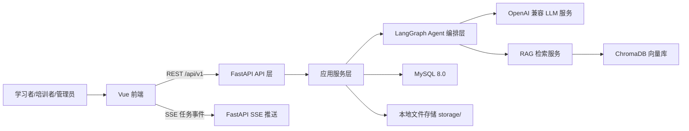
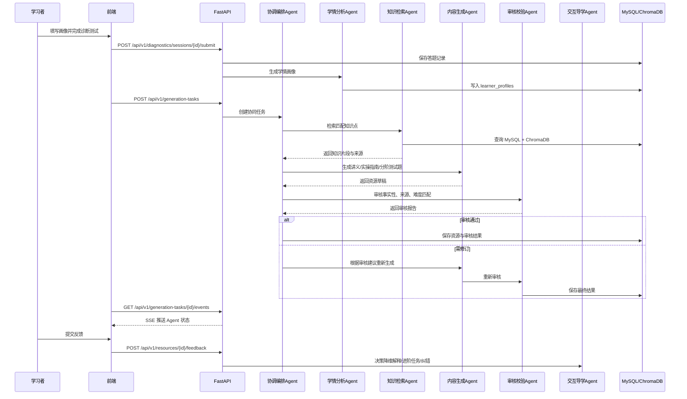

# 人工智能应用开发实训多智能体个性化知识生成系统设计文档

> 文档版本：v1.0  
> 编制日期：2026 年 7 月 4 日  
> 关联赛题：XH-202630 领域知识个性化生成与多智能体协同决策系统研究  
> 主验证领域：人工智能应用开发实训  
> 作品定位：以人工智能应用开发为验证样例，构建可迁移的多智能体个性化技能培训系统。

---

## 1. 技术栈总览

### 1.1 技术选型

| 层级 | 技术 | 固定版本 | 用途 |
|------|------|----------|------|
| 前端框架 | Vue | 3.5.12 | 构建 Web 单页应用 |
| 前端语言 | TypeScript | 5.5.4 | 类型约束与可维护开发 |
| 构建工具 | Vite | 5.4.11 | 前端构建与本地开发 |
| UI 组件库 | Element Plus | 2.8.4 | 表单、表格、弹窗、布局、统计卡片 |
| 图表库 | ECharts | 5.5.1 | 雷达图、热力图、折线图、柱状图 |
| 流程图组件 | Vue Flow | 1.41.5 | Agent 协同流程可视化 |
| 状态管理 | Pinia | 2.2.4 | 前端会话状态、任务状态、页面缓存 |
| HTTP 客户端 | Axios | 1.7.7 | REST API 调用 |
| Markdown 渲染 | marked + highlight.js + marked-katex-extension | marked 15.0.8 + highlight.js 11.11.1 + marked-katex-extension 5.1.4 | 讲义、实操指南、测试题渲染，支持代码高亮和公式 |
| 文件导入导出 | xlsx + file-saver | xlsx 0.18.5 + file-saver 2.0.5 | 知识库批量导入、评测数据导出 |
| 后端框架 | FastAPI | 0.115.6 | REST API、SSE 推送、OpenAPI 文档 |
| 后端语言 | Python | 3.12.4 | Agent 编排、RAG、业务逻辑 |
| Agent 编排 | LangGraph | 0.2.56 | 多智能体状态图、条件分支、重试、检查点 |
| ORM | SQLAlchemy | 2.0.35 | MySQL 数据访问 |
| 数据库迁移 | Alembic | 1.13.3 | 数据库版本迁移 |
| 关系数据库 | MySQL | 8.0.39 | 用户、画像、题目、资源、日志、评测数据 |
| 向量数据库 | ChromaDB | 1.5.8 | 知识库 Embedding 存储与语义检索 |
| LLM 统一调用 | OpenAI Python SDK | 1.51.2 | 兼容 OpenAI 格式模型服务 |
| 文档解析 | pypdf + markdown | pypdf 4.3.1 | 知识库文档导入 |
| 后端测试 | pytest | 8.3.3 | 单元测试与接口测试 |
| 前端测试 | Vitest + Vue Test Utils | Vitest 2.1.1 + Vue Test Utils 2.4.6 | 组件与工具函数测试 |
| 代码规范 | Ruff + ESLint + Prettier | Ruff 0.6.9 + ESLint 9.11.1 + Prettier 3.3.3 | 代码质量和格式化 |
| 容器化 | Docker Compose | 2.29.7 | 本地一键启动前后端与数据库 |

### 1.2 固定实现边界

1. 系统第一版只实现一个主验证领域：`ai_app_dev`，中文名为“人工智能应用开发实训”。
2. 第一版知识关系使用 MySQL 表建模，不引入 Neo4j。
3. 第一版 Agent 状态使用 MySQL 持久化，不引入 Redis。
4. 第一版实时过程展示使用 SSE，不使用 WebSocket。
5. 第一版向量检索使用 ChromaDB，本地持久化目录为 `data/chroma`。
6. 第一版 Agent 编排使用 LangGraph `StateGraph` 实现，不手写临时流程控制器。
7. 所有外部模型通过 OpenAI 兼容接口调用，模型供应商由环境变量配置，但业务代码不直接依赖具体供应商。
8. 第一版用户体系采用演示账号和角色字段，不建设完整注册、找回密码、复杂权限审批流程。
9. 第一版以可演示闭环和可复现评测为优先，企业级兼容、长期版本治理和细粒度审计放入后续扩展。

### 1.3 第一版 MVP 范围

第一版必须优先完成能够支撑比赛评分的最小闭环，避免将开发资源消耗在低收益的企业后台能力上。

| 类别 | 第一版交付范围 |
|------|----------------|
| 领域数据 | 1 个 `ai_app_dev` 领域包，至少 50 条真实知识点、60 道诊断题 |
| 学习者样例 | 至少 3 组差异化学习者画像，覆盖初学者、进阶者和实操型学习者 |
| Agent 闭环 | 协调编排、学情分析、知识检索、内容生成、审核校验 5 个主流程 Agent；交互导学 Agent 由反馈触发 |
| 资源输出 | 每个画像生成定制化讲义、实操指南、分阶测试题 3 类资源 |
| 审核纠错 | 审核报告必须包含事实准确性、来源追溯、难度匹配和核心覆盖评分 |
| 可视化 | 完成学情画像页、Agent 协同页、学习资源页、学习报告页 4 个核心页面 |
| 评测 | 提供 50 组评测样例和 `test_script`，可复现幻觉率、难度匹配准确率、知识覆盖率 |

### 1.4 简化与扩展原则

1. REST API 固定前缀为 `/api/v1`，第一版不建设 `/api/v2`。
2. 所有 API 响应包含 `schema_version` 字段，便于演示和测试脚本稳定解析。
3. 数据库结构通过 Alembic 迁移管理，禁止直接手工改生产库结构。
4. 领域配置包含 `domain_schema_version` 字段，第一版固定为 `"1.0"`。
5. Agent 输入输出 JSON 必须包含 `contract_version` 字段，第一版固定为 `"agent-contract-v1"`。
6. 已生成学习资源不可直接覆盖；第一版在 `learning_resources` 中保留 `version` 字段，不单独建设完整资源版本表。
7. 知识条目修改后记录 `updated_at` 和变更摘要；完整历史版本表作为后续增强项。

---

## 2. 系统架构

### 2.1 总体架构



### 2.2 分层职责

| 层级 | 目录 | 职责 |
|------|------|------|
| 前端表现层 | `frontend/src/pages` | 页面渲染、表单交互、图表展示、流程状态展示 |
| 前端数据层 | `frontend/src/api` | 封装 `/api/v1` 请求和 SSE 订阅 |
| API 层 | `backend/app/api/v1` | 参数校验、权限校验、响应格式封装 |
| 应用服务层 | `backend/app/services` | 学情画像、诊断测试、资源生成、反馈、报告等业务流程 |
| Agent 编排层 | `backend/app/agents` | 使用 LangGraph `StateGraph` 定义多 Agent 节点、状态、条件边、重试、审核闭环 |
| RAG 层 | `backend/app/rag` | 文档切片、Embedding、向量检索、引用片段返回 |
| 数据访问层 | `backend/app/repositories` | 数据库读写封装 |
| 数据模型层 | `backend/app/models` | SQLAlchemy 表模型 |
| 配置层 | `backend/app/core` | 环境变量、日志、异常、鉴权、兼容性策略 |

### 2.3 核心业务闭环



### 2.4 Agent 状态机

Agent 编排由 LangGraph `StateGraph` 执行。系统将一个生成任务映射为一个图运行实例，`generation_tasks.public_id` 作为 `thread_id`，用于串联 MySQL 中的任务状态、Agent 运行日志和 SSE 前端事件。

LangGraph 状态对象固定为 `AgentGraphState`：

```python
class AgentGraphState(TypedDict):
    contract_version: str
    task_id: str
    learner_id: str
    profile_id: str
    domain_code: str
    resource_types: list[str]
    learning_goal: str
    profile: dict
    retrieved_chunks: list[dict]
    draft_resources: list[dict]
    review_reports: list[dict]
    revision_count: int
    decision: str
    error_message: str | None
```

LangGraph 节点固定为：

| 节点 | 对应 Agent | 职责 |
|------|------------|------|
| `load_profile` | 学情分析 Agent | 读取或生成学习者画像 |
| `retrieve_knowledge` | 知识检索 Agent | 检索知识点、引用片段、前置关系 |
| `generate_resource` | 内容生成 Agent | 生成讲义、实操指南、分阶测试题 |
| `review_resource` | 审核校验 Agent | 审核事实性、来源、难度、覆盖率 |
| `decide_next_step` | 协调编排 Agent | 根据审核结果决定通过、修订或失败 |
| `persist_resource` | 协调编排 Agent | 保存资源、版本、审核报告 |
| `handle_feedback` | 交互导学 Agent | 根据反馈生成降维解释、进阶挑战或复核任务 |

LangGraph 条件边固定为：

```text
START -> load_profile -> retrieve_knowledge -> generate_resource -> review_resource -> decide_next_step
decide_next_step -> persist_resource      when decision = passed
decide_next_step -> retrieve_knowledge    when decision = revision_required and revision_count < 2
decide_next_step -> END                   when decision = failed
persist_resource -> END
handle_feedback -> review_resource
```

Agent 任务状态枚举固定为：

| 状态 | 含义 | 是否终态 |
|------|------|----------|
| `pending` | 已创建，等待执行 | 否 |
| `running` | 正在执行 | 否 |
| `waiting_review` | 等待审核 Agent 校验 | 否 |
| `revision_required` | 审核未通过，等待修订 | 否 |
| `completed` | 全部资源生成并审核通过 | 是 |
| `failed` | 重试后仍失败 | 是 |
| `cancelled` | 用户或管理员取消 | 是 |

失败重试规则固定为：

1. LLM 调用失败最多重试 3 次。
2. 重试等待时间为 1 秒、3 秒、5 秒。
3. 三次失败后任务状态置为 `failed`。
4. 失败原因写入 `agent_runs.error_message`。

---

## 3. 目录结构

```text
ai-training-agent-system/
├── README.md
├── docker-compose.yml
├── .env.example
├── docs/
│   ├── requirements.md
│   ├── design.md
│   ├── api-v1.md
│   ├── deployment.md
│   ├── ENV_SETUP.md
│   └── demo_accounts.md
├── backend/
│   ├── pyproject.toml
│   ├── alembic.ini
│   ├── alembic/
│   │   ├── env.py
│   │   └── versions/
│   ├── app/
│   │   ├── main.py
│   │   ├── api/
│   │   │   └── v1/
│   │   │       ├── auth.py
│   │   │       ├── learners.py
│   │   │       ├── diagnostics.py
│   │   │       ├── knowledge.py
│   │   │       ├── generation_tasks.py
│   │   │       ├── resources.py
│   │   │       ├── reports.py
│   │   │       ├── domains.py
│   │   │       └── evaluations.py
│   │   ├── agents/
│   │   │   ├── base.py
│   │   │   ├── orchestrator.py
│   │   │   ├── graphs.py
│   │   │   ├── state.py
│   │   │   ├── nodes.py
│   │   │   ├── checkpointer.py
│   │   │   ├── profile_agent.py
│   │   │   ├── retrieval_agent.py
│   │   │   ├── generation_agent.py
│   │   │   ├── review_agent.py
│   │   │   ├── tutoring_agent.py
│   │   │   ├── contracts.py
│   │   │   └── prompts/
│   │   │       ├── profile_agent.md
│   │   │       ├── retrieval_agent.md
│   │   │       ├── generation_agent.md
│   │   │       ├── review_agent.md
│   │   │       └── tutoring_agent.md
│   │   ├── core/
│   │   │   ├── config.py
│   │   │   ├── security.py
│   │   │   ├── logging.py
│   │   │   ├── errors.py
│   │   │   └── compatibility.py
│   │   ├── models/
│   │   │   ├── user.py
│   │   │   ├── learner.py
│   │   │   ├── domain.py
│   │   │   ├── knowledge.py
│   │   │   ├── diagnostic.py
│   │   │   ├── agent.py
│   │   │   ├── resource.py
│   │   │   ├── feedback.py
│   │   │   └── evaluation.py
│   │   ├── schemas/
│   │   │   ├── common.py
│   │   │   ├── learner.py
│   │   │   ├── diagnostic.py
│   │   │   ├── generation.py
│   │   │   ├── resource.py
│   │   │   ├── report.py
│   │   │   └── domain.py
│   │   ├── services/
│   │   │   ├── learner_service.py
│   │   │   ├── diagnostic_service.py
│   │   │   ├── profile_service.py
│   │   │   ├── generation_service.py
│   │   │   ├── feedback_service.py
│   │   │   ├── report_service.py
│   │   │   ├── domain_service.py
│   │   │   └── evaluation_service.py
│   │   ├── rag/
│   │   │   ├── chunker.py
│   │   │   ├── embeddings.py
│   │   │   ├── vector_store.py
│   │   │   └── retriever.py
│   │   ├── repositories/
│   │   │   ├── base.py
│   │   │   ├── learner_repo.py
│   │   │   ├── knowledge_repo.py
│   │   │   ├── agent_repo.py
│   │   │   └── resource_repo.py
│   │   └── workers/
│   │       └── generation_worker.py
│   └── tests/
│       ├── unit/
│       └── api/
├── frontend/
│   ├── package.json
│   ├── vite.config.ts
│   ├── index.html
│   └── src/
│       ├── main.ts
│       ├── App.vue
│       ├── api/
│       │   ├── client.ts
│       │   ├── learners.ts
│       │   ├── diagnostics.ts
│       │   ├── generation.ts
│       │   ├── resources.ts
│       │   ├── reports.ts
│       │   └── domains.ts
│       ├── components/
│       │   ├── AgentFlow/
│       │   ├── Charts/
│       │   ├── ResourceViewer/
│       │   ├── ResourceMarkdownViewer/
│       │   └── Layout/
│       ├── pages/
│       │   ├── DashboardPage.vue
│       │   ├── LearnerProfilePage.vue
│       │   ├── DiagnosticPage.vue
│       │   ├── AgentWorkspacePage.vue
│       │   ├── ResourcePage.vue
│       │   ├── ReportPage.vue
│       │   ├── KnowledgeAdminPage.vue
│       │   └── DomainConfigPage.vue
│       ├── stores/
│       │   ├── authStore.ts
│       │   ├── taskStore.ts
│       │   └── domainStore.ts
│       ├── types/
│       │   └── api.ts
│       └── styles/
│           └── theme.css
├── data/
│   ├── seed/
│   │   ├── ai_app_dev_domain.json
│   │   ├── knowledge_items.json
│   │   ├── diagnostic_questions.json
│   │   └── sample_learners.json
│   ├── evaluation_cases/
│   │   ├── hallucination/
│   │   │   ├── standard.xlsx
│   │   │   └── predict.xlsx
│   │   ├── difficulty_match/
│   │   │   ├── standard.xlsx
│   │   │   └── predict.xlsx
│   │   ├── knowledge_coverage/
│   │   │   ├── standard.xlsx
│   │   │   └── predict.xlsx
│   │   └── learning_path/
│   │       ├── standard.xlsx
│   │       └── predict.xlsx
│   └── chroma/
├── test_script/
│   ├── requirements.txt
│   ├── src/
│   │   ├── main.py
│   │   ├── evaluator.py
│   │   ├── matcher.py
│   │   └── extract.py
│   └── README.md
└── storage/
    ├── exports/
    ├── uploads/
    └── generated/
```

---

## 4. 数据库设计

### 4.1 通用字段约定

1. 主键统一使用 `BIGINT UNSIGNED AUTO_INCREMENT`。
2. 对外暴露统一使用 `public_id`，类型为 `VARCHAR(36)`，存储 UUID。
3. 所有业务表包含 `created_at`、`updated_at`。
4. 需要软删除的表包含 `deleted_at`。
5. JSON 字段使用 MySQL `JSON` 类型。
6. 字符集使用 `utf8mb4`，排序规则使用 `utf8mb4_0900_ai_ci`。

### 4.2 表清单

第一版数据库只保留支撑闭环演示和指标复现的核心表。历史版本、长期审计和复杂兼容表作为后续扩展，不作为 MVP 必建范围。

| 表名 | 用途 | 第一版优先级 |
|------|------|--------------|
| `users` | 演示账号与角色，包含学习者、培训者、管理员 | 必建 |
| `learners` | 学习者扩展信息 | 必建 |
| `domains` | 领域配置，第一版只维护当前有效配置 | 必建 |
| `knowledge_items` | 当前有效知识条目，记录来源和更新时间 | 必建 |
| `knowledge_relations` | 知识点前置、依赖、关联关系 | 必建 |
| `knowledge_chunks` | RAG 文本切片元数据 | 必建 |
| `diagnostic_questions` | 诊断题库 | 必建 |
| `diagnostic_sessions` | 诊断测试会话 | 必建 |
| `answer_records` | 答题记录 | 必建 |
| `learner_profiles` | 学情画像 | 必建 |
| `generation_tasks` | 资源生成任务 | 必建 |
| `agent_runs` | 单个 Agent 执行记录 | 必建 |
| `agent_messages` | Agent 间标准消息 | 必建 |
| `learning_resources` | 生成的学习资源，包含 `version` 字段 | 必建 |
| `review_reports` | 审核报告，记录双模型审核结果和仲裁结论 | 必建 |
| `resource_feedback` | 学习者反馈 | 必建 |
| `learning_paths` | 学习路径，支持 `needs_refresh` 标记 | 必建 |
| `evaluation_cases` | 评测样例元数据，可由脚本文件导入 | 建议 |
| `evaluation_results` | 评测结果汇总；第一版也可由 `test_script` 输出文件替代 | 可选 |

后续扩展可新增 `domain_versions`、`knowledge_item_versions`、`resource_versions` 等历史版本表，不影响第一版闭环交付。

### 4.3 核心表结构

#### 4.3.1 `users`

| 字段 | 类型 | 约束 | 说明 |
|------|------|------|------|
| `id` | BIGINT UNSIGNED | PK | 内部主键 |
| `public_id` | VARCHAR(36) | UNIQUE NOT NULL | 对外 ID |
| `username` | VARCHAR(64) | UNIQUE NOT NULL | 登录名 |
| `password_hash` | VARCHAR(255) | NOT NULL | 密码哈希 |
| `display_name` | VARCHAR(64) | NOT NULL | 展示名 |
| `role` | ENUM('learner','instructor','admin') | NOT NULL | 用户角色 |
| `status` | ENUM('active','disabled') | NOT NULL DEFAULT 'active' | 账号状态 |
| `created_at` | DATETIME | NOT NULL | 创建时间 |
| `updated_at` | DATETIME | NOT NULL | 更新时间 |

索引：`idx_users_role(role)`。

#### 4.3.2 `learners`

| 字段 | 类型 | 约束 | 说明 |
|------|------|------|------|
| `id` | BIGINT UNSIGNED | PK | 内部主键 |
| `public_id` | VARCHAR(36) | UNIQUE NOT NULL | 对外 ID |
| `user_id` | BIGINT UNSIGNED | FK users.id | 对应用户 |
| `education_level` | ENUM('college','bachelor','master','doctor','vocational','other') | NOT NULL | 学历 |
| `major` | VARCHAR(128) | NOT NULL | 专业 |
| `experience_years` | DECIMAL(3,1) | NOT NULL DEFAULT 0 | 相关经验年限 |
| `learning_style` | ENUM('theory','practice','mixed') | NOT NULL DEFAULT 'mixed' | 学习风格 |
| `target_domain_code` | VARCHAR(64) | NOT NULL | 目标领域 |
| `tags` | JSON | NOT NULL | 学习方向标签 |
| `created_at` | DATETIME | NOT NULL | 创建时间 |
| `updated_at` | DATETIME | NOT NULL | 更新时间 |

索引：`idx_learners_user(user_id)`、`idx_learners_domain(target_domain_code)`。

#### 4.3.3 `domains`

| 字段 | 类型 | 约束 | 说明 |
|------|------|------|------|
| `id` | BIGINT UNSIGNED | PK | 内部主键 |
| `code` | VARCHAR(64) | UNIQUE NOT NULL | 领域编码，主领域固定为 `ai_app_dev` |
| `name` | VARCHAR(128) | NOT NULL | 领域名称 |
| `description` | TEXT | NOT NULL | 领域描述 |
| `domain_schema_version` | VARCHAR(16) | NOT NULL DEFAULT '1.0' | 配置协议版本 |
| `ability_model` | JSON | NOT NULL | 能力模型 |
| `difficulty_rubric` | JSON | NOT NULL | 难度标准 |
| `review_rules` | JSON | NOT NULL | 审核规则 |
| `resource_templates` | JSON | NOT NULL | 资源模板 |
| `status` | ENUM('active','archived') | NOT NULL DEFAULT 'active' | 状态 |
| `created_at` | DATETIME | NOT NULL | 创建时间 |
| `updated_at` | DATETIME | NOT NULL | 更新时间 |

#### 4.3.4 `knowledge_items`

| 字段 | 类型 | 约束 | 说明 |
|------|------|------|------|
| `id` | BIGINT UNSIGNED | PK | 内部主键 |
| `public_id` | VARCHAR(36) | UNIQUE NOT NULL | 对外 ID |
| `domain_code` | VARCHAR(64) | NOT NULL | 所属领域 |
| `title` | VARCHAR(255) | NOT NULL | 知识点名称 |
| `category` | ENUM('theory','practice','case','tooling') | NOT NULL | 分类 |
| `difficulty` | TINYINT UNSIGNED | NOT NULL | 难度 1-5 |
| `summary` | VARCHAR(512) | NOT NULL | 摘要 |
| `content_md` | MEDIUMTEXT | NOT NULL | Markdown 正文 |
| `source_title` | VARCHAR(255) | NOT NULL | 来源名称 |
| `source_url` | VARCHAR(1024) | NULL | 来源链接 |
| `source_license` | VARCHAR(128) | NOT NULL | 授权说明 |
| `tags` | JSON | NOT NULL | 标签 |
| `version` | INT UNSIGNED | NOT NULL DEFAULT 1 | 当前版本 |
| `status` | ENUM('draft','active','archived') | NOT NULL DEFAULT 'active' | 状态 |
| `created_at` | DATETIME | NOT NULL | 创建时间 |
| `updated_at` | DATETIME | NOT NULL | 更新时间 |

索引：`idx_knowledge_domain(domain_code)`、`idx_knowledge_difficulty(difficulty)`、`idx_knowledge_category(category)`。

#### 4.3.5 `knowledge_relations`

| 字段 | 类型 | 约束 | 说明 |
|------|------|------|------|
| `id` | BIGINT UNSIGNED | PK | 内部主键 |
| `source_item_id` | BIGINT UNSIGNED | FK knowledge_items.id | 起点知识 |
| `target_item_id` | BIGINT UNSIGNED | FK knowledge_items.id | 终点知识 |
| `relation_type` | ENUM('prerequisite','depends_on','related_to','next_step') | NOT NULL | 关系类型 |
| `weight` | DECIMAL(4,3) | NOT NULL DEFAULT 1.000 | 关系权重 |
| `created_at` | DATETIME | NOT NULL | 创建时间 |

唯一约束：`uk_knowledge_relation(source_item_id,target_item_id,relation_type)`。

#### 4.3.6 `knowledge_chunks`

| 字段 | 类型 | 约束 | 说明 |
|------|------|------|------|
| `id` | BIGINT UNSIGNED | PK | 内部主键 |
| `public_id` | VARCHAR(36) | UNIQUE NOT NULL | 对外 ID |
| `knowledge_item_id` | BIGINT UNSIGNED | FK knowledge_items.id | 所属知识条目 |
| `chunk_index` | INT UNSIGNED | NOT NULL | 切片序号 |
| `content` | TEXT | NOT NULL | 切片文本 |
| `token_count` | INT UNSIGNED | NOT NULL | Token 数 |
| `embedding_id` | VARCHAR(128) | UNIQUE NOT NULL | ChromaDB 中的向量 ID |
| `created_at` | DATETIME | NOT NULL | 创建时间 |

唯一约束：`uk_chunk_item_index(knowledge_item_id,chunk_index)`。

#### 4.3.7 `diagnostic_questions`

| 字段 | 类型 | 约束 | 说明 |
|------|------|------|------|
| `id` | BIGINT UNSIGNED | PK | 内部主键 |
| `public_id` | VARCHAR(36) | UNIQUE NOT NULL | 对外 ID |
| `domain_code` | VARCHAR(64) | NOT NULL | 所属领域 |
| `knowledge_item_id` | BIGINT UNSIGNED | FK knowledge_items.id | 关联知识点 |
| `question_type` | ENUM('single_choice','multiple_choice','short_answer') | NOT NULL | 题型 |
| `difficulty` | TINYINT UNSIGNED | NOT NULL | 难度 1-5 |
| `stem` | TEXT | NOT NULL | 题干 |
| `options` | JSON | NULL | 选择题选项 |
| `answer_key` | JSON | NOT NULL | 标准答案 |
| `rubric` | JSON | NOT NULL | 评分规则 |
| `created_at` | DATETIME | NOT NULL | 创建时间 |
| `updated_at` | DATETIME | NOT NULL | 更新时间 |

#### 4.3.8 `diagnostic_sessions`

| 字段 | 类型 | 约束 | 说明 |
|------|------|------|------|
| `id` | BIGINT UNSIGNED | PK | 内部主键 |
| `public_id` | VARCHAR(36) | UNIQUE NOT NULL | 对外 ID |
| `learner_id` | BIGINT UNSIGNED | FK learners.id | 学习者 |
| `domain_code` | VARCHAR(64) | NOT NULL | 领域 |
| `status` | ENUM('created','submitted','scored','profiled') | NOT NULL | 状态 |
| `question_ids` | JSON | NOT NULL | 本次题目 ID 列表 |
| `total_score` | DECIMAL(5,2) | NULL | 总分 |
| `started_at` | DATETIME | NOT NULL | 开始时间 |
| `submitted_at` | DATETIME | NULL | 提交时间 |
| `created_at` | DATETIME | NOT NULL | 创建时间 |
| `updated_at` | DATETIME | NOT NULL | 更新时间 |

#### 4.3.9 `answer_records`

| 字段 | 类型 | 约束 | 说明 |
|------|------|------|------|
| `id` | BIGINT UNSIGNED | PK | 内部主键 |
| `session_id` | BIGINT UNSIGNED | FK diagnostic_sessions.id | 测试会话 |
| `question_id` | BIGINT UNSIGNED | FK diagnostic_questions.id | 题目 |
| `knowledge_item_id` | BIGINT UNSIGNED | FK knowledge_items.id | 知识点 |
| `learner_answer` | JSON | NOT NULL | 学习者答案 |
| `is_correct` | BOOLEAN | NOT NULL | 是否正确 |
| `score` | DECIMAL(5,2) | NOT NULL | 得分 |
| `time_spent_seconds` | INT UNSIGNED | NOT NULL | 作答耗时 |
| `attempt_count` | INT UNSIGNED | NOT NULL DEFAULT 1 | 修改次数 |
| `ai_comment` | VARCHAR(1024) | NULL | AI 评语 |
| `created_at` | DATETIME | NOT NULL | 创建时间 |

#### 4.3.10 `learner_profiles`

| 字段 | 类型 | 约束 | 说明 |
|------|------|------|------|
| `id` | BIGINT UNSIGNED | PK | 内部主键 |
| `public_id` | VARCHAR(36) | UNIQUE NOT NULL | 对外 ID |
| `learner_id` | BIGINT UNSIGNED | FK learners.id | 学习者 |
| `diagnostic_session_id` | BIGINT UNSIGNED | FK diagnostic_sessions.id | 来源测试 |
| `domain_code` | VARCHAR(64) | NOT NULL | 领域 |
| `ability_scores` | JSON | NOT NULL | 五维能力分数 |
| `known_knowledge` | JSON | NOT NULL | 已掌握知识点 |
| `weak_knowledge` | JSON | NOT NULL | 薄弱知识点 |
| `blind_spots` | JSON | NOT NULL | 未接触知识点 |
| `profile_summary` | TEXT | NOT NULL | 画像摘要 |
| `profile_version` | INT UNSIGNED | NOT NULL DEFAULT 1 | 画像版本 |
| `created_at` | DATETIME | NOT NULL | 创建时间 |

索引：`idx_profiles_learner_domain(learner_id,domain_code)`。

#### 4.3.11 `generation_tasks`

| 字段 | 类型 | 约束 | 说明 |
|------|------|------|------|
| `id` | BIGINT UNSIGNED | PK | 内部主键 |
| `public_id` | VARCHAR(36) | UNIQUE NOT NULL | 对外 ID |
| `learner_id` | BIGINT UNSIGNED | FK learners.id | 学习者 |
| `profile_id` | BIGINT UNSIGNED | FK learner_profiles.id | 使用画像 |
| `domain_code` | VARCHAR(64) | NOT NULL | 领域 |
| `requested_resource_types` | JSON | NOT NULL | 请求资源类型 |
| `status` | ENUM('pending','running','waiting_review','revision_required','completed','failed','cancelled') | NOT NULL | 状态 |
| `progress` | TINYINT UNSIGNED | NOT NULL DEFAULT 0 | 进度 0-100 |
| `error_message` | TEXT | NULL | 失败原因 |
| `created_by` | BIGINT UNSIGNED | FK users.id | 创建人 |
| `created_at` | DATETIME | NOT NULL | 创建时间 |
| `updated_at` | DATETIME | NOT NULL | 更新时间 |

#### 4.3.12 `agent_runs`

| 字段 | 类型 | 约束 | 说明 |
|------|------|------|------|
| `id` | BIGINT UNSIGNED | PK | 内部主键 |
| `public_id` | VARCHAR(36) | UNIQUE NOT NULL | 对外 ID |
| `task_id` | BIGINT UNSIGNED | FK generation_tasks.id | 所属任务 |
| `agent_name` | ENUM('profile','retrieval','generation','review','orchestrator','tutoring') | NOT NULL | Agent 名称 |
| `status` | ENUM('pending','running','completed','failed') | NOT NULL | 状态 |
| `input_json` | JSON | NOT NULL | 输入 |
| `output_json` | JSON | NULL | 输出 |
| `model_name` | VARCHAR(128) | NULL | 使用模型 |
| `prompt_version` | VARCHAR(32) | NOT NULL | Prompt 版本 |
| `tokens_input` | INT UNSIGNED | NOT NULL DEFAULT 0 | 输入 Token |
| `tokens_output` | INT UNSIGNED | NOT NULL DEFAULT 0 | 输出 Token |
| `duration_ms` | INT UNSIGNED | NOT NULL DEFAULT 0 | 耗时 |
| `error_message` | TEXT | NULL | 错误 |
| `started_at` | DATETIME | NULL | 开始时间 |
| `finished_at` | DATETIME | NULL | 结束时间 |
| `created_at` | DATETIME | NOT NULL | 创建时间 |

#### 4.3.13 `agent_messages`

| 字段 | 类型 | 约束 | 说明 |
|------|------|------|------|
| `id` | BIGINT UNSIGNED | PK | 内部主键 |
| `task_id` | BIGINT UNSIGNED | FK generation_tasks.id | 所属任务 |
| `sender_agent` | VARCHAR(64) | NOT NULL | 发送方 |
| `receiver_agent` | VARCHAR(64) | NOT NULL | 接收方 |
| `message_type` | ENUM('request','response','review','revision','decision','event') | NOT NULL | 消息类型 |
| `payload` | JSON | NOT NULL | 消息内容 |
| `contract_version` | VARCHAR(32) | NOT NULL DEFAULT 'agent-contract-v1' | 契约版本 |
| `created_at` | DATETIME | NOT NULL | 创建时间 |

#### 4.3.14 `learning_resources`

| 字段 | 类型 | 约束 | 说明 |
|------|------|------|------|
| `id` | BIGINT UNSIGNED | PK | 内部主键 |
| `public_id` | VARCHAR(36) | UNIQUE NOT NULL | 对外 ID |
| `task_id` | BIGINT UNSIGNED | FK generation_tasks.id | 生成任务 |
| `learner_id` | BIGINT UNSIGNED | FK learners.id | 学习者 |
| `domain_code` | VARCHAR(64) | NOT NULL | 领域 |
| `resource_type` | ENUM('lecture','practice_guide','graded_quiz','remedial_explanation','challenge_task') | NOT NULL | 资源类型 |
| `title` | VARCHAR(255) | NOT NULL | 标题 |
| `content_md` | MEDIUMTEXT | NOT NULL | Markdown 内容 |
| `difficulty` | TINYINT UNSIGNED | NOT NULL | 难度 1-5 |
| `adaptation_reason` | TEXT | NOT NULL | 个性化适配原因 |
| `source_refs` | JSON | NOT NULL | 知识来源引用 |
| `review_status` | ENUM('pending','passed','revision_required','rejected') | NOT NULL | 审核状态 |
| `current_version` | INT UNSIGNED | NOT NULL DEFAULT 1 | 当前版本 |
| `created_at` | DATETIME | NOT NULL | 创建时间 |
| `updated_at` | DATETIME | NOT NULL | 更新时间 |

#### 4.3.15 `review_reports`

| 字段 | 类型 | 约束 | 说明 |
|------|------|------|------|
| `id` | BIGINT UNSIGNED | PK | 内部主键 |
| `resource_id` | BIGINT UNSIGNED | FK learning_resources.id | 资源 |
| `task_id` | BIGINT UNSIGNED | FK generation_tasks.id | 任务 |
| `factual_score` | DECIMAL(5,2) | NOT NULL | 事实准确分 |
| `source_trace_score` | DECIMAL(5,2) | NOT NULL | 溯源分 |
| `difficulty_match_score` | DECIMAL(5,2) | NOT NULL | 难度匹配分 |
| `coverage_score` | DECIMAL(5,2) | NOT NULL | 知识覆盖分 |
| `decision` | ENUM('passed','revision_required','rejected') | NOT NULL | 审核结论 |
| `issues` | JSON | NOT NULL | 问题列表 |
| `suggestions` | JSON | NOT NULL | 修改建议 |
| `created_at` | DATETIME | NOT NULL | 创建时间 |

#### 4.3.16 `resource_feedback`

| 字段 | 类型 | 约束 | 说明 |
|------|------|------|------|
| `id` | BIGINT UNSIGNED | PK | 内部主键 |
| `resource_id` | BIGINT UNSIGNED | FK learning_resources.id | 资源 |
| `learner_id` | BIGINT UNSIGNED | FK learners.id | 学习者 |
| `rating` | TINYINT UNSIGNED | NOT NULL | 1-5 星 |
| `difficulty_feedback` | ENUM('too_easy','matched','too_hard') | NOT NULL | 难度反馈 |
| `usefulness_feedback` | ENUM('helpful','neutral','not_helpful') | NOT NULL | 有用性 |
| `error_mark_text` | TEXT | NULL | 标记错误文本 |
| `comment` | TEXT | NULL | 文字反馈 |
| `trigger_action` | ENUM('none','review_again','remedial_explanation','challenge_task') | NOT NULL | 触发动作 |
| `created_at` | DATETIME | NOT NULL | 创建时间 |

#### 4.3.17 `evaluation_cases`

| 字段 | 类型 | 约束 | 说明 |
|------|------|------|------|
| `id` | BIGINT UNSIGNED | PK | 内部主键 |
| `public_id` | VARCHAR(36) | UNIQUE NOT NULL | 对外 ID |
| `domain_code` | VARCHAR(64) | NOT NULL | 领域 |
| `case_name` | VARCHAR(128) | NOT NULL | 样例名称 |
| `learner_profile_snapshot` | JSON | NOT NULL | 学习者画像快照 |
| `expected_knowledge_ids` | JSON | NOT NULL | 期望覆盖知识点 |
| `expected_difficulty` | TINYINT UNSIGNED | NOT NULL | 期望难度 |
| `resource_type` | ENUM('lecture','practice_guide','graded_quiz') | NOT NULL | 资源类型 |
| `created_at` | DATETIME | NOT NULL | 创建时间 |

#### 4.3.18 `evaluation_results`

| 字段 | 类型 | 约束 | 说明 |
|------|------|------|------|
| `id` | BIGINT UNSIGNED | PK | 内部主键 |
| `case_id` | BIGINT UNSIGNED | FK evaluation_cases.id | 评测样例 |
| `resource_id` | BIGINT UNSIGNED | FK learning_resources.id | 被评测资源 |
| `hallucination_flag` | BOOLEAN | NOT NULL | 是否存在幻觉 |
| `difficulty_matched` | BOOLEAN | NOT NULL | 难度是否匹配 |
| `knowledge_covered` | BOOLEAN | NOT NULL | 核心知识点是否覆盖 |
| `reviewer` | VARCHAR(64) | NOT NULL | 评测人 |
| `comment` | TEXT | NULL | 备注 |
| `created_at` | DATETIME | NOT NULL | 创建时间 |

### 4.4 初始种子数据

系统必须内置以下数据：

1. 领域 `ai_app_dev`。
2. 至少 50 条人工智能应用开发知识点。
3. 至少 60 道诊断题，其中选择题不少于 40 道，简答题不少于 20 道。
4. 至少 3 个学习者画像：
   - `L-AI-001`：零基础本科生，理论弱，实操弱。
   - `L-AI-002`：有 Python 基础的高职学生，理论中等，实操强。
   - `L-AI-003`：有后端开发经验的研究生，理论强，RAG 和 Agent 编排弱。
5. 至少 50 组评测样例，覆盖 3 类资源、5 个难度等级和 3 种画像。

---

## 5. API 接口设计

### 5.1 通用规范

基础路径：`/api/v1`

第一版认证方式采用演示令牌或演示用户头，满足角色区分和演示隔离即可：

```text
Authorization: Bearer demo-token
X-Demo-User: learner_001
X-Demo-Role: learner | instructor | admin
```

正式 JWT、注册、找回密码和账号生命周期管理作为后续扩展，不进入 MVP 必做范围。

通用成功响应：

```json
{
  "schema_version": "1.0",
  "request_id": "req_20260704120000001",
  "data": {}
}
```

通用错误响应：

```json
{
  "schema_version": "1.0",
  "request_id": "req_20260704120000001",
  "error": {
    "code": "VALIDATION_ERROR",
    "message": "参数校验失败",
    "details": {
      "field": "domain_code"
    }
  }
}
```

错误码固定为：

| 错误码 | HTTP 状态 | 含义 |
|--------|-----------|------|
| `UNAUTHORIZED` | 401 | 未登录或 Token 无效 |
| `FORBIDDEN` | 403 | 无权限 |
| `NOT_FOUND` | 404 | 资源不存在 |
| `VALIDATION_ERROR` | 422 | 参数校验失败 |
| `CONFLICT` | 409 | 状态冲突或重复提交 |
| `TASK_FAILED` | 500 | 任务执行失败 |
| `LLM_PROVIDER_ERROR` | 502 | 模型服务调用失败 |

### 5.2 演示账号接口

第一版只提供演示账号能力，目标是让评委和团队成员快速切换学习者、培训者和管理员视角，不建设完整账号系统。

| 方法 | 路径 | 说明 | 权限 |
|------|------|------|------|
| GET | `/auth/demo-users` | 获取内置演示账号列表 | 公开 |
| POST | `/auth/demo-login` | 选择演示账号并返回演示令牌 | 公开 |
| GET | `/auth/me` | 获取当前演示用户 | 登录用户 |

`POST /auth/demo-login` 请求：

```json
{
  "demo_user": "admin"
}
```

响应：

```json
{
  "schema_version": "1.0",
  "request_id": "req_001",
  "data": {
    "access_token": "demo-token-admin",
    "token_type": "bearer",
    "user": {
      "public_id": "uuid",
      "username": "admin",
      "display_name": "管理员",
      "role": "admin"
    }
  }
}
```

### 5.3 学习者接口

| 方法 | 路径 | 说明 | 权限 |
|------|------|------|------|
| POST | `/learners` | 创建学习者 | instructor/admin |
| GET | `/learners` | 学习者列表 | instructor/admin |
| GET | `/learners/{learner_id}` | 学习者详情 | learner本人/instructor/admin |
| PATCH | `/learners/{learner_id}` | 更新学习者基础信息 | learner本人/instructor/admin |
| GET | `/learners/{learner_id}/profiles/latest` | 获取最新画像 | learner本人/instructor/admin |

`POST /learners` 请求：

```json
{
  "display_name": "学习者A",
  "education_level": "bachelor",
  "major": "计算机科学与技术",
  "experience_years": 0.5,
  "learning_style": "practice",
  "target_domain_code": "ai_app_dev",
  "tags": ["Python", "RAG", "大模型应用开发"]
}
```

### 5.4 诊断测试接口

| 方法 | 路径 | 说明 | 权限 |
|------|------|------|------|
| POST | `/diagnostics/sessions` | 创建诊断测试 | learner本人/instructor/admin |
| GET | `/diagnostics/sessions/{session_id}` | 获取测试题目 | learner本人/instructor/admin |
| POST | `/diagnostics/sessions/{session_id}/submit` | 提交答案并评分 | learner本人 |
| GET | `/diagnostics/sessions/{session_id}/result` | 获取诊断结果 | learner本人/instructor/admin |

`POST /diagnostics/sessions` 请求：

```json
{
  "learner_id": "learner-public-id",
  "domain_code": "ai_app_dev",
  "question_count": 10
}
```

`POST /diagnostics/sessions/{session_id}/submit` 请求：

```json
{
  "answers": [
    {
      "question_id": "question-public-id",
      "answer": ["A"],
      "time_spent_seconds": 45,
      "attempt_count": 1
    }
  ]
}
```

### 5.5 知识库接口

| 方法 | 路径 | 说明 | 权限 |
|------|------|------|------|
| GET | `/knowledge/items` | 查询知识点 | 登录用户 |
| POST | `/knowledge/items` | 创建知识点 | admin |
| GET | `/knowledge/items/{item_id}` | 获取知识点详情 | 登录用户 |
| PATCH | `/knowledge/items/{item_id}` | 更新知识点并生成新版本 | admin |
| POST | `/knowledge/items/import` | 批量导入知识点 | admin |
| POST | `/knowledge/reindex` | 重建向量索引 | admin |
| GET | `/knowledge/relations` | 获取知识关系 | 登录用户 |

`GET /knowledge/items` 参数：

| 参数 | 类型 | 必填 | 说明 |
|------|------|------|------|
| `domain_code` | string | 是 | 固定为 `ai_app_dev` |
| `category` | string | 否 | `theory/practice/case/tooling` |
| `difficulty` | integer | 否 | 1-5 |
| `keyword` | string | 否 | 标题关键词 |
| `page` | integer | 否 | 默认 1 |
| `page_size` | integer | 否 | 默认 20，最大 100 |

### 5.6 生成任务接口

| 方法 | 路径 | 说明 | 权限 |
|------|------|------|------|
| POST | `/generation-tasks` | 创建多 Agent 生成任务 | learner本人/instructor/admin |
| GET | `/generation-tasks/{task_id}` | 查询任务详情 | learner本人/instructor/admin |
| GET | `/generation-tasks/{task_id}/events` | 订阅 SSE 任务事件 | learner本人/instructor/admin |
| POST | `/generation-tasks/{task_id}/cancel` | 取消任务 | learner本人/instructor/admin |
| GET | `/generation-tasks/{task_id}/agent-runs` | 查看 Agent 执行记录 | instructor/admin |

`POST /generation-tasks` 请求：

```json
{
  "learner_id": "learner-public-id",
  "profile_id": "profile-public-id",
  "domain_code": "ai_app_dev",
  "resource_types": ["lecture", "practice_guide", "graded_quiz"],
  "learning_goal": "掌握基于本地知识库的 RAG 应用开发"
}
```

响应：

```json
{
  "schema_version": "1.0",
  "request_id": "req_002",
  "data": {
    "task_id": "task-public-id",
    "status": "pending",
    "event_stream_url": "/api/v1/generation-tasks/task-public-id/events"
  }
}
```

SSE 事件格式：

```text
event: agent_status
data: {"task_id":"task-public-id","agent_name":"retrieval","status":"running","progress":30}

event: resource_created
data: {"task_id":"task-public-id","resource_id":"resource-public-id","resource_type":"lecture"}

event: task_completed
data: {"task_id":"task-public-id","status":"completed","progress":100}
```

### 5.7 学习资源接口

| 方法 | 路径 | 说明 | 权限 |
|------|------|------|------|
| GET | `/resources` | 查询资源列表 | learner本人/instructor/admin |
| GET | `/resources/{resource_id}` | 获取资源详情 | learner本人/instructor/admin |
| GET | `/resources/{resource_id}/versions` | 获取资源版本 | learner本人/instructor/admin |
| POST | `/resources/{resource_id}/feedback` | 提交反馈 | learner本人 |
| POST | `/resources/{resource_id}/export` | 导出 Markdown/PDF | learner本人/instructor/admin |

`POST /resources/{resource_id}/feedback` 请求：

```json
{
  "rating": 4,
  "difficulty_feedback": "too_hard",
  "usefulness_feedback": "helpful",
  "error_mark_text": "",
  "comment": "实操步骤清楚，但向量检索参数解释偏难"
}
```

### 5.8 报告接口

| 方法 | 路径 | 说明 | 权限 |
|------|------|------|------|
| GET | `/reports/learners/{learner_id}` | 个人学情报告 | learner本人/instructor/admin |
| GET | `/reports/learners/{learner_id}/knowledge-heatmap` | 知识掌握热力图数据 | learner本人/instructor/admin |
| GET | `/reports/learners/{learner_id}/learning-path` | 学习路径图数据 | learner本人/instructor/admin |
| GET | `/reports/group` | 群体学情概览 | instructor/admin |

### 5.9 领域配置接口

| 方法 | 路径 | 说明 | 权限 |
|------|------|------|------|
| GET | `/domains` | 领域列表 | 登录用户 |
| GET | `/domains/{domain_code}` | 领域详情 | 登录用户 |
| PATCH | `/domains/{domain_code}` | 更新领域配置并生成版本 | admin |
| POST | `/domains/{domain_code}/validate` | 校验领域配置完整性 | admin |
| POST | `/domains/import` | 导入领域包 | admin |

### 5.10 评测接口（可选）

第一版评测以 `test_script` 离线脚本为准。若开发时间允许，可提供以下轻量接口展示脚本结果；在线创建样例和人工审核工作台不作为 MVP 必做范围。

| 方法 | 路径 | 说明 | 权限 |
|------|------|------|------|
| GET | `/evaluations/cases` | 评测样例列表，可从文件导入 | instructor/admin |
| POST | `/evaluations/run` | 调用或记录一次离线评测结果 | instructor/admin |
| GET | `/evaluations/summary` | 获取指标汇总 | instructor/admin |

评测汇总响应：

```json
{
  "schema_version": "1.0",
  "request_id": "req_003",
  "data": {
    "case_count": 50,
    "hallucination_rate": 0.04,
    "difficulty_match_accuracy": 0.88,
    "knowledge_coverage_rate": 0.92
  }
}
```

---

## 6. 核心模块设计

### 6.1 学情画像模块

输入：

1. 学习者基础信息。
2. 诊断测试答题记录。
3. 题目关联知识点和难度。

处理规则：

1. 每道题按知识点聚合得分。
2. 单个知识点得分率 `>= 0.8` 标记为 `known`。
3. 单个知识点得分率 `>= 0.4 且 < 0.8` 标记为 `weak`。
4. 单个知识点得分率 `< 0.4` 标记为 `blind_spot`。
5. 前置知识点未掌握时，后继知识点最高掌握等级不超过 `weak`。
6. 五维能力分数固定为：
   - `theory`：理论基础。
   - `practice`：实操能力。
   - `problem_solving`：问题解决。
   - `knowledge_breadth`：知识广度。
   - `learning_speed`：学习速度。

输出：

```json
{
  "contract_version": "agent-contract-v1",
  "ability_scores": {
    "theory": 62,
    "practice": 48,
    "problem_solving": 55,
    "knowledge_breadth": 50,
    "learning_speed": 70
  },
  "weak_knowledge": [
    {
      "knowledge_id": "kid-rag-retrieval",
      "level": 4,
      "reason": "向量召回与重排序题目得分低"
    }
  ],
  "blind_spots": []
}
```

### 6.2 RAG 检索模块

切片规则：

1. 知识条目按 Markdown 标题和段落切片。
2. 单个 chunk 长度控制在 300-600 中文字。
3. 相邻 chunk 重叠 80 中文字。
4. 每个 chunk 必须保存 `knowledge_item_id`、`chunk_index`、`source_title`。

检索规则：

1. 输入查询由“学习目标 + 薄弱知识点 + 资源类型”拼接生成。
2. ChromaDB 返回 Top 8 语义相似 chunk。
3. MySQL 根据知识关系补充前置知识点，最多补充 5 个。
4. 最终传给生成 Agent 的引用片段数量固定为 8-12 条。
5. 每条引用必须带 `source_ref_id`。

### 6.3 Prompt Budget 管理模块

系统必须在所有 LLM 调用前执行 Prompt Budget 检查，避免上下文超限、输出 JSON 失真和批量任务失败。

固定预算：

| 场景 | 最大输入 Token | 最大输出 Token | 固定策略 |
|------|----------------|----------------|----------|
| 学情分析 Agent | 6000 | 2000 | 只传诊断题摘要、错题知识点、答题统计，不传完整题库 |
| 知识检索 Agent | 4000 | 1500 | 只传学习目标、薄弱知识点、资源类型 |
| 内容生成 Agent | 12000 | 4000 | 引用 chunk 固定为 8-12 条，超出时按匹配分截断 |
| 审核校验 Agent | 10000 | 3000 | 一次只审核 1 类资源，三类资源分三次审核 |
| 交互导学 Agent | 6000 | 2000 | 只传当前资源片段、反馈内容和画像摘要 |
| 批量评测脚本 | 8000 | 2000 | 每批最多处理 5 条资源 |

实现规则：

1. `backend/app/agents/base.py` 提供 `PromptBudget` 类。
2. 每个 Agent 调用模型前必须调用 `PromptBudget.validate()`.
3. 超出预算时按以下顺序裁剪：历史对话、低匹配度引用片段、长案例、非核心解释。
4. 裁剪记录写入 `agent_runs.input_json.truncation_log`。
5. 审核 Agent 不允许裁剪资源正文中的“知识来源”部分。

### 6.4 多 Agent 编排模块

实现框架固定为 LangGraph。`backend/app/agents/graphs.py` 负责构建 `StateGraph`，`backend/app/agents/state.py` 定义 `AgentGraphState`，`backend/app/agents/nodes.py` 将各 Agent 封装为 LangGraph 节点，`backend/app/agents/checkpointer.py` 负责把图运行检查点和 MySQL 任务状态同步。

Agent 固定为 6 个：

| Agent | 是否必跑 | 职责 |
|-------|----------|------|
| 协调编排 Agent | 是 | 创建任务、推进状态、处理重试、写入日志 |
| 学情分析 Agent | 是 | 生成或读取最新画像 |
| 知识检索 Agent | 是 | 检索知识点、片段、前置关系 |
| 内容生成 Agent | 是 | 生成三类学习资源 |
| 审核校验 Agent | 是 | 检查事实、来源、难度、覆盖率 |
| 交互导学 Agent | 反馈触发时必跑 | 生成追问、降维解释或进阶挑战 |

主生成图 `build_generation_graph()` 固定为：

```text
START
 -> load_profile
 -> retrieve_knowledge
 -> generate_resource
 -> review_resource
 -> decide_next_step
    -> persist_resource when passed
    -> retrieve_knowledge when revision_required and revision_count < 2
    -> END when failed
 -> END
```

`generate_resource` 节点一次生成三类资源，输出写入 `draft_resources`。`review_resource` 节点逐项审核三类资源，输出写入 `review_reports`。`decide_next_step` 节点只读取审核结果和修订次数，不直接调用大模型。

反馈图 `build_feedback_graph()` 固定为：

```text
START
 -> handle_feedback
 -> review_resource
 -> decide_next_step
    -> persist_resource when passed
    -> handle_feedback when revision_required and revision_count < 2
    -> END when failed
 -> END
```

LangGraph 运行配置固定为：

```python
config = {
    "configurable": {
        "thread_id": generation_task_public_id
    }
}
```

每个 LangGraph 节点执行时必须写入一条 `agent_runs`，每次节点间传递必须写入一条 `agent_messages`。前端 SSE 事件从 `agent_runs` 和 `generation_tasks` 的状态变化中生成。

审核不通过处理：

1. `factual_score < 90`：必须重新检索并重新生成。
2. `source_trace_score < 90`：必须补充引用来源。
3. `difficulty_match_score < 85`：必须调整讲解深度和题目难度。
4. 同一资源最多修订 2 次。
5. 第 2 次修订仍未通过时，任务状态置为 `failed`，资源不展示给学习者。

### 6.5 内容生成模块

生成资源固定为三类：

1. `lecture`：定制化讲义。
2. `practice_guide`：实操指南。
3. `graded_quiz`：分阶测试题。

讲义结构固定：

```markdown
# 标题
## 适配对象
## 学习目标
## 前置知识
## 核心概念
## 示例说明
## 常见误区
## 小结
## 知识来源
```

实操指南结构固定：

```markdown
# 标题
## 适配对象
## 环境准备
## 操作步骤
## 预期结果
## 常见问题排查
## 验收标准
## 知识来源
```

分阶测试题结构固定：

```markdown
# 标题
## 基础巩固
## 能力提升
## 挑战突破
## 答案与解析
## 知识来源
```

### 6.6 审核校验模块

审核维度固定为：

| 维度 | 满分 | 通过线 | 检查方式 |
|------|------|--------|----------|
| 事实准确性 | 100 | 90 | 对照引用片段检查 |
| 来源可追溯 | 100 | 90 | 检查每个核心结论是否有来源 |
| 难度匹配 | 100 | 85 | 对照学习者画像和资源难度 |
| 核心覆盖 | 100 | 90 | 对照期望知识点列表 |

双模型交叉审核规则：

1. 审核 Agent 至少配置两个 OpenAI 兼容模型通道：`primary_review_model` 和 `secondary_review_model`。
2. 事实准确性和来源可追溯两个维度必须由两个模型分别审核。
3. 两个模型评分差异 `> 10` 分，或一个通过一个不通过时，触发仲裁策略。
4. 仲裁优先重新检索来源片段并再次审核；仍不一致时标记为 `manual_review_required`，不直接展示给学习者。
5. 审核报告必须记录两个模型的评分、差异点、仲裁动作和最终结论，用于证明系统不是单模型自检。

审核输出固定格式：

```json
{
  "contract_version": "agent-contract-v1",
  "decision": "passed",
  "scores": {
    "factual_score": 96,
    "source_trace_score": 94,
    "difficulty_match_score": 88,
    "coverage_score": 92
  },
  "model_reviews": [
    {
      "model_role": "primary_review_model",
      "factual_score": 96,
      "source_trace_score": 94,
      "issues": []
    },
    {
      "model_role": "secondary_review_model",
      "factual_score": 93,
      "source_trace_score": 92,
      "issues": []
    }
  ],
  "arbitration": {
    "required": false,
    "action": "none",
    "final_reason": "双模型审核结论一致"
  },
  "issues": [],
  "suggestions": []
}
```

### 6.7 反馈与动态决策模块

反馈触发规则：

| 反馈 | 触发动作 |
|------|----------|
| `too_hard` | 生成 `remedial_explanation` |
| `too_easy` | 生成 `challenge_task` |
| `error_mark_text` 非空 | 触发审核 Agent 复核 |
| `rating <= 2` | 生成改进建议并写入评测样例候选 |
| `rating >= 4` 且 `difficulty_feedback = matched` | 标记资源适配成功 |

交互导学策略：

1. 学习者回答错误时，先给 1 个提示问题，不直接给答案。
2. 学习者第二次仍错误时，生成降维解释。
3. 学习者连续 2 个资源评分为 `too_easy` 时，生成进阶挑战任务。

### 6.8 学习路径规划模块

学习路径算法采用“薄弱知识点集合 + 前置知识链 + 掌握度排序”的确定性规则，保证路径可解释、可复现。

输入：

1. 学习者最新画像 `learner_profiles`。
2. 当前领域知识关系 `knowledge_relations`。
3. 学习目标 `learning_goal`。
4. 已生成资源与反馈记录。

路径生成规则：

1. 从画像中提取 `weak_knowledge` 和 `blind_spots`，形成待学习知识点集合 `K`.
2. 对 `K` 中每个知识点递归查找 `prerequisite` 前置关系，形成前置闭包链。
3. 去除学习者已熟练掌握的知识点，保留得分 `< 95` 的知识点。
4. 将存在前置依赖的知识点合并为若干知识链。
5. 计算每条知识链的平均掌握度。
6. 按平均掌握度从低到高排序。
7. 同一掌握度下，前置深度更浅的知识链优先。
8. 输出最终学习路径，并为每个节点绑定推荐资源类型。

路径节点固定字段：

```json
{
  "knowledge_id": "kid-rag-retrieval",
  "knowledge_title": "RAG 向量召回",
  "mastery_score": 0.52,
  "path_order": 3,
  "reason": "该知识点是重排序和 Agent 工具调用的前置能力",
  "recommended_resource_type": "practice_guide"
}
```

掌握度分层固定为：

| 掌握度 | 状态 | 图谱颜色 |
|--------|------|----------|
| `< 0.40` | 知识盲区 | `#e74c3c` 红色 |
| `0.40-0.60` | 严重薄弱 | `#e67e22` 橙色 |
| `0.60-0.80` | 部分掌握 | `#f1c40f` 黄色 |
| `0.80-0.95` | 基本掌握 | `#27ae60` 绿色 |
| `>= 0.95` | 熟练掌握 | `#2ecc71` 深绿色 |
| 无数据 | 未诊断 | `#c0c4cc` 灰色 |

### 6.9 领域迁移模块

领域包格式固定为：

```text
domain_package/
├── domain.json
├── knowledge_items.json
├── knowledge_relations.json
├── diagnostic_questions.json
├── resource_templates.json
└── review_rules.json
```

导入校验规则：

1. `domain.json` 必须包含 `code`、`name`、`domain_schema_version`。
2. `knowledge_items.json` 至少包含 50 条知识点。
3. 每个知识点必须包含 `title`、`category`、`difficulty`、`content_md`、`source_title`、`source_license`。
4. 每个诊断题必须关联一个知识点。
5. 导入成功后必须重建 ChromaDB 索引。

知识更新影响路径规则：

1. 管理员新增、修改或导入知识条目后，系统记录受影响的 `knowledge_item_id`。
2. 系统根据 `knowledge_relations` 查找直接前置、后继和关联知识点，形成影响集合。
3. 命中影响集合的 `learning_paths` 标记为 `needs_refresh=true`，并记录 `refresh_reason`。
4. 学习者或培训者再次打开报告页时，系统重新生成学习路径并清除刷新标记。
5. 若更新涉及来源或审核规则，相关已生成资源标记为 `review_stale`，提示可触发审核 Agent 复核。

### 6.10 评测脚本模块

评测脚本固定放在 `test_script/`，用于复现系统三项核心指标，不依赖前端页面人工统计。

数据组织固定为：

```text
test_script/data/
├── hallucination/
│   ├── standard.xlsx
│   └── predict.xlsx
├── difficulty_match/
│   ├── standard.xlsx
│   └── predict.xlsx
├── knowledge_coverage/
│   ├── standard.xlsx
│   └── predict.xlsx
└── learning_path/
    ├── standard.xlsx
    └── predict.xlsx
```

评测脚本固定入口：

```powershell
cd test_script
python -m src.main
```

评测指标：

| 指标 | 计算方式 | 达标线 |
|------|----------|--------|
| 幻觉率 | 人工标准表中标记为事实错误的断言数 / 生成资源断言总数 | `< 5%` |
| 难度匹配准确率 | 系统预测难度与专家标注难度一致的样例数 / 总样例数 | `>= 85%` |
| 核心知识点覆盖率 | 系统资源覆盖知识点与专家标注知识点语义匹配数 / 专家标注知识点总数 | `>= 90%` |
| 学习路径顺序准确率 | 预测路径与标准路径的知识点匹配度 × 前置顺序准确率 | `>= 85%` |

知识点语义匹配规则：

1. 使用 `BAAI/bge-m3` 计算知识点名称和描述的 embedding。
2. 余弦相似度 `>= 0.85` 判定为同一知识点。
3. 标准知识点被多个预测知识点命中时，只保留最高相似度匹配。
4. 未命中的标准知识点计入覆盖失败。

路径顺序准确率规则：

1. 先用语义匹配确定标准路径和预测路径中对应知识点。
2. 统计预测路径中匹配节点的逆序对。
3. 顺序准确率 = `1 - 逆序对数 / 可比较节点对数`。
4. 最终路径得分 = `知识点集合匹配率 × 顺序准确率`。

---

## 7. 前端核心页面设计

### 7.1 总体导航

左侧导航固定包含：

1. 工作台
2. 学情画像
3. 诊断测试
4. Agent 协同
5. 学习资源
6. 学习报告
7. 知识库管理
8. 领域配置
9. 指标汇总（可选评测看板）

角色可见性：

| 页面 | learner | instructor | admin |
|------|---------|------------|-------|
| 工作台 | 是 | 是 | 是 |
| 学情画像 | 本人 | 全部 | 全部 |
| 诊断测试 | 本人 | 创建/查看 | 创建/查看 |
| Agent 协同 | 本人任务 | 全部 | 全部 |
| 学习资源 | 本人 | 全部 | 全部 |
| 学习报告 | 本人 | 全部 | 全部 |
| 知识库管理 | 否 | 只读 | 读写 |
| 领域配置 | 否 | 只读 | 读写 |
| 指标汇总 | 否 | 是 | 是；完整评测看板为后续增强 |

### 7.2 工作台 `DashboardPage`

区域：

1. 顶部指标：学习者数量、知识点数量、生成任务数、审核通过率。
2. 当前任务列表：显示任务状态、进度、资源类型。
3. 质量指标卡片：幻觉率、难度匹配准确率、核心知识点覆盖率。
4. 快捷入口：创建诊断测试、生成学习资源、导入知识库。

### 7.3 学情画像页 `LearnerProfilePage`

区域：

1. 学习者基础信息卡片。
2. 五维能力雷达图。
3. 知识盲区列表。
4. 知识掌握热力图。
5. 最新学习路径。

交互：

1. 点击知识点显示来源、前置知识和推荐资源。
2. 点击“生成个性化资源”创建 `generation_task`。
3. 知识图谱使用 ECharts Graph 实现，节点颜色严格使用 6.8 中的掌握度配色。
4. 节点 tooltip 固定展示：知识点名称、掌握度、答题数、正确数、薄弱原因、推荐资源类型。
5. 前置关系边使用虚线箭头，关联关系边使用实线，当前路径节点加粗显示。

### 7.4 诊断测试页 `DiagnosticPage`

流程：

1. 选择学习者。
2. 创建 10 题诊断测试。
3. 答题并提交。
4. 展示得分、错题、知识点归因。
5. 生成画像。

约束：

1. 未提交前允许修改答案。
2. 提交后答案不可修改。
3. 简答题评分结果必须展示 AI 评语。

### 7.5 Agent 协同页 `AgentWorkspacePage`

区域：

1. 左侧 Vue Flow：展示 6 个 Agent 节点和状态颜色。
2. 右侧任务详情：进度、当前步骤、错误信息。
3. 下方消息日志：展示 Agent 间消息。
4. 资源预览：生成成功后展示三类资源卡片。

状态颜色：

| 状态 | 颜色 |
|------|------|
| `pending` | 灰色 |
| `running` | 蓝色 |
| `waiting_review` | 橙色 |
| `revision_required` | 紫色 |
| `completed` | 绿色 |
| `failed` | 红色 |

### 7.6 学习资源页 `ResourcePage`

区域：

1. 资源筛选：资源类型、难度、审核状态、创建时间。
2. 资源正文 Markdown 预览，由 `ResourceMarkdownViewer.vue` 统一渲染。
3. 来源引用列表。
4. 审核报告。
5. 学习反馈表单。

交互：

1. 点击来源引用跳转知识点详情。
2. 提交 `too_hard` 后展示降维解释生成入口。
3. 提交 `too_easy` 后展示进阶挑战生成入口。
4. 标记错误文本后触发复核任务。

Markdown 渲染要求：

1. 支持 Markdown 标题、列表、表格、引用、代码块。
2. 代码块使用 `highlight.js` 高亮。
3. 数学公式使用 `marked-katex-extension` 渲染。
4. 资源生成中显示加载状态，资源完成后显示审核状态和来源引用。
5. Markdown 中的外部链接默认新窗口打开。

### 7.7 学习报告页 `ReportPage`

图表：

1. 知识盲区定位图。
2. 资源难度匹配雷达图。
3. 学习路径流程图。
4. 历史画像变化折线图。

导出：

1. 支持导出 Markdown。
2. 支持导出 PDF。
3. PDF 文件保存到 `storage/exports`。

### 7.8 知识库管理页 `KnowledgeAdminPage`

功能：

1. 知识点列表。
2. 知识点详情。
3. 新增知识点。
4. 修改知识点并生成历史版本。
5. 批量导入 JSON。
6. 重建向量索引。

校验：

1. 来源标题不能为空。
2. 授权说明不能为空。
3. 难度必须为 1-5。
4. 正文不能为空。

### 7.9 领域配置页 `DomainConfigPage`

功能：

1. 查看 `ai_app_dev` 配置。
2. 编辑能力模型。
3. 编辑难度标准。
4. 编辑审核规则。
5. 编辑资源模板。
6. 执行领域配置校验。

### 7.10 指标汇总面板 `EvaluationSummaryPanel`

第一版不强制建设完整在线评测看板，只需要能够展示 `test_script` 输出的核心指标，用于答辩截图和验收说明。

区域：

1. 评测样例数量。
2. 幻觉率统计。
3. 难度匹配准确率统计。
4. 核心知识点覆盖率统计。
5. 最近一次评测时间和结果文件路径。

完整的评测样例管理、在线人工审核和未达标资源工作台作为后续增强项。

---

## 8. 开发迭代计划

当前日期为 2026 年 7 月 4 日，作品提交截止为 2026 年 9 月 5 日前。开发周期按 9 周执行。

### 8.1 里程碑总览

| 阶段 | 时间 | 目标 | 验收物 |
|------|------|------|--------|
| M0 | 2026-07-04 至 2026-07-07 | 项目初始化 | 代码仓库、Docker Compose、前后端空壳、数据库连接 |
| M1 | 2026-07-08 至 2026-07-14 | 数据模型与知识库 | Alembic 表结构、50 条知识点、60 道题、ChromaDB 索引 |
| M2 | 2026-07-15 至 2026-07-21 | 学情画像与诊断测试 | 诊断测试闭环、画像生成、画像页面 |
| M3 | 2026-07-22 至 2026-08-02 | 多 Agent 生成闭环 | 任务创建、LangGraph 编排、三类资源生成、审核报告 |
| M4 | 2026-08-03 至 2026-08-12 | 可视化与反馈决策 | Agent 流程图、资源反馈、降维解释、进阶挑战 |
| M5 | 2026-08-13 至 2026-08-22 | 报告与评测 | 学习报告、50 组评测样例、三项指标统计 |
| M6 | 2026-08-23 至 2026-08-30 | 稳定性与部署 | 部署说明、单元测试、接口测试、演示数据重置脚本 |
| M7 | 2026-08-31 至 2026-09-04 | 提交材料 | 设计实现方案、PPT、10 分钟演示视频、源码打包 |

### 8.2 M0 项目初始化

任务：

1. 创建前端 Vite Vue TypeScript 工程。
2. 创建后端 FastAPI 工程。
3. 配置 MySQL 8.0 和 ChromaDB 本地持久化目录。
4. 配置 `.env.example`。
5. 配置统一响应结构和 `/api/v1/health`。

验收标准：

1. `docker compose up` 后前端、后端、MySQL 均可启动。
2. 访问 `/api/v1/health` 返回 `{"status":"ok"}`。

### 8.3 M1 数据模型与知识库

任务：

1. 创建全部核心表的 Alembic 迁移。
2. 编写 `ai_app_dev` 领域种子数据。
3. 导入至少 50 条知识点。
4. 导入至少 60 道诊断题。
5. 完成知识切片和向量索引。

验收标准：

1. `/api/v1/knowledge/items?domain_code=ai_app_dev` 返回不少于 50 条。
2. ChromaDB 中向量数量不少于知识切片数量。

### 8.4 M2 学情画像与诊断测试

任务：

1. 实现学习者创建。
2. 实现诊断测试创建和提交。
3. 实现选择题自动评分。
4. 实现简答题 AI 辅助评分。
5. 实现画像生成。
6. 实现画像雷达图和盲区列表。

验收标准：

1. 3 个样例学习者均可完成诊断测试。
2. 每个学习者生成一份 `learner_profiles`。
3. 前端展示五维能力雷达图。

### 8.5 M3 多 Agent 生成闭环

任务：

1. 实现 `generation_tasks` 创建。
2. 实现 LangGraph `StateGraph` 主生成图。
3. 实现知识检索 Agent。
4. 实现内容生成 Agent。
5. 实现审核校验 Agent。
6. 生成讲义、实操指南、分阶测试题。
7. 保存审核报告和来源引用。

验收标准：

1. 单个学习者可生成 3 类资源。
2. 每类资源均包含知识来源。
3. 审核不通过时执行修订流程。
4. 任务状态最终为 `completed` 或 `failed`，不可停留在中间状态。

### 8.6 M4 可视化与反馈决策

任务：

1. 实现 SSE 任务事件推送。
2. 实现 Agent 流程图。
3. 实现 Agent 消息日志展示。
4. 实现资源反馈。
5. 实现交互导学 Agent。
6. 实现降维解释和进阶挑战生成。

验收标准：

1. 前端能实时显示 Agent 状态变化。
2. 提交 `too_hard` 后生成降维解释。
3. 提交 `too_easy` 后生成挑战任务。
4. 标记错误文本后触发复核。

### 8.7 M5 报告与评测

任务：

1. 实现个人学情报告。
2. 实现知识盲区图、难度匹配图、学习路径图。
3. 创建 50 组评测样例。
4. 实现评测执行和统计。
5. 输出幻觉率、难度匹配准确率、核心知识点覆盖率。

验收标准：

1. 评测样例数量不少于 50。
2. 系统能输出三项指标。
3. 指标看板可截图用于答辩材料。

### 8.8 M6 稳定性与部署

任务：

1. 完成核心服务单元测试。
2. 完成 API 接口测试。
3. 编写部署说明。
4. 编写演示数据重置脚本。
5. 完成异常处理和空状态处理。

验收标准：

1. 后端核心单元测试通过。
2. 前端无阻塞级控制台错误。
3. 按部署说明可在新环境启动系统。

### 8.9 M7 提交材料

任务：

1. 编写作品设计实现方案。
2. 制作答辩 PPT。
3. 录制 10 分钟以内演示视频。
4. 整理源码、部署说明、测试数据。
5. 按比赛要求打包提交。

最终提交包结构固定为：

```text
域智共生-人工智能应用开发实训多智能体个性化知识生成系统/
├── README.md
├── ENV_SETUP.md
├── demo_accounts.md
├── backend/
├── frontend/
├── docs/
│   ├── 作品设计实现方案.pdf
│   ├── 需求规格说明书.md
│   ├── 系统设计文档.md
│   └── API接口文档.md
├── data/
│   ├── mysql_seed.sql
│   ├── domain_package_ai_app_dev/
│   ├── chroma_index/
│   └── evaluation_cases/
├── test_script/
├── ppt/
│   └── 答辩PPT.pptx
└── video/
    └── 系统演示视频.mp4
```

验收标准：

1. 演示视频覆盖“画像输入 → Agent 协同 → 三类资源生成 → 审核 → 反馈更新”的完整闭环。
2. 压缩包包含文档、PPT、视频、源码、部署说明、测试数据。
3. `test_script` 可复现幻觉率、难度匹配准确率、核心知识点覆盖率和学习路径顺序准确率。
4. `ENV_SETUP.md` 必须包含数据库初始化、ChromaDB 索引导入、模型环境变量、启动命令和测试账号。

---

## 9. 质量保障与后续扩展设计

### 9.1 MVP 性能与可靠性

第一版以演示稳定性和指标可复现为目标，性能验收采用可观测、可解释的方式完成。

| 指标 | 第一版目标 | 实现方式 |
|------|------------|----------|
| 完整生成流程 | 常规样例 30 秒内返回任务完成或可见进度 | 异步生成任务 + SSE 进度推送 |
| 单 Agent 调用失败 | 最多重试 3 次 | 等待 1s、3s、5s 后重试 |
| 并发演示 | 支持至少 5 个生成任务排队执行 | 后端任务状态入库，前端不阻塞等待 |
| 审核失败 | 不向学习者展示未通过资源 | 标记 `failed` 或 `manual_review_required` |
| 页面可用性 | 关键页面无阻塞级控制台错误 | 演示前执行核心流程冒烟测试 |

### 9.2 日志与隐私保护

1. 普通应用日志不得明文输出学习者姓名、完整答题原文、完整画像和完整生成资源。
2. `agent_runs.input_json` 和 `agent_runs.output_json` 只保存摘要、知识点 ID、评分和状态；调试模式下的完整内容单独开关控制。
3. 对外展示的学习者可使用代号，例如 `learner_001`、`learner_002`。
4. 评测样例中的错误断言、资源片段和审核结论可保存，但不得包含真实个人身份信息。

### 9.3 第一版兼容约束

1. `/api/v1` 字段在比赛开发期内保持稳定，不建设 `/api/v2`。
2. Agent 输入输出固定包含 `contract_version`，方便测试脚本校验。
3. 领域包固定使用 `domain_schema_version=1.0`，导入器输出基础校验报告。
4. 枚举新增值时，前端展示为“未知状态”，不得崩溃。

### 9.4 后续扩展项

以下能力有工程价值，但不进入 MVP 必做范围：

1. 完整 JWT 登录、注册、找回密码、账号生命周期管理。
2. API 多版本兼容策略和 `/api/v2`。
3. `domain_versions`、`knowledge_item_versions`、`resource_versions` 等历史版本表。
4. Redis 会话缓存、WebSocket 双向通信、Neo4j 知识图谱增强。
5. 完整在线评测看板和人工审核工作台。

---

## 10. 验收指标对齐

| 赛题评分项 | 设计响应 |
|------------|----------|
| 作品完整性 30 分 | 画像、诊断、Agent 编排、生成、审核、反馈、更新全闭环 |
| 技术创新性 25 分 | 多 Agent 交叉验证、来源追溯、审核修订、启发式导学 |
| 用户体验 15 分 | Agent 流程可视化、报告图表、资源排版、反馈交互 |
| 实用价值 30 分 | 50 组评测样例，统计幻觉率、难度匹配准确率、覆盖率 |

系统最终必须达到：

1. 幻觉率 `< 5%`。
2. 难度匹配准确率 `>= 85%`。
3. 核心知识点覆盖率 `>= 90%`。
4. 至少 3 组差异化学习者画像。
5. 至少 1 个人工智能应用开发知识库切片，知识点不少于 50 条。

---

## 11. 结论

本设计文档将系统固定为“人工智能应用开发实训”领域的多智能体个性化知识生成系统。第一版采用 Vue、FastAPI、LangGraph、MySQL、ChromaDB 和 OpenAI 兼容模型服务实现，覆盖学情画像、知识检索、资源生成、审核纠偏、反馈决策、可视化报告和评测闭环。

系统第一版通过稳定的 `/api/v1` 接口、Alembic 迁移、Agent 契约字段和领域包协议保证演示期内的结构稳定；完整 API 多版本治理、历史版本表和长期兼容策略作为后续扩展。后续迁移到智能制造、工业互联网或其他技能培训领域时，优先替换领域包和知识库，不改变核心业务流程与 Agent 协作模式。
